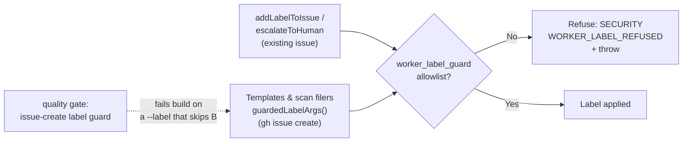

## Summary

`worker_label_guard.ts` documents a whole-worker invariant — every label the
worker applies passes its positive allowlist — but it was wired into two call
sites only (`addLabelToIssue`, `escalateToHuman`), both of which label an issue
that **already exists**. The scan and idle-task templates apply theirs at
*creation* time, pushing `"--label", <value>` straight into the
`gh issue create` argv, so none of them ever reached the guard. This closes
that half and adds a build-failing check so it cannot reopen.
Closes #1276.

- **`worker/deno/lib/guarded_issue_labels.ts`** (new) — `guardedLabelArgs()`
  is the creation-time chokepoint. It asserts every label through
  `assertWorkerCanApplyLabel` and **throws** naming each refused label, rather
  than silently dropping it, then returns the flat `--label` argv.
- **`worker/deno/lib/worker_label_guard.ts`** — new
  `WORKER_APPLIABLE_CONTENT_LABELS` set (`dead-code`, `doc-coverage`,
  `alert-feed`, `enable-feed`, `bash-syntax-audit`, `workflow-annotation-scan`,
  `security-tree-sweep`, …) plus the `confidence:` prefix, so the allowlist
  describes what the worker actually does. `isWorkerAppliableLabel` accepts it;
  `WORKER_FORBIDDEN_LABEL_LITERALS` is untouched and a test asserts the two
  stay disjoint.
- **15 creation sites converted** — the six in-process templates, the two
  `extraLabels` sites the issue names (`workflow_scan_common.ts`,
  `runner_deprecation_filer.ts`), plus `alert_feed_enable_issue.ts`,
  `security_tree_sweep.ts`, `run_failure_issue.ts`, `planning_carrier.ts`,
  `baseline_carryover_tracker.ts`, `create_all_idle_task_wrappers.ts` and
  `maybe_file_idle_task.ts`. Where the argv was built inside a
  `catch { return null }` / "continuing" block, the label args are hoisted
  **before** the `try` so a refusal fails loud instead of reading as a `gh`
  failure.
- **`worker/deno/lib/issue_create_label_check.ts`** (new) — quality-gate check
  in the shape of `gh_spawn_chokepoint_check.ts`, wired into `quality_gate.ts`
  as `issue-create label guard`. It fails the build on a `--label` reaching a
  `create` argv (`create-argv`), on `args.push("--label", …)` (`label-push`),
  and on a `["--label", x]` flatMap pair (`label-array`). A `--label` under a
  read verb (`gh issue list --label …`) applies nothing and is ignored.

Two files carry a documented allowlist entry rather than the guard, because
their labels are not worker-curated constants:

| File | Why |
| --- | --- |
| `lib/github.ts` | Labels come from the model's `suggest-improvements` output. Externally-derived labels cannot pass a positive allowlist that enumerates worker content — that path is guarded the other way round, by the reserved-label denylist in `filterReservedLabelsWithWarning` (#2825). |
| `lib/escalate_as_work.ts` | Deliberately applies the configured pickup label (`work-on` by default) when the fleet files a stuck PR as work (#569) — a label the positive allowlist forbids by design. |



## Evidence

Backend/CLI only — no web interface to screenshot. The evidence is the
scanner's own red→green run over the real tree, plus the unit tests.

The check was run against the **unfixed** tree (`git archive HEAD~1`) and the
fixed tree with the identical scanner:

```text
pre-fix (HEAD~1): 26 violations across 15 files (908 scanned)
post-fix (HEAD):  0 violations across 0 files  (909 scanned)
```

The 26 pre-fix violations are exactly the sites the issue reports —
`bash_syntax_audit_template.ts:413,415`, `bash_script_refs_template.ts:236,238`,
`alert_feed_template.ts:464,466`, `workflow_annotation_scan_template.ts:246,248`,
`alert_feed_enable_issue.ts:334`, `workflow_scan_common.ts:365,367,371` and
`runner_deprecation_filer.ts:220,224,226` — plus the eight further creation
paths found while fixing the class. Line 286 of
`workflow_annotation_scan_template.ts` is a `gh issue list --label` read and is
correctly **not** reported.

Full `./quality.sh` run after the final edit: **PASSED** (20 checks; the new
`issue-create label guard` reports PASSED alongside the existing `needs-human`
and `gh spawn` chokepoint checks; `config integration`, `pages-liquid` and
`mermaid built output` skipped as usual).

## Security

- **Regression test / linkage** — `worker/deno/tests/guarded_issue_labels_test.ts::guardedLabelArgs - refuses every reserved workflow label`
  reproduces the flaw: it drives the exact creation path the templates use and
  asserts every `WORKER_FORBIDDEN_LABEL_LITERALS` entry is refused. It **fails
  against the unfixed code** — `guarded_issue_labels.ts` does not exist there,
  so there is no chokepoint to refuse anything and the label reaches
  `gh issue create` — and **passes after the fix**. The class-level companion,
  `worker/deno/tests/issue_create_label_check_test.ts::issue_create_label_check - flags unguarded create labels`,
  fails against the unfixed filer shape (2 violations reported) and passes
  against the guarded one, and the same scanner reports 26 → 0 over the real
  tree as shown above.
- **Original trigger closed, no trivial bypass** — every `--label` argument in
  `worker/deno/lib/` and `worker/deno/commands/` is now produced by
  `guardedLabelArgs`, which refuses anything outside the positive allowlist and
  throws rather than dropping it. The three shapes that could reintroduce the
  gap are each covered by a check rule: an inline or multi-line `create` argv
  (`create-argv`), a `.push("--label", …)` (`label-push`), and the `flatMap`
  `["--label", x]` pair (`label-array`) — the last being how `github.ts` and
  `maybe_file_idle_task.ts` built theirs, so the obvious evasion is not an
  evasion. The two allowlisted files are named literally in
  `CREATE_LABEL_ALLOWLIST` with their reason, and a test asserts the chokepoint
  itself is on that list; adding a new entry is a visible source change under
  review, not a silent bypass. The guard broadened only to non-reserved content
  labels — `WORKER_FORBIDDEN_LABEL_LITERALS` is unchanged and a test asserts the
  allowlist, the content set and the forbidden list remain disjoint.

## Test Plan

Added:

- `worker/deno/tests/guarded_issue_labels_test.ts` — 6 tests: argv shape for
  allowed content labels, empty input, refusal of **every** reserved workflow
  label, refusal of a label interpolated from scan data, refusal of the whole
  call when one label of several is off-list, and every off-list label named in
  the error.
- `worker/deno/tests/issue_create_label_check_test.ts` — 9 tests over the real
  scanner with literal inputs: the pre-fix filer flagged at the right lines and
  rule, the guarded filer clean, a `gh issue list --label` read ignored, inline
  create argv flagged, `.push` and `flatMap` shapes flagged, comment-only
  mentions ignored, `resolveOwningVerb` unit behaviour, and a temp-directory
  walk asserting the allowlist is honoured.

Modified:

- `worker/deno/tests/worker_label_guard_test.ts` — added coverage for the
  content set (every entry appliable, case-insensitive match, disjoint from the
  forbidden list). One existing assertion changed, deliberately and documented
  in-line: `isWorkerAppliableLabel("bug")` was asserted `false`, but `bug` is a
  label the run-failure filer genuinely applies at creation time, so it is now
  on the allowlist and the "random unrelated label" case uses `wontfix`
  instead. No test was removed or commented out.

Re-run of the suites covering every converted call site (391 tests) plus the
full `./quality.sh` gate: all passing.
