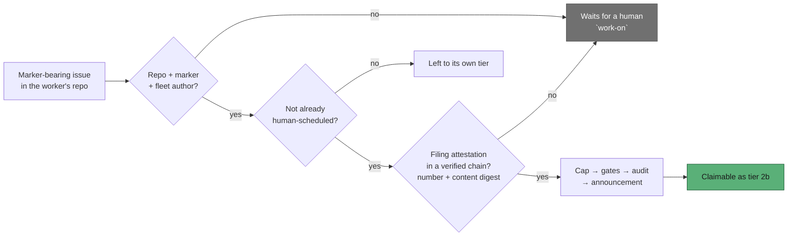

# Tier 2b self-scheduling now requires a filing attestation the agent cannot mint

## Summary

Tier 2b (`collect_self_diagnostic_candidates.ts`) is the one discovery route
that emits a workable candidate with no human-applied label. Its gate was
repo + body marker + fleet author — and the marker lives in the body, which is
exactly what a prompt-injected agent writes with the run's own `gh`
credential. The composed gate therefore reduced to "filed by the worker
account", the signal the module's own docstring calls insufficient: one
`gh issue create --body '<!-- VIBE_RUN_FAILURE:… -->'` in the worker's own repo
minted a self-scheduled, billed work item, and each run could file the next.

This implements the issue's preferred fix (option 1): bind the marker to state
the agent does not author. When the worker's own filer creates a diagnostic it
now records a **filing attestation** in the tamper-evident audit journal —
the created issue number plus a length-prefixed SHA-256 digest of the title and
body it posted, under the new `file-self-diagnostic` verb. The collector emits a
candidate only for an issue that attestation covers, and only when it comes
from a journal that reconciles with its chain anchor.

Closes #1277.



### Why the attestation is not just another body marker

- The journal lives **outside every repo working tree**, under
  `${WORK_DIR}/audit/`, so nothing the agent writes in the clone reaches it.
- The agent's own `gh` calls *are* journalled — by `gh_guard_shim.ts`, under
  the mutation classifier's verb (`issue create`), never under this verb and
  never carrying the created issue's number, which is not in the argv it
  classifies. **No sequence of `gh` commands produces an attestation.**
- Only a journal whose hash chain reconciles with its **chain anchor** is read,
  so a hand-appended line, a rewritten entry, and a freshly dropped unanchored
  journal file are all skipped rather than believed.
- Stated honestly, in code and docs: the audit store is tamper-*evident*, not
  tamper-proof. An agent with unrestricted local shell could forge a journal,
  its anchor and its roster entry together — a far higher bar than typing a
  marker into an issue body, and one that leaves a permanent record outside the
  repo. That is the same bar every other audit-chain guarantee rests on.

### Original trigger closed, with no trivial bypass

The issue's trigger — `gh issue create --title "…" --body '<!-- VIBE_RUN_FAILURE:… -->…'`
during a run whose claimed repo is the self-diagnostic repo — is closed: the
created issue has no `file-self-diagnostic` entry naming its number, so
`verifySelfDiagnosticFilings` returns `no-attestation` and the collector refuses
it before `filterAndSort`. Static reasoning over the changed path shows the
equivalent moves fail the same check, because none of them creates an
attestation for that issue number:

- **A different marker family** (`VIBE_IDLE_INVERSION` instead of
  `VIBE_RUN_FAILURE`) — the gate is keyed on the issue number, not the family;
  and an attestation recorded under a different family is refused as
  `family-mismatch`.
- **A different `gh` spelling** (`--body-file`, `gh api -X POST`, an `--input`
  JSON body) — the refusal is at scan time on the issue, not at the write, so
  how the body reached GitHub is irrelevant.
- **Editing an existing, genuinely-filed diagnostic's body** — the follow-on
  move the sibling TOCTOU gate would *not* have caught, because fleet logins sit
  inside `allowed_authors` and its edit would read as trusted. The attested
  digest covers the title and body the filer posted, so edited content is
  refused as `content-mismatch`.
- **Renaming the issue** — the digest is length-prefixed over title *and* body,
  so a rename cannot be laundered through the field boundary.
- **Dropping a forged journal file** carrying a hand-written attestation line —
  refused, because the file does not reconcile with a chain anchor
  (`self_diagnostic_attestation_test.ts::attestation - a hand-written journal with no anchor attests nothing`).

Every refusal is loud (`[self-schedule] refused …`, a `SelfScheduleRefusal` with
cause `unattested`, and a `logIssueSkipped` diagnostic) and fail-closed: the
issue stays open and a human `work-on` schedules it exactly as before.

### Known, deliberate consequences

- **Attestations are host-local.** A diagnostic is self-scheduled by the host
  that filed it; on any other host it waits for a human. Documented in
  `docs/workflows/issue-processing.md` and `SECURITY.md`.
- **Diagnostics filed before this gate existed carry no attestation**, so they
  wait for a human `work-on` too. Fail-closed by design.
- **The digest is compared against the content the scan read.** An edit made
  after that read is caught on the next scan rather than this one.

## Evidence

Backend/CLI change with no web interface, so there is no screenshot to capture;
the evidence is the test suite and the full quality gate.

**Red-then-green, observed.** With the attestation filter neutralised
(`if (verdict?.attested || true) return true;`) the three new regression tests
fail; restoring the gate turns them green:

```
self-schedule - a marker-bearing issue the agent filed is not scheduled ... FAILED
self-schedule - a worker-filed diagnostic whose body was rewritten is not scheduled ... FAILED
findOldestIssue - a marker-bearing issue with no filing attestation is not selected ... FAILED
FAILED | 18 passed | 3 failed
# gate restored
ok | 21 passed | 0 failed
```

The same check for the chain-anchor half — with the `verifyChain` guard
short-circuited, `attestation - a hand-written journal with no anchor attests nothing`
fails; restored, it passes.

Full gate after the final edit:

```
Result: PASSED (with skipped checks)
  deno tests / deno lint / deno type check / deno fmt / semgrep / markdownlint / mermaid  PASSED
```

## Acceptance Criteria

<!-- vibe-spec-review inputs="diff+issue-body" -->

- **met** — the marker must be evidence the agent cannot mint; bind it to state
  the worker recorded out of band, checked before the candidate is emitted
  (fix option 1) — evidence: `worker/deno/lib/self_diagnostic_attestation.ts`,
  gate at `worker/deno/lib/collect_self_diagnostic_candidates.ts` — reviewer:
  partial — reason: the reviewer saw only the first commit, where the reader
  trusted any `audit-*.jsonl` and a dropped file with no anchor would attest
  anything; the follow-up commit reads a journal only when its chain reconciles
  with its anchor, and `self_diagnostic_attestation_test.ts::attestation - a
  hand-written journal with no anchor attests nothing` fails without that check.
  Its second point — that the binding is issue number + content digest rather
  than a run id — stands as a deliberate departure: the issue number is
  strictly stronger here, because the agent's run id is one it does hold.
- **met** — the check runs before the candidate is emitted — evidence:
  `worker/deno/lib/collect_self_diagnostic_candidates.ts` (the attestation
  filter precedes the cap, the gates, the audit entry and the announcement) —
  reviewer: met
- **met** — ships with a test that files a marker-bearing issue authored by a
  fleet login and asserts it is **not** emitted as a candidate, failing against
  the unfixed code — evidence: `worker/deno/tests/collect_self_diagnostic_candidates_test.ts::self-schedule - a marker-bearing issue the agent filed is not scheduled`
  (observed failing with the gate neutralised) — reviewer: met
- **partial** — add the missing `verifyWorkOnContentIntegrity` TOCTOU gate (fix
  option 2, the issue's *second* preference) — evidence:
  `worker/deno/lib/self_diagnostic_attestation.ts` (attested content digest) —
  reviewer: partial — reason: the issue offers the two options as alternatives
  ("Either ships with a test…") and option 1 was implemented; the digest covers
  what that gate would have covered here and more, since fleet logins sit inside
  `allowed_authors` and `verifyWorkOnContentIntegrity` would have read an agent
  edit as a *trusted* one. What is not covered is an edit landing between the
  scan's read and the claim, which the next scan catches.
- **unrequested** — `selfDiagnosticDeps` added to `FindIssuesOptions` and
  threaded through `findOldestIssue` — reviewer: unrequested — reason: the
  end-to-end test must point the attestation reader at a temp audit directory
  without mutating the process environment (Issue #880's serialisation rule);
  it is one optional field, inert in production.
- **unrequested** — `recordFiling` seam on both filers, and
  `recordFiling: () => Promise.resolve(true)` added to the ~25 existing filer
  tests — reviewer: unrequested — reason: without it those tests append
  attestations to the host's **real** audit chain; verified there are now no
  writes under a temp `WORK_DIR`.
- **unrequested** — family-id constants moved to the filers and imported by
  `self_diagnostic_provenance.ts` — reviewer: unrequested — reason: the family
  a candidate is recognised under and the family its attestation records must
  not drift; the `family-mismatch` verdict compares them.
- **unrequested** — the in-flight cap now counts every marked diagnostic,
  attested or not — reviewer: unrequested — reason: the reviewer found that
  filtering first had quietly loosened the cap, since an assigned-but-unattested
  diagnostic still occupies a slot; restoring the original count is part of not
  regressing #505.

## Standards Review

<!-- vibe-standards-review inputs="diff+CODING-STANDARDS.md" -->

- **violation** — stale "three signals (repo, marker, author)" left in the
  collector docstring while every other surface says four — evidence:
  `worker/deno/lib/collect_self_diagnostic_candidates.ts:12` — reason: fixed in
  this diff; it now names the four signals and the attestation module.
- **violation** — no `docs/archive/pr-summaries/pr-summary-1277.md` — evidence:
  `docs/archive/pr-summaries/` — reason: fixed — this file, with the closing
  keyword, the evidence, the Mermaid diagram and the test plan.
- **violation** — redundant `log` fallback re-implementing the default the
  attestation module already applies — evidence:
  `worker/deno/lib/run_failure_issue.ts:394` — reason: fixed; the filer now
  passes `{ log: opts.log }` and the module's own stderr default applies, as
  `idle_inversion_streak.ts` already did.
- **clean** — Australian English throughout (no American spellings in added
  lines); every new test calls real code (records into a real journal on a temp
  dir and reads it back — no source-grepping); happy path, error paths and edge
  cases covered for all four new exported functions; no existing test deleted or
  commented out; fail-loud on every refusal path; no `Deno.env.set`, no sleeps,
  no wall-clock thresholds; commit trailers and no hidden paths staged; docs
  updated alongside the code.

## Test Plan

New file `worker/deno/tests/self_diagnostic_attestation_test.ts` (10 tests,
real journal on a temp audit directory):

- `attestation - a diagnostic the worker's own filer created is attested`
- `attestation - a marker-bearing issue no filer created is refused`
- `attestation - a body rewritten after filing no longer matches`
- `attestation - GitHub's CRLF line endings still match the filed body`
- `attestation - an attestation for another repo does not cover this one`
- `attestation - a family the marker does not recognise is refused`
- `attestation - a hand-written journal with no anchor attests nothing`
- `attestation - journalling disabled refuses loudly rather than passing`
- `attestation - an unparsed issue number records nothing`
- `attestation - the digest folds line endings but not content`

Added to `worker/deno/tests/collect_self_diagnostic_candidates_test.ts`:

- `self-schedule - a marker-bearing issue the agent filed is not scheduled` —
  the issue's own regression test; reproduces the flaw (an attested #39 is
  scheduled, an agent-filed #41 is refused with cause `unattested`), fails
  against the unfixed code and passes after the fix
- `self-schedule - a worker-filed diagnostic whose body was rewritten is not scheduled`

Added to `worker/deno/tests/find_oldest_issue_self_diagnostic_test.ts`:

- `findOldestIssue - a marker-bearing issue with no filing attestation is not selected`
  (and the existing selection test now records a real attestation first, so the
  end-to-end path is exercised through the real journal)

Added to the filers:

- `worker/deno/tests/run_failure_issue_test.ts::run failure issue - filing records an attestation carrying the posted body (Issue #1277)`
- `worker/deno/tests/idle_inversion_streak_test.ts::#1277 - filing records an attestation carrying the posted body`

Modified existing tests, and why: `captureDeps` in the collector test now
supplies an attested verdict for every issue (the attestation gate itself is
covered by the tests above), and the ~25 existing filer tests pass
`recordFiling: () => Promise.resolve(true)` so they no longer append to the
host's real audit chain.
