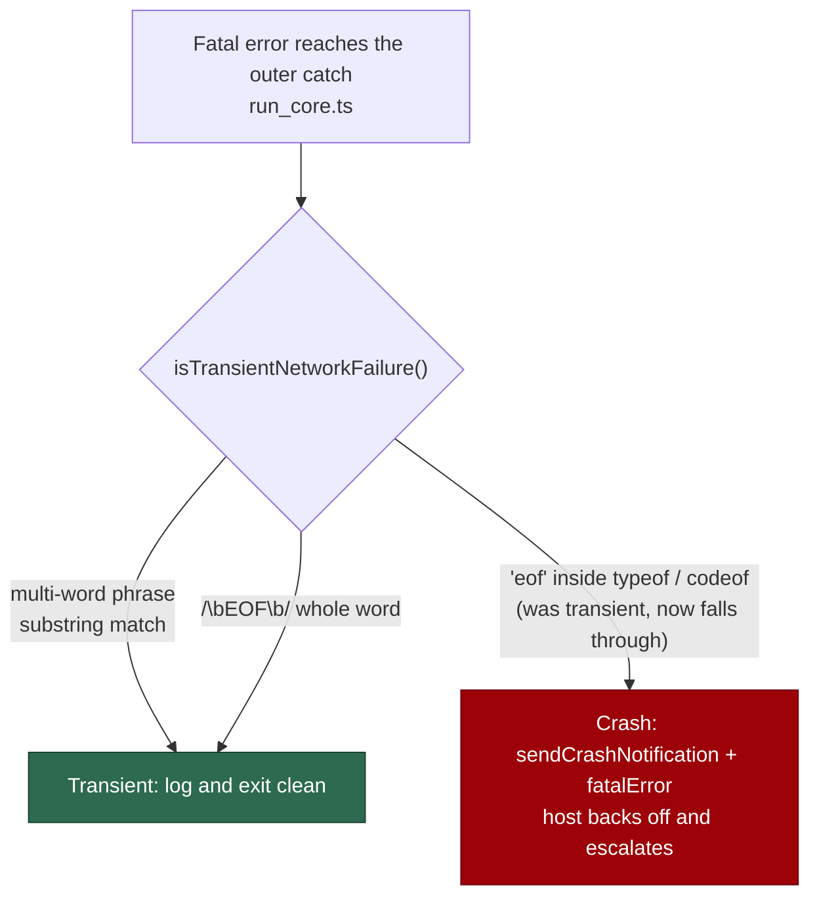

# Word-boundary the bare `eof` transient-network pattern

## Summary

`isTransientNetworkFailure()` matched its patterns with an unanchored,
case-folded `haystack.includes(...)`. Every entry is a multi-word phrase except
one: the bare string `"eof"`, which is short enough to match **inside an
ordinary word** — `typeof`, `codeof`, or any `e o f` run in an error message.

That is a fail-open classifier. On a match, `worker/deno/lib/run_core.ts` logs
"the network failed, not the worker", returns `buildResult("Transient network
failure")`, and skips **both** `deps.sendCrashNotification(message)` and
`fatalError = true`. As `run_core.ts` states in place, without the crash flag
"the launcher records a clean run and the host neither backs off nor
escalates" — so a genuinely broken worker whose fatal error message happened to
contain `eof` crash-looped indefinitely with no notification and no backoff.

The fix moves that one short entry out of the substring list and into a new
`TRANSIENT_NETWORK_WORD_PATTERNS` list matched with `/\beof\b/`. The multi-word
phrases keep their substring matching, which is correct for them — none can
collide inside a word.

Closes #1278.

## Evidence

Backend/CLI change with no web interface to screenshot. The evidence is the
regression test, run against the unfixed and the fixed code.

Against the unfixed code (test added first, per TDD):

```
isTransientNetworkFailure - 'eof' inside an ordinary word is NOT transient ... FAILED (11ms)
error: AssertionError: Values are not equal: should NOT be transient:
  TypeError: Cannot read properties of undefined (reading 'typeof')
-   true
+   false
FAILED | 10 passed | 1 failed (17ms)
```

After the fix:

```
ok | 16 passed | 0 failed (95ms)
```

Full gate: `./quality.sh` → `Result: PASSED (with skipped checks)` (the three
skips — config integration, pages-liquid, mermaid built output — are the
repository's standing local skips, unrelated to this change).

### Classification path



### Original trigger closed, no trivial bypass

The trigger was *any* fatal error message containing `eof` as a substring. The
only pattern that could fire on a sub-word match was `"eof"`; it is now matched
by `/\beof\b/` against the same lower-cased haystack, so `typeof`, `codeof` and
any other message where `eof` is preceded or followed by a word character no
longer classify as transient — they fall through to the crash path that sends
the notification and sets `fatalError`. No equivalent bypass exists: every
remaining entry in `TRANSIENT_NETWORK_PATTERNS` is a multi-word phrase
containing a space, a slash or a distinctive ≥8-character token
(`econnrefused`, `etimedout`, `eai_again`, …), none of which can appear inside
an ordinary English or identifier word. The reverse direction is preserved and
covered by a test — a standalone `EOF` token, the truncated-response-body case
the entry exists for, is still classified transient.

## Test Plan

- Added `worker/deno/tests/transient_network_failure_test.ts::isTransientNetworkFailure - 'eof' inside an ordinary word is NOT transient`
  — the regression test. It reproduces the flaw (`TypeError: Cannot read
  properties of undefined (reading 'typeof')` classified transient), **fails
  against the unfixed code** and **passes after the fix**, exactly as shown in
  Evidence above.
- Added `worker/deno/tests/transient_network_failure_test.ts::isTransientNetworkFailure - a standalone EOF token is still transient`
  — guards the other direction, so the word-boundary change does not lose the
  bare-EOF case the pattern was added for.
- No existing tests were modified or removed. The whole file plus
  `worker/deno/tests/route_gate_transient_failure_test.ts` pass (16 tests), and
  the full `./quality.sh` gate passes.
