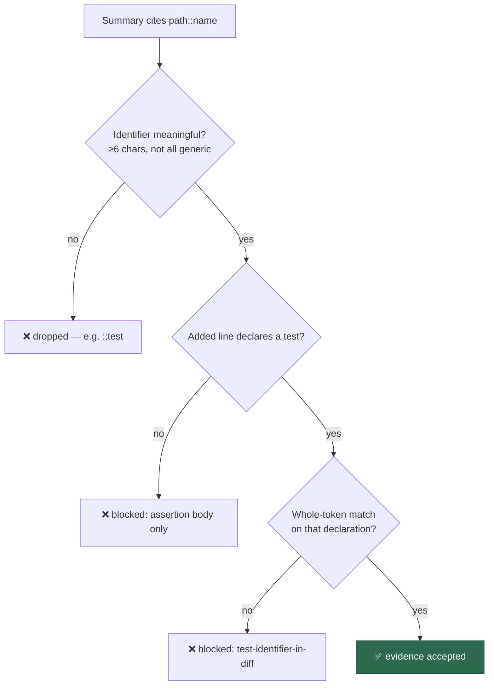

# Harden the security-fix gate's cited-test-identifier check

## Summary

The security-fix gate's one machine-checkable evidence item —
`test-identifier-in-diff`, the check the module header calls *"the coupling that
prose alone cannot fake"* — was satisfiable by the four-character token `test`.
`TEST_IDENTIFIER_PATTERNS[0]` extracted `test` from a summary citing
`tests/foo_test.ts::test`, that cleared the `>= 4` floor, and the match was a
**substring** test over the whole normalised added-line blob — which any added
`+Deno.test("…"` line contains. The gate then degraded to "touched a test file
and wrote the right words".

Three independent changes in `worker/deno/lib/security_fix_gate.ts` close it:

1. **Whole-token match, not substring** — `containsWholeToken` compares
   space-padded normalised text, so `test` inside `Deno.test` and `inject`
   inside `rejects_injection` no longer match.
2. **Generic tokens rejected, floor raised** — `GENERIC_IDENTIFIER_TOKENS`
   (`test`, `tests`, `spec`, `specs`, `deno`, `case`, `cases`, `it`, `should`,
   `todo`) plus a six-character normalised floor; an identifier built only from
   generic tokens (`test_case`) cites nothing and is dropped.
3. **Declaration lines only** — the cited identifier must appear in an added
   line that *declares* a test (`Deno.test(`, the object form's `name:` field,
   `it("…"`/`test("…"`, `@test "…"` for BATS, `def test_…(` for pytest, and the
   line following a bare `@Test` annotation for JUnit), so citing a token
   borrowed from an assertion body no longer counts.

The remediation text the gate feeds back to a blocked agent, the module header,
and the gap-analysis doc were updated to state the stricter contract.

Closes #1279.

## Evidence

Backend/CLI change with no web interface, so there is nothing to screenshot.
The evidence is the test suite.

Added
`worker/deno/tests/security_fix_gate_test.ts::citedTestIdentifierInDiff - rejects the generic token test cited against an unrelated test`
— the exact scenario the issue names (a summary citing
`tests/anything_test.ts::test` against a diff adding
`+Deno.test("unrelated name", …)`). It **fails against the unfixed code**
(observed: `AssertionError` — actual `true`, expected `false`) and **passes
after the fix**. Its end-to-end companion is
`worker/deno/tests/security_fix_gate_test.ts::evaluateSecurityFixGate - blocks a summary citing the generic token test`,
which asserts the whole gate reports `missing: ["test-identifier-in-diff"]` for
that summary.

Observed sequence:

- Before the fix: `5 failed | 27 passed` — the five new cases red.
- After the fix: `ok | 32 passed | 0 failed`.
- Related suites (gate feedback, diff collection, completion phase, execute
  phase): `ok | 70 passed | 0 failed`.
- `./quality.sh`: `Result: PASSED (with skipped checks)`.

**Original trigger closed, no trivial bypass.** The issue's trigger — a PR
summary naming `tests/anything_test.ts::test` on a branch whose diff adds any
test line — is rejected at two independent points: `extractTestIdentifiers`
never emits `test` (it is in the stop-list and below the six-character floor),
and even if an identifier survives extraction it must match whole normalised
tokens of a line that declares a test, so the `test` inside `Deno.test` is not a
match and neither is a name lifted from an assertion body. The near-miss
bypasses were checked too: `::test_case` (all-generic → dropped), `::inject`
against `rejects_injection` (substring, not a whole token → rejected), and
`rejects_injection` appearing only inside a test body (not a declaration line →
rejected). Each has its own test. Genuine citations across Deno, Jest/Mocha,
pytest, BATS and JUnit still pass, so the tightening does not trade the fault
for a false negative.

## Test Plan

Added to `worker/deno/tests/security_fix_gate_test.ts`:

- `extractTestIdentifiers - drops generic tokens that name no test` — each of
  `test`, `spec`, `deno`, `case`, `should`, `it`, and the all-generic
  `test_case`, yields no identifier.
- `citedTestIdentifierInDiff - rejects the generic token test cited against an unrelated test`
  — the issue's trigger; the regression test for this fix.
- `citedTestIdentifierInDiff - requires a whole-token match, not a substring` —
  `::inject` must not match `rejects_injection`.
- `citedTestIdentifierInDiff - ignores an identifier used only in an assertion body`
  — a name present only inside the test body is not evidence.
- `citedTestIdentifierInDiff - matches pytest, BATS and JUnit declarations` —
  the non-Deno ecosystems still match (no false negatives).
- `citedTestIdentifierInDiff - matches the Deno object-form test name` —
  `Deno.test({ name: "…" })` still matches.
- `evaluateSecurityFixGate - blocks a summary citing the generic token test` —
  end-to-end: the gate reports `test-identifier-in-diff` as the missing item.

No existing test was removed or weakened; all 27 pre-existing cases in the file
still pass unchanged.
