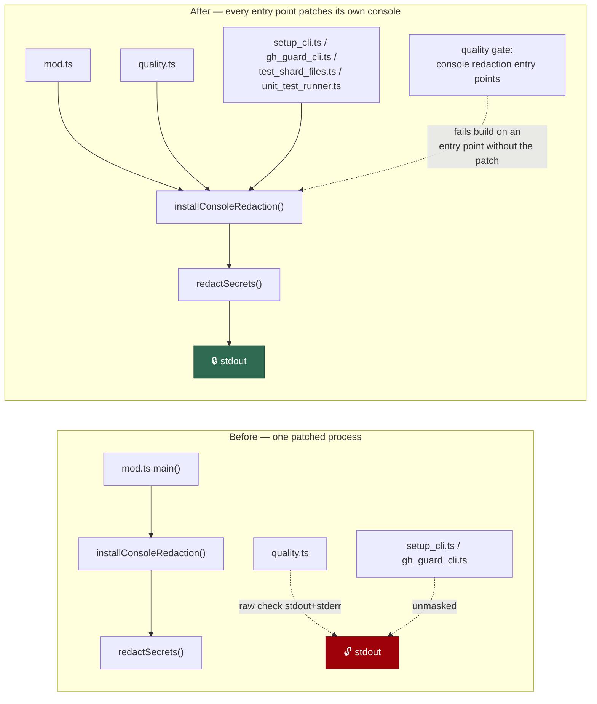

# Install console redaction in every entry point (Issue #1280)

## Summary

`installConsoleRedaction()` patches `console.*` **per process**, and the repo
had exactly one call site — `mod.ts`'s `main()`. Every other entry point ran
unpatched, so anything they printed reached stdout/stderr verbatim. The sharpest
case is `worker/deno/quality.ts`, which `./quality.sh` execs directly: it
streams each check's live output and then prints the assembled transcript built
from the raw `stdout + stderr` of every check, so a test, lint or build step
that echoed a tokenised clone URL or an `export FOO_TOKEN=…` line put that
credential straight onto stdout — which the worker captures and quotes onward
into failure comments and remediation prompts.

The fix installs the patch in each `import.meta.main` module and holds the
invariant with a new quality-gate check, in the shape of
`gh_spawn_chokepoint_check.ts`: a module with a top-level `import.meta.main`
guard that does not install the patch fails the build.

Closes #1280.

Changed:

- `worker/deno/quality.ts` — installs the patch first thing in `main()`, and the
  transcript/summary print stage moves into an exported `printGateOutput()`
  which installs it too. The installer is idempotent, and binding it to the
  function that prints the captured transcript means no reordering of `main()`
  can leave that path unpatched — it is also the seam the token test drives.
- `worker/deno/setup/setup_cli.ts`, `worker/deno/lib/gh_guard_cli.ts`,
  `worker/deno/test_shard_files.ts`, `worker/deno/unit_test_runner.ts` — install
  the patch as the first statement of their entry point. The guard child's
  stdout contract is unaffected: its NUL-encoded verdict is written through
  `Deno.stdout.write`, which the patch does not touch; only its stderr reason —
  which quotes the agent's own argv — is now masked.
- `worker/deno/lib/console_redaction_entrypoint_check.ts` (new) — pure scanner
  for the invariant, wired into the gate as `console redaction entry points`.
- `SECURITY.md`, `docs/THREAT-MODEL.md` — both asserted the patch was installed
  "once in `mod.ts`"; corrected to per-process, and the enforcing check recorded
  under control **C24**.



## Evidence

Backend/CLI change with no web interface, so there is nothing to screenshot.
The evidence is test output plus the gate.

**The regression test observed red against the unfixed code.** Before the entry
points were patched, the production-tree scan named exactly the five leaking
entry points:

```text
- [
-   "worker/deno/lib/gh_guard_cli.ts:259",
-   "worker/deno/quality.ts:87",
-   "worker/deno/setup/setup_cli.ts:1469",
-   "worker/deno/unit_test_runner.ts:71",
-   "worker/deno/test_shard_files.ts:71",
- ]
+ []
FAILED | 7 passed | 1 failed (203ms)
```

The token test was verified the same way: with the install removed from
`printGateOutput`, `printGateOutput - masks a token echoed by a check into the
transcript` and `printGateOutput - masks an exported token in a check's stderr`
both fail (`FAILED | 1 passed | 2 failed`); with the fix in place all three
pass.

After the fix:

```text
ok | 17 passed | 0 failed (278ms)   # the two new suites + console_redaction_test.ts
```

Full gate (`./quality.sh`) — `Result: PASSED (with skipped checks)`, with the
new check reporting alongside the existing chokepoint checks:

```text
  gh spawn chokepoint            PASSED
  issue-create label guard       PASSED
  console redaction entry points PASSED
```

### Original trigger closed, no trivial bypass

The trigger was a check echoing a credential into the output `quality.ts`
prints. Every write path in that process is now downstream of the patch:
`main()` installs it before parsing arguments, so the streamed `onProgress`
lines (`quality.ts`), the gate-error `console.error`, and the
`quality_gate.ts:1309`/`:1385` diagnostics are all covered; `printGateOutput()`
installs it again before printing the transcript and summary. The patch wraps
every string argument to `console.log/info/warn/error/debug/trace`, so no
`console.*` spelling in this process escapes it. The equivalent bypass —
adding a sixth entry point, or a new module with an `import.meta.main` guard,
that prints without installing the patch — is what the new gate check refuses:
it scans all production `.ts` under `worker/deno`, matches the guard on
comment-stripped source (so a commented-out install does not satisfy it), and
fails the build. Redaction itself remains the existing conservative
`redactSecrets()` chokepoint, so ordinary gate output is unchanged — asserted by
`printGateOutput - prints the summary and skips an empty transcript`.

Not closed by this change, and out of its scope: `Deno.stdout.write` and
`Deno.stderr.write` bypass the console entirely (the guard child's verdict
marker uses one deliberately), and subprocess output inherited straight to the
terminal — `unit_test_runner.ts` uses `stdout: "inherit"` — never passes through
this process's console.

## Test Plan

Added `worker/deno/tests/console_redaction_entrypoint_check_test.ts`:

- `::scanDirectoriesForMissingRedaction - every worker entry point installs console redaction`
  — the regression test. It reproduces the flaw, **fails against the unfixed
  code** (naming all five unpatched entry points, output quoted above) and
  **passes after the fix**.
- `::scanContentForMissingRedaction - flags an entry point that never installs the patch`
- `::scanContentForMissingRedaction - an entry point that installs the patch is clean`
- `::scanContentForMissingRedaction - a module with no entry-point guard is not an entry point`
- `::scanContentForMissingRedaction - comments mentioning the guard do not count`
- `::scanContentForMissingRedaction - a commented-out install does not satisfy the check`
- `::scanDirectoriesForMissingRedaction - walks directories and skips tests`
- `::scanDirectoriesForMissingRedaction - missing directories yield no violations`

Added `worker/deno/tests/quality_entrypoint_redaction_test.ts`, which drives the
real `quality.ts` print path with a capture sink swapped in ahead of the patch:

- `::printGateOutput - masks a token echoed by a check into the transcript` — a
  known-shaped fake token (`ghp_…` inside a clone URL) in a check's captured
  output is absent from what the entry point prints, and the placeholder is
  present. Fails against the unfixed code, passes after the fix.
- `::printGateOutput - masks an exported token in a check's stderr` — the
  `export ANTHROPIC_API_KEY=sk-ant-…` shape.
- `::printGateOutput - prints the summary and skips an empty transcript` — the
  surrounding transcript is untouched, so redaction stays targeted.

No existing test was modified or removed.
