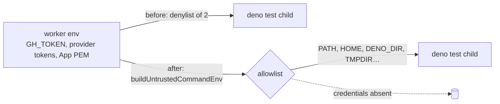

# Build the gate's `deno test` environment instead of inheriting it

## Summary

The quality gate's `deno test` stage spawned the checkout's own test suite with
`Deno.env.toObject()` minus a two-name denylist (`CONFIG_PATH`, `WORK_DIR`) —
neither a secret. Repository-supplied test code, including the `*_test.ts` files
the coding agent added or edited during the run, therefore executed as the
worker uid holding `GH_TOKEN`, the provider credentials
`credential_preflight.applyProviderCredentialEnv` exports into the process, and
the worker-only secrets `agent_env.ts` denies to every agent child by name
(`GITHUB_APP_PRIVATE_KEY`, `GITHUB_APP_PRIVATE_KEY_PATH`, `VIBE_IMGBB_API_KEY`).

`testStageEnv` now routes through `buildUntrustedCommandEnv` — the same
allowlist `quality_gate_phase.ts` already applies to the repository's own
quality command — plus a short, documented extras list for what this stage
genuinely needs. `CONFIG_PATH` and `WORK_DIR` remain absent because nothing puts
them on the allowlist, so the reasons #891 and #1098 dropped them still hold.

Closes #1281.



### What changed

- `worker/deno/lib/unit_test_passes.ts` — `testStageEnv` builds from
  `ALLOWED_ENV_NAMES` + `TEST_STAGE_EXTRA_ENV_NAMES` (`DENO_JOBS`,
  `VIBE_IMAGE_AGENT_PROVIDERS`, the suites' opt-in switches, `XDG_RUNTIME_DIR`,
  `PATHEXT`). Every extra is a switch or a path; a guard test asserts none is
  credential-shaped. Both gate passes and `deno task test:unit` /
  `test:integration` go through it.
- `worker/deno/lib/vibe_env_registry.ts` — declares the five `VIBE_*` switch
  names the extras list now mentions in `lib/`, as `switch` entries (the
  registry scan fails on any undeclared `VIBE_*` name in scanned source).

### Behaviour changes to existing tests (documented, not removed)

Two assertions in `quality_gate_test_env_test.ts` asserted the old pass-through
behaviour and were rewritten in place — no test was deleted or commented out:

- `everything else is passed through (Issue #891)` → `what the suite genuinely
  needs is kept (Issue #1281)`: asserts the allowlisted names survive
  (`PATH`, `HOME`, `DENO_DIR`, `DENO_JOBS`, `VIBE_IMAGE_AGENT_PROVIDERS`).
- `CONFIG_FILE is left alone (Issue #891)` → `an ambient CONFIG_FILE does not
  reach the suite either (Issue #1281)`: an ambient `CONFIG_FILE` names the
  operator's own credential-bearing config, so it is absent for the same reason
  `CONFIG_PATH` is. Nothing is lost — a test wanting its own fixture sets
  `CONFIG_FILE` in the environment of the process *it* spawns, which this does
  not touch.

## Evidence

Backend/CLI change with no web interface, so no screenshot: the evidence is the
red-then-green regression test and the gate run.

- Regression test against the **unfixed** `testStageEnv` (denylist body
  restored, everything else identical):

  ```text
  FAILED | 2 passed | 4 failed | 5 filtered out
  test stage env - a token in the worker's environment cannot be read by the
    spawned suite (Issue #1281) => ./tests/quality_gate_test_env_test.ts:138:6
  ```

- The same tests after the fix:

  ```text
  ok | 6 passed | 0 failed | 5 filtered out (65ms)
  ```

- Both gate passes over the whole suite, built by the changed code
  (`deno task test:unit`): parallel `18442 passed | 0 failed`, serial
  `PASSED in 11s`.

- `./quality.sh` — `Result: PASSED (with skipped checks)`; `deno tests`,
  `deno lint`, `deno type check`, `deno fmt`, `semgrep` all PASSED. The gate's
  own `deno test` stage ran under the new built environment, so the fix is
  exercised end to end.

### Trigger closed, no trivial bypass

The named trigger — issue/PR/comment text that prompt-injects the agent into
adding a `*_test.ts` file that reads a worker credential, run by the gate before
the work is pushed — is closed at the source: the child's environment is
constructed name by name from an allowlist, so a variable that is not named is
never in the child's address space, whatever the test file does. There is no
equivalent bypass through the same channel: both passes and the integration pass
share the one `testStageEnv` builder, `runCommand` spawns with `clearEnv: true`
(asserted by the existing #1098 test), and a credential added to the worker
tomorrow is excluded by default rather than needing a new denylist entry. The
extras list is fixed in source, guarded against credential-shaped names by
`test stage extras - the stage's own allowlist carries no credential name`, and
`VIBE_*` additions must additionally be declared in the env registry.

Out of scope, and stated rather than implied: this bounds what the suite can
*read from the environment*. It does not run the suite as the separate `agent`
account, so credential *files* the worker uid owns remain readable — the same
uid-separation gap `untrusted_command_env.ts` records as Issue #571, unchanged
by this PR.

## Test Plan

Added to `worker/deno/tests/quality_gate_test_env_test.ts`:

- `worker/deno/tests/quality_gate_test_env_test.ts::test stage env - a token in the worker's environment cannot be read by the spawned suite (Issue #1281)` —
  the regression test. Plants `GH_TOKEN=ghs_planted_by_the_parent_…` in an
  intermediate process, has that process build the real passes with
  `unitTestPasses` and spawn a probe through the gate's own `runCommand`, and
  asserts both passes' children print `ABSENT-IN-GRANDCHILD`. It **fails against
  the unfixed code** (the child printed the planted token, because `GH_TOKEN`
  was never on the two-name denylist) and **passes after the fix**.
- `…::test stage env - no worker credential reaches the suite (Issue #1281)` —
  sweeps the built environment by name (`isCredentialVariableName`) and by
  value over a realistic worker environment.
- `…::test stage env - an unknown variable is absent rather than inherited (Issue #1281)` —
  the allowlist covers the credential nobody has added yet.
- `…::test stage extras - the stage's own allowlist carries no credential name (Issue #1281)` —
  guard on the guard for `TEST_STAGE_EXTRA_ENV_NAMES`.
- `…::test stage env - what the suite genuinely needs is kept (Issue #1281)` and
  `…::test stage env - an ambient CONFIG_FILE does not reach the suite either (Issue #1281)` —
  the two rewritten assertions above.

Unchanged and still passing: the `#891`/`#1098` scrub tests in the same file,
`unit_test_passes_test.ts` (25 tests, including the `DENO_JOBS` bound and the
operator override), and `vibe_env_registry_test.ts`.
