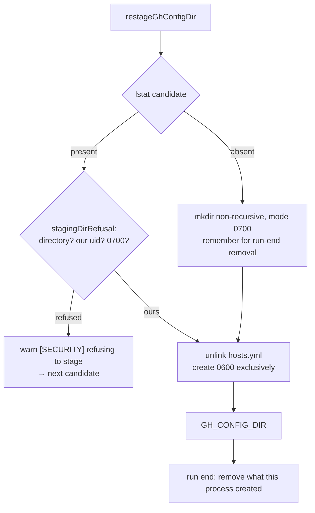

# PR Summary — Issue #1282

## Summary

The worker's `gh` credential re-stage wrote `hosts.yml` into a directory any
other local account could own. On a host run neither `VIBE_STATE_DIR` nor
`VIBE_SCRATCH_DIR` is set (the container entrypoint exports them, `loop.sh`
does not), so the only staging candidate was `${TMPDIR:-/tmp}/vibe-gh-config`
— one fixed path for every account on the box. The directory was created with
`recursive: true` (so a pre-planted one was adopted), the token was written at
the umask default and `chmod`'d **after** it was already on disk, every failure
in that block was swallowed by a bare `catch`, and nothing removed the
directory at the end of the run.

`worker/deno/lib/gh_credential_stage.ts` now binds the copy to this account
before the token touches the disk:

- the `TMPDIR` candidate is per-account via the repo's existing
  `sharedTmpStateDir` helper (Issue #1215) — `/tmp/vibe-gh-config-uid1000`, not
  `/tmp/vibe-gh-config`;
- the leaf directory is created **non-recursively** with `mode: 0o700` applied
  at creation, so an existing path is inspected rather than adopted;
- a pre-existing path that is not this account's private directory — a symlink
  or file, another uid's directory, or one with group/other bits — is
  **refused** for that candidate by `stagingDirRefusal`;
- `hosts.yml` is unlinked and then created with `{ mode: 0o600, createNew: true }`,
  so a planted symlink is dropped rather than followed and there is no
  world-readable window between the write and a later `chmod`;
- a refusal is **warned loudly** per candidate (`[SECURITY] refusing to stage
  the gh credential at …`) instead of being swallowed;
- a directory this process created is registered and removed at run end
  (`removeStagedGhConfigDirs`, armed on `unload`), so the credential does not
  outlive the worker.

Closes #1282.



## Evidence

Backend/CLI change with no web interface, so the evidence is test output rather
than a screenshot.

The pre-fix behaviour was reproduced directly against the unfixed code path (a
throwaway driver, since removed) with the candidate directory pre-created
world-writable and `hosts.yml` a symlink to a file the "attacker" controls:

```text
# unfixed code path
planted file now holds: "github.com:\n    oauth_token: <the staged token>\n"

# after the fix
planted file now holds: ""
```

Targeted suites, all green after the fix:

```text
deno test tests/gh_credential_stage_test.ts tests/service_account_env_test.ts \
  tests/gh_spawn_test.ts tests/gh_auth_test.ts tests/gh_guard_shim_test.ts \
  tests/git_timeout_test.ts
ok | 122 passed | 0 failed (755ms)
```

Full gate: `./quality.sh` was run and reports `deno tests` and `deno lint` as
FAILED — **both fail identically on the unmodified branch base** (verified by
stashing this change and re-running the gate). The failures are
`tests/lib_sweep_coverage_test.ts::every worker/deno/lib module is claimed by
exactly one sweep slice` (four unrelated modules —
`console_redaction_entrypoint_check.ts`, `guarded_issue_labels.ts`,
`issue_create_label_check.ts`, `self_diagnostic_attestation.ts` — claimed by no
sweep slice) and four `no-unused-vars` lint errors in
`tests/collect_self_diagnostic_candidates_test.ts`. None of those files is
touched by this change. Every check this change does affect —
`deno type check`, `deno fmt`, semgrep, and the suites above — passes.

## Reproduction

- **symptom** — on a shared host, a second local account that pre-creates
  `/tmp/vibe-gh-config` with a `hosts.yml` symlink receives the worker's
  `oauth_token`; failing that, the token is world-readable between the write
  and the `chmod`, and the directory is left behind after the run
- **status** — `verified` — the regression test was observed failing against
  the unfixed code (it staged into the pre-created world-writable directory and
  the planted file received the real token, output above) and passing after the
  fix
- **regression test** —
  `worker/deno/tests/gh_credential_stage_test.ts::restageGhConfigDir - refuses a pre-created world-writable candidate and never follows a planted hosts.yml symlink`

## Security

- **Regression test** — added
  `worker/deno/tests/gh_credential_stage_test.ts::restageGhConfigDir - refuses a pre-created world-writable candidate and never follows a planted hosts.yml symlink`,
  which reproduces the flaw: it **fails against the unfixed code** (the token is
  written through the planted symlink into the attacker's file) and **passes
  after the fix** (the candidate is refused, `restageGhConfigDir` returns null,
  and the planted file stays empty).
- **Original trigger closed, no trivial bypass** — the original attack input is
  a pre-existing path at the staging candidate. Every write now goes through
  `prepareStagingDir` → `stagingDirRefusal`, which `lstat`s (never follows) the
  candidate and refuses it unless it is a real directory, owned by this uid, with
  no group/other bits; a path that appears **after** that check still cannot be
  adopted, because the leaf `mkdir` is non-recursive (EEXIST → refused) and
  `hosts.yml` is created with `createNew: true` (EEXIST → refused) rather than
  truncating or following. The equivalent bypasses are closed with it: the
  fixed `/tmp/vibe-gh-config` name is now per-account, the mode is applied at
  creation rather than after the write, the refusal is warned rather than
  swallowed, and the directory this process created is removed at run end.

## Test Plan

Added to `worker/deno/tests/gh_credential_stage_test.ts`:

- `stagingDirRefusal - only this account's own private directory is staged into`
  — the refusal table: a symlink/file, another uid, group/other bits, and the
  clean case.
- `restageGhConfigDir - refuses a directory another account owns, staging the credential nowhere`
  — with no writable fallback, the credential is written nowhere and the warning
  names the foreign uid.
- `restageGhConfigDir - refuses a pre-created world-writable candidate and never follows a planted hosts.yml symlink`
  — the regression test (real filesystem, production IO).
- `restageGhConfigDir - creates the copy private from birth and removes it at run end`
  — asserts `0600` on the file and `0700` on the directory as created, then that
  `removeStagedGhConfigDirs()` removes what this process created.

Modified (documented, none removed or disabled):

- `stagingCandidates - with no roots configured, TMPDIR still serves` and
  `stagingCandidates - the durable state root before the agents' scratch` — the
  `TMPDIR` candidate is now per-account, so the expectations use the suffixed
  path and assert the old shared `/tmp/vibe-gh-config` is gone.
- `restageGhConfigDir - an unwritable candidate falls through to the next` and
  `service_account_env_test.ts::buildServiceAccountEnv - an unwritable gh config dir is restaged writable`
  — same path change.
- The test file's `fakeIo` was updated to the new IO seams
  (`writePrivateFile`, `makePrivateDir`, `lstat`, `remove`, `ownerUid`), which
  record creation modes and can report a foreign-uid directory.
