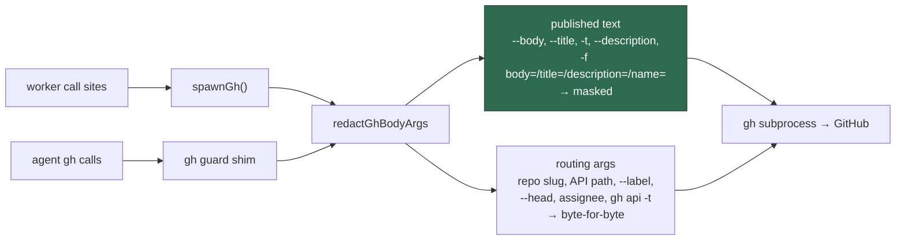

# Redact `gh` titles and label fields at the chokepoint (Issue #1283)

## Summary

`redactGhBodyArgs` — the chokepoint whose stated promise is that "every present
and future public sink inherits redaction by construction" — masked
body-shaped arguments only. `--title`, `-f title=`, `-f description=` and
`-f name=` are published just as widely (≈30 issue-create sites, `editIssue`,
`gh pr create`, the milestone and label REST calls) and reached GitHub
byte-for-byte, which is why `refinement_processor.ts` and
`revision_processor.ts` hand-wrapped `redactSecrets` around a new title.

This change covers published text at the chokepoint instead:

- `TEXT_FLAGS` gains `--title` and `--description` (plus the `--title=` /
  `--description=` spellings), and `-t` — the title shorthand on
  `issue`/`pr`/`release create` — everywhere except `gh api`, where `-t` is
  `--template` and must not be rewritten.
- `BODY_FIELD_KEYS` became `PUBLISHED_FIELD_KEYS` and gains `title`,
  `description` and `name`. This applies to `-f key=value`, `-F key=@path` and
  the `gh api --input` JSON body arm alike.
- Routing arguments stay byte-for-byte untouched: repo slug, API path,
  `--label`, `--head`, `assignee`, reaction fields, and a `gh api` output
  template.

Closes #1283.



## Evidence

Backend/CLI change with no web interface, so there is nothing to screenshot.
The evidence is the test run.

**Regression linkage.** `worker/deno/tests/gh_title_redaction_test.ts` was
written first and observed **failing against the unfixed code** — 6 of its 9
cases then failed, including
`redactGhBodyArgs - masks a secret in a --title argument`, whose diff was
`"--title", "run failed: ghp_a1B2c3D4e5…"` where
`"run failed: ***REDACTED***"` was expected. After the fix the whole file
passes:

```
deno test --allow-all tests/gh_title_redaction_test.ts \
  tests/gh_body_redaction_test.ts tests/gh_guard_cli_test.ts < /dev/null
ok | 51 passed | 0 failed
```

**Original trigger closed, no trivial bypass.** The trigger was a secret-shaped
token reaching GitHub through a title. Every argv spelling that carries a title
now runs through `redactSecrets` inside the single chokepoint both callers use
(`spawnGh` and the guard CLI): the separate flag (`--title x`, `-t x`), the
joined flag (`--title=x`), the REST field (`-f title=`), the file-backed field
(`-F title=@path`), and the `--input` JSON body key. The `--input` arm keeps
its fail-closed rule — a secret in a field the key-scan cannot reach still
raises `UnredactableBodyError` rather than publishing unscanned — so widening
the key set removed no refusal. The one remaining `-t` spelling deliberately
left alone is `gh api -t`, which is `--template`: a local output format that is
never sent to GitHub, so it is not a bypass of the sink.

## Acceptance Criteria

<!-- vibe-spec-review inputs="diff+issue-body" -->

The issue has no `## Acceptance Criteria` heading; the block below answers its
"What a fix looks like" list, which the Spec reviewer was asked to judge as
criteria.

- **met** — add `title`, `description` and `name` to the published-text set —
  evidence: `worker/deno/lib/gh_body_redaction.ts` (`PUBLISHED_FIELD_KEYS`),
  applied in `redactFieldAssignment` and `maskedJsonBody` — reviewer: met
- **met** — cover the `--title` / `--title=` flag spellings alongside `--body`
  — evidence: `worker/deno/tests/gh_title_redaction_test.ts::redactGhBodyArgs - masks a secret in the --title=<text> form`
  — reviewer: partial — reason: the reviewer's only gaps were the `-t`
  shorthand and the `--description` CLI spelling; both are covered in the
  second commit of this branch, with `gh api -t` (`--template`) excluded and
  tested
- **met** — routing arguments stay byte-for-byte untouched — evidence:
  `worker/deno/tests/gh_title_redaction_test.ts::redactGhBodyArgs - leaves routing arguments byte-for-byte alone`
  — reviewer: partial — reason: the reviewer noted `-F name=<repo>` is a
  GraphQL routing variable that now passes through `redactSecrets`. Redaction
  is shape-specific, so a repository name is never rewritten; that is now
  stated in the module comment and pinned by
  `redactGhBodyArgs - leaves a GraphQL name variable byte-for-byte alone`
- **met** — a test asserting a fake token in `--title` is masked and a clean
  repo slug is unchanged — evidence:
  `worker/deno/tests/gh_title_redaction_test.ts::redactGhBodyArgs - masks a secret in a --title argument`
  (asserts `--repo org/repo` survives) — reviewer: met
- **missing** — remove the `redactSecrets` hand-wrap in
  `refinement_processor.ts` / `revision_processor.ts` — reviewer: missing —
  reason: the issue names the hand-wrap as evidence of the gap, not as work to
  do; redaction is idempotent so the wraps are harmless, and removing them is
  out of this change's scope
- **unrequested** — `-t` and `--description` flag coverage, and the
  `THREAT-MODEL.md` C24 row — reviewer: unrequested — reason: `-t` and
  `--description` are further spellings of the exact sinks the issue names
  (leaving them would ship a chokepoint that covers one spelling of a field and
  not its sibling); the C24 row is the docs surface owed by the code change
- **unrequested** — `worker/deno/tests/support/gh_body_fixtures.ts` —
  reviewer: unrequested — reason: DRY fix raised by the Standards reviewer, so
  the two redaction suites share one token/reader/writer fixture instead of
  keeping a third copy

## Standards Review

<!-- vibe-standards-review inputs="diff+CODING-STANDARDS.md" -->

- **violation** — `tests/gh_guard_cli_test.ts` used a `title` field as its
  "secret outside the body field" fixture, so the widened key set masked it and
  the test went red — evidence:
  `worker/deno/tests/gh_guard_cli_test.ts:307` — reason: fixed here; the
  fixture moved to `head`, a routing field, and the fail-closed assertion is
  unchanged
- **violation** — `-t`, the everyday title shorthand, still published
  unredacted — evidence: `worker/deno/lib/gh_body_redaction.ts:71` — reason:
  fixed here; `-t` is covered for every subcommand except `gh api`
- **violation** — `--description` (the CLI spelling of the label description at
  `lib/label_operations.ts:190`) left uncovered while `-f description=` was
  added — evidence: `worker/deno/lib/gh_body_redaction.ts:74` — reason: fixed
  here
- **violation** — `name` now passes GraphQL routing variables through
  redaction, contradicting the module's "routing args untouched" wording —
  evidence: `worker/deno/lib/gh_body_redaction.ts:103` — reason: stands, with
  the wording corrected: masking is shape-specific, a repository name cannot
  match a rule, and a test pins that. The issue asks for `name` because a
  label's name is published
- **violation** — `docs/THREAT-MODEL.md:192` (control C24) not updated
  alongside `SECURITY.md` — evidence: `docs/THREAT-MODEL.md:192` — reason:
  fixed here
- **violation** — test helpers duplicated across the two redaction suites —
  evidence: `worker/deno/tests/gh_title_redaction_test.ts:30` — reason: fixed
  here via `worker/deno/tests/support/gh_body_fixtures.ts`
- **violation** — `TEXT_FLAGS` and `TEXT_FLAG_PREFIXES` are two hand-maintained
  lists of the same flag knowledge — evidence:
  `worker/deno/lib/gh_body_redaction.ts:71` — reason: stands. Deriving the
  `--x=` forms would hide the `-b` / `-t` shorthands, which have no `=` form,
  behind a special case; two short literal lists are the simpler shape
- **clean** — Australian English throughout; tests call the real function with
  real argv and assert on returned values (no source-grepping, no sleeps, no
  wall-clock budgets); no existing test deleted or commented out; the
  `UnredactableBodyError` fail-closed paths are untouched; no hidden or
  credential paths staged; `deno fmt` and `deno lint` clean

## Test Plan

- **Added** `worker/deno/tests/gh_title_redaction_test.ts` — 12 cases:
  `--title`, `--title=`, `-t` (and `gh api -t` left alone), `--description`,
  `-f title=` / `-f description=`, `-f name=`, `-F title=@path`, a `title` in a
  `gh api --input` JSON body, a clean title surviving byte-for-byte, the
  routing-argument invariant, the GraphQL `-F name=<repo>` invariant, and the
  `--input` fail-closed refusal on a routing field.
- **Added** `worker/deno/tests/support/gh_body_fixtures.ts` — shared fake
  token, reader and writer for both redaction suites.
- **Modified** `worker/deno/tests/gh_body_redaction_test.ts` — two fixtures
  that used `title` as their "not published text" example moved to `assignee`
  and `head`. Each keeps the invariant it asserted; `title=@path` is now
  covered in the new file. Documented in-file and in the commit message.
- **Modified** `worker/deno/tests/gh_guard_cli_test.ts` — the same fixture
  change for the guard-CLI copy of the unreachable-field case.
