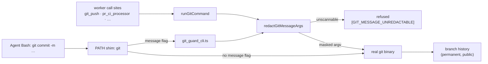

# 🔐 A `git` argv chokepoint and a `git` PATH shim

## Summary

`git` had a spawn chokepoint but no redaction at it, and the agent subprocess
had no `git` wrapper at all — so `git commit -m "$GH_TOKEN" && git push` reached
a public branch with no control anywhere in the path. Unlike a comment, pushed
history is permanent and mirrored by every clone. Both halves are closed.
Closes #1284.

- **`redactGitMessageArgs()`** (`worker/deno/lib/git_message_redaction.ts`) masks
  `-m` / `--message` / `--message=` / `-m<text>` / `-am <text>` and the contents
  of `-F` / `--file`, following `redactGhBodyArgs`'s rule exactly: only
  text-carrying arguments are rewritten, the argument count never changes, and
  routing arguments stay byte-for-byte. Scoping is **per subcommand**, because
  `-m` is a message only in `commit`/`tag`/`merge`/`notes`/`stash` — it is a
  mainline number in `revert`/`cherry-pick`, a rename in `branch`, and `--merge`
  (taking no argument) in `rebase`, so consuming the next argument on the
  strength of the letter alone would corrupt those commands. `git`'s own leading
  global options (`-C <path>`, `-c <k=v>`, `--git-dir …`) are stepped over first.
- **Wired into `runGitCommand`** (`worker/deno/lib/git_timeout.ts`), the worker's
  single `git` spawn point, so `git_push.ts`, `pr_ci_processor.ts`,
  `branch_history_rewrite.ts` and `bump_deps_phase.ts` all inherit it. A message
  that cannot be scanned (`-F -`, an unreadable path) fails the call with
  `[SECURITY] [GIT_MESSAGE_UNREDACTABLE]` rather than being committed unscanned;
  a masked one says so with `[SECURITY] [GIT_MESSAGE_REDACTED]`.
- **A `git` PATH shim beside the `gh` one.** `installGhGuardShim` now writes a
  second wrapper named `git` into the same per-spawn directory
  (`worker/deno/lib/git_guard_shim.ts`), so one `PATH` prefix covers both
  binaries and one cleanup removes both. A message-carrying `git` re-enters
  `worker/deno/lib/git_guard_cli.ts`, which returns the redacted argv as
  NUL-terminated fields; the wrapper `exec`s that argv, and fails closed on a
  missing `VIBE_GIT_GUARD_ALLOW` marker exactly as the `gh` wrapper does.
  A command with no option *containing* an `m` or an `F`, and no long `--f…`
  option, skips the guard child entirely. The test is on the whole option rather
  than its first letter because `git` clusters short options —
  `git commit -am "$GH_TOKEN"` is the same exploit as `-m` — and it deliberately
  over-matches (`--format`, `--amend`, `--force` all reach the guard and come
  back untouched), because under-matching is a silent bypass.
- **Long-option abbreviations are covered.** `git` expands any unambiguous
  prefix, so `git commit --mess "$TOKEN"` commits exactly as `--message` does;
  matching only the full spelling would have left a one-character bypass.
  `--message` is matched from `--m` (a false match there can only redact some
  other option's routing value, which never matches a secret shape); `--file` is
  matched from `--fil`, the shortest prefix `git` itself does not reject as
  ambiguous with `--fixup`, so `git commit --fixup <ref>` is untouched.

## Evidence

Backend/CLI change — no web interface to screenshot. The evidence is the argv the
chokepoint finally spawned, asserted in both new test files, plus a live
end-to-end run of the installed wrapper against a real repository:

```text
$ # the installed shim on the child's PATH, driving real git
exit 0
leak ***REDACTED***
/tmp/vibe-gh-guard-f0a81ceeaa620ce9/git
[SECURITY] [GIT_MESSAGE_REDACTED] a secret was masked in the message of this git command before it reached history.
```

`./quality.sh` passes in full (deno tests, lint, type check, fmt, semgrep,
markdownlint, mermaid, and both spawn-chokepoint gates).



### Security-fix evidence

- **Regression test that fails before and passes after.** Added
  `worker/deno/tests/git_message_redaction_test.ts::runGitCommand masks a token in the commit message it spawns (Issue #1284)`,
  which commits `chore: leak ghp_…` through `runGitCommand` into a throwaway
  repository and reads the message back out of history. It was **observed
  failing** against the unfixed `runGitCommand` (`FAILED | 18 passed | 3 failed`
  — that test plus the two sibling chokepoint tests) and passes after the wiring
  (`ok | 35 passed | 0 failed`).
- **The agent half is covered the same way** by
  `worker/deno/tests/git_guard_shim_test.ts::git-guard-shim - a token spelled -am <text> (cluster) never reaches git (Issue #1284)`
  and its seven sibling spellings, each of which installs the real shim, runs it
  against a stub `git` that logs its argv, and asserts the token is absent from
  that log. The `-am` case in particular **failed against the first version of
  this branch** — the fast path's `-m*` pattern does not match `-am`, so the
  wrapper `exec`d the raw argv — and passes against the `-*m*|-*F*|--f*`
  patterns shipped here.
- **The original trigger is closed, with no trivial bypass.**
  `git commit -m "$GH_TOKEN" && git push` from the agent's shell now resolves
  `git` to the shim, which routes the command to the guard (the `-m` prefix
  matches the fast-path test) and `exec`s the argv the guard returned, in which
  `redactSecrets` has replaced the token. The equivalent spellings are closed by
  construction rather than by pattern-matching one shape: the attached form
  (`-m$GH_TOKEN`), the cluster (`-am $GH_TOKEN`), the long forms
  (`--message`, `--message=`), every abbreviation `git` would expand
  (`--m` … `--messag`, and `--fil`) and the file form (`-F msg.txt`, whose
  contents are scanned and inlined) all reach the same redaction, and
  `git -C /repo commit -m` is scoped identically because the global options are
  stepped over first; `git commit-tree -m` is covered too. The
  worker's own path is closed at `runGitCommand`, which the
  `git spawn chokepoint` quality gate already proves is the only `git` spawn in
  `worker/deno/`. Two residual bypasses are stated rather than closed, in
  `git_guard_shim.ts` and in SECURITY.md §6b: an agent that invokes the real
  binary by absolute path or edits `PATH` is outside this boundary (this is a
  containment control, not a sandbox), and the wrapper rides on the `gh`
  install, so a run with no `gh` on `PATH` — or an operator opt-in to
  `VIBE_ALLOW_UNGUARDED_AGENT_GH=1` — has no `git` wrapper either.

## Test Plan

50 new tests across four files; `./quality.sh` passes in full.

New — `worker/deno/tests/git_message_redaction_test.ts` (25 tests):

- masks `-m`, `--message`, `--message=`, `-m<text>`, `-am <text>`, `-am<text>`
  and every abbreviation `git` would expand (`--m` … `--messag`, `--fil`)
- masks `tag`, `merge`, `notes`, `stash` and `commit-tree` messages
- scopes past `git`'s own `-C` / `-c` / `--git-dir` global options
- leaves routing arguments byte-for-byte: `-C <sha>`, `revert`/`cherry-pick`/
  `branch`/`rebase` `-m`, `commit-tree -p`, `--fixup <ref>`, an ambiguous
  `--fi`, a cluster whose earlier letter takes the value (`-Sm keyid`), and
  anything after `--`
- `-F` file contents inlined as a masked `-m` only when a secret was present;
  the caller's own file is never rewritten; no reader means no file read
- fails closed on `-F -` and on an unreadable path
- four end-to-end tests driving real `git` through `runGitCommand` and reading
  the message back out of history, including the unchanged-ordinary-message case

New — `worker/deno/tests/git_guard_shim_test.ts` (14 tests), all behavioural —
the installed wrapper is run for real against a stub `git` that logs its argv:

- eight message spellings, each asserting the token is absent from that log and
  the mask is present
- a `-F` message file masked without the agent's own file being rewritten
- `git push origin HEAD` passed through untouched via the fast path
- `git log -1 --format=%H` (which reaches the guard) returned byte-for-byte
- a broken guard refuses the call and the real `git` never runs
- no `git` on `PATH` means no `git` wrapper, since the child has no `git` either

New — `worker/deno/tests/git_guard_cli_test.ts` (8 tests) and
`worker/deno/tests/guard_field_encoding_test.ts` (4 tests): the guard's verdict,
its refusals, and the NUL framing carrying newlines, quotes and backslashes.

Modified — `worker/deno/tests/collect_self_diagnostic_candidates_test.ts`: four
unused imports removed; no test was changed, removed or commented out.

## Acceptance Criteria

<!-- vibe-spec-review inputs="diff+issue-body" -->

The issue states its criteria under "What a fix looks like". An independent Spec
reviewer was given the diff and the issue body only; its verdicts are recorded
below, including the two it failed the diff on — both were real and both are
fixed in this branch.

- **met** — apply message-argument redaction inside `runGitCommand` for `-m` /
  `--message` / `-F <path>`, mirroring `redactGhBodyArgs`'s routing-arguments-
  untouched rule — evidence:
  `worker/deno/lib/git_timeout.ts:174-200` and
  `worker/deno/tests/git_message_redaction_test.ts::runGitCommand masks a token in the commit message it spawns (Issue #1284)`
  — reviewer: met
- **met** — install a `git` PATH shim beside the `gh` one in
  `gh_guard_shim.ts`, so the agent's own commits pass the same redaction —
  evidence: `worker/deno/lib/gh_guard_shim.ts:476-494` and
  `worker/deno/tests/git_guard_shim_test.ts::git-guard-shim - a token spelled -am <text> (cluster) never reaches git (Issue #1284)`
  — reviewer: partial — reason: the reviewer found the wrapper's fast path
  (`-m*|--message*|-F*|--file*`) did not match a short cluster, so
  `git commit -am "$GH_TOKEN"` bypassed the guard entirely. Confirmed and fixed
  — the patterns are now `-*m*|-*F*|--f*`, and the eight message spellings
  (including `-am`, `-am<text>` and the abbreviated `--mess`) are each driven
  through the installed wrapper against a stub `git` that logs its argv.
- **met** — ship each half with a test asserting a known-shaped fake token in a
  commit message is absent from the argv the chokepoint finally spawns —
  evidence: `worker/deno/tests/git_message_redaction_test.ts` reads the message
  back out of real history; `worker/deno/tests/git_guard_shim_test.ts` reads it
  out of the stub `git`'s argv log — reviewer: met
- **unrequested** — long-option abbreviation support (`--mess`, `--fil`) —
  reviewer: unrequested — reason: the reviewer raised it as a live bypass
  (`git commit --mess "$TOKEN"` is a valid commit `git` accepts), so closing it
  is part of "no trivial bypass" rather than new scope; the `--file` floor of
  three characters keeps `git commit --fixup <ref>` untouched.
- **unrequested** — fail-closed refusal on an unscannable message (`-F -`, an
  unreadable path) rather than redaction alone — reviewer: unrequested —
  reason: the repo's fail-loud standard forbids treating "could not scan" as
  "nothing to mask"; it mirrors `UnredactableBodyError` at the `gh` chokepoint.
- **unrequested** — `-F <path>` rewritten to an inline masked `-m` — reviewer:
  unrequested — reason: this is exactly how `redactGhBodyArgs` handles
  `--body-file`, and it is what keeps the agent's own file from being rewritten;
  it happens only when the file actually contained a secret.
- **unrequested** — `git commit-tree -m` added to the message subcommands —
  reviewer: unrequested — reason: the reviewer named it as a plumbing spelling
  reachable from the agent's unrestricted shell that writes the same history.
- **unrequested** — `worker/deno/lib/guard_field_encoding.ts` extracted from
  `gh_guard_cli.ts` — reviewer: unrequested — reason: DRY; the NUL framing is
  now written once and used by both guards rather than copied.
- **unrequested** — `[SECURITY] [GIT_MESSAGE_REDACTED]` stderr line on a masked
  call — reviewer: unrequested — reason: the `gh` guard emits the equivalent
  `[GH_BODY_REDACTED]`; a control that acts silently cannot be audited.
- **unrequested** — `docs/audits/lib-sweep-coverage.json` also claims four
  modules left unclaimed by earlier merges on this milestone branch, and four
  unused imports were dropped from
  `worker/deno/tests/collect_self_diagnostic_candidates_test.ts` — reviewer:
  unrequested — reason: both were pre-existing failures of `./quality.sh` on
  the base commit (`lib_sweep_coverage_test.ts` and `deno lint`); the gate must
  be green before a PR exists, and each is a one-line correction rather than a
  refactor.

## Standards Review

<!-- vibe-standards-review inputs="diff+CODING-STANDARDS.md" -->

- **violation** — the shim's fast path skipped clustered short options, so
  `git commit -am "$GH_TOKEN"` reached the real `git` unredacted — evidence:
  `worker/deno/lib/git_guard_shim.ts:91` (as reviewed) — reason: fixed here; the
  patterns are now `-*m*|-*F*|--f*` and eight message spellings are driven
  through the installed wrapper.
- **violation** — the "strict superset" claim in the module comment and in
  `SECURITY.md` was false — evidence:
  `worker/deno/lib/git_guard_shim.ts:86` (as reviewed) — reason: fixed here;
  both the comment and SECURITY.md §6b now state the whole-option test and say
  why it over-matches.
- **violation** — the shim was exercised end to end only with `commit -m`, which
  is why the `-am` gap shipped green — evidence:
  `worker/deno/tests/git_guard_shim_test.ts:158` (as reviewed) — reason: fixed
  here; the table-driven test covers `-m`, `-m<text>`, `-am`, `-am<text>`,
  `--message`, `--message=`, `--mess` and `tag -m`, plus `-F <path>`.
- **violation** — the `gitShimPath`-absent branch had no test — evidence:
  `worker/deno/lib/gh_guard_shim.ts:476` — reason: fixed here; added
  `git-guard-shim - no git on PATH means no git wrapper (there is nothing to guard)`.
- **violation** — two tests asserted on the generated bash source text rather
  than behaviour — evidence: `worker/deno/tests/git_guard_shim_test.ts:96` (as
  reviewed) — reason: fixed here; the source-text assertions are gone and the
  fail-closed contract is covered behaviourally by the broken-guard test.
- **violation** — no test file for `guard_field_encoding.ts` or
  `git_guard_cli.ts` — evidence: `worker/deno/lib/guard_field_encoding.ts:1` —
  reason: fixed here; added `tests/guard_field_encoding_test.ts` and
  `tests/git_guard_cli_test.ts`, matching the `gh_guard_cli_test.ts` precedent.
- **violation** — unrelated churn in `docs/audits/lib-sweep-coverage.json` (an
  em dash re-encoded as `—`) — evidence:
  `docs/audits/lib-sweep-coverage.json:4` — reason: fixed here; the em dash is
  restored, leaving only the added path entries in that file's diff.
- **violation** — the PR summary was missing — evidence:
  `docs/archive/pr-summaries/pr-summary-1284.md` — reason: it did not exist when
  the reviewer ran; this file is it.
- **clean** — Australian English throughout; TDD (the chokepoint tests were run
  red before the wiring and green after); no test removed or commented out;
  fail-loud error handling (`Result` error tagged
  `[SECURITY] [GIT_MESSAGE_UNREDACTABLE]`, positive-marker-only wrapper, exit
  126 on a garbled verdict or an argv-count mismatch, non-`UnredactableMessageError`
  re-thrown); KISS/DRY (one `MESSAGE_SUBCOMMANDS` table, one NUL framing); file
  sizes 24–360 lines with one job each; commit safety (no hidden or
  credential-shaped path staged, no `git add -f`, no `--no-verify`); commit
  messages reference `#1284` and carry the run-id trailer; docs updated with the
  code (SECURITY.md §6b and its redaction-sink list, THREAT-MODEL C24, the
  chunk-12d audit ledger, the sweep-coverage ledger, the `VIBE_` registry);
  secure coding (routing arguments provably untouched and tested, argv-count
  invariant re-checked before `exec`, guard child runs `--allow-read` only,
  paths shell-quoted, `#!/bin/bash` not `env bash`, the caller's `-F` file never
  rewritten in place, the log line names the source and never the text).
