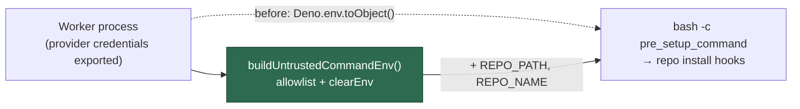

## Summary

`runPreSetupCommand` (`worker/deno/lib/repo_config.ts`) was the last
repo-adjacent shell spawn that inherited the worker's whole environment via
`...Deno.env.toObject()`. By the time it runs, `applyProviderCredentialEnv` has
already exported `CLAUDE_CODE_OAUTH_TOKEN` / `ANTHROPIC_API_KEY` /
`DEEPSEEK_API_KEY` into that environment — and the pre-setup command's stated
purpose is the repository's own dependency setup, so it runs the repository's
install hooks with the worker's full credential set.

It now builds the child environment with `buildUntrustedCommandEnv()` and
`clearEnv: true`, layering `REPO_PATH` / `REPO_NAME` on top, matching the four
sibling call sites (`pre_flight_gate.ts`, `dependency_lock_regen.ts`,
`bump_deps_phase.ts`, `quality_gate_phase.ts`). Closes #1285.

### Original trigger closed, no trivial bypass

The trigger was the inherited environment itself: any `pre_setup_command` — or
any install hook it reaches — could read a provider credential with
`echo $CLAUDE_CODE_OAUTH_TOKEN`. The child environment is now **built by
allowlist**, not filtered: `buildUntrustedCommandEnv()` copies only the names in
`ALLOWED_ENV_NAMES`, and `clearEnv: true` means nothing else reaches the child at
all. No credential name is on that allowlist, so there is no variant spelling,
suffix or new provider name to bypass with — a denylist could be evaded, an
allowlist has nothing to slip past. The only remaining additions are the two
explicit overrides `REPO_PATH` and `REPO_NAME`, both worker-computed, neither
carrying a secret. Deeper descendants inherit from the built environment, so
grandchild processes are covered by construction.

## Evidence

Backend/CLI change with no web interface, so there is no screenshot to capture.
The evidence is the two regression tests below, run against the unfixed and
fixed code, plus the full gate.

Both new tests were run against the **unfixed** code first and failed:

```
pre-setup command - a repo's install hook sees only the allowlisted environment => FAILED
  the child inherited names the allowlist never granted: VIBE_RUN_ID, WORKER_LOG_FILE,
  CLAUDE_CODE_ENTRYPOINT, VIBE_STATE_DIR, ... (31 names)
pre-setup command - a provider credential in the worker's environment is out of reach => FAILED
  AssertionError: the pre-setup command could read a provider credential
FAILED | 0 passed | 2 failed
```

After the fix, the whole file and the pre-setup suite pass:

```
deno test tests/untrusted_spawn_env_test.ts tests/repo_config_test.ts
ok | 57 passed | 0 failed (1s)
```

Full gate: `./quality.sh` → `Result: PASSED (with skipped checks)` — semgrep,
markdownlint, deno tests, lint, type check and fmt all PASSED.

Where the environment now comes from:



## Test Plan

Added to `worker/deno/tests/untrusted_spawn_env_test.ts` — the existing
regression file for this class (Issues #572 / #1214):

- `worker/deno/tests/untrusted_spawn_env_test.ts::pre-setup command - a repo's install hook sees only the allowlisted environment`
  — runs a real pre-setup command that dumps its own environment and asserts
  every name it can see was put there by the allowlist (plus `REPO_PATH` /
  `REPO_NAME`, which it also asserts still arrive). Reproduces the flaw: it
  fails against the unfixed code, because an inherited environment always
  carries names outside a thirty-name allowlist, and passes after the fix.
- `worker/deno/tests/untrusted_spawn_env_test.ts::pre-setup command - a provider credential in the worker's environment is out of reach`
  — plants a known-shaped fake token (`sk-ant-oat01-…`) as
  `CLAUDE_CODE_OAUTH_TOKEN` / `ANTHROPIC_API_KEY` in a **child** worker's
  environment, has that child run the real `runPreSetupCommand`, and asserts the
  spawned command cannot read the token. Fails against the unfixed code with
  "the pre-setup command could read a provider credential"; passes after the fix.
  The credential is planted in a child process, never this one, so nothing
  process-wide is mutated and the test stays parallel-safe (Issue #880).

Existing `worker/deno/tests/repo_config_test.ts` pre-setup tests (success,
failure, timeout, invalid path, `no_command`) are unchanged and still pass.

Documentation updated in the same change: `docs/CONFIGURATION.md` (Pre-Setup
Command — the environment is built, not inherited, and how a repo declares a
further variable) and `SECURITY.md` (the fourth sibling spawn now closed).
