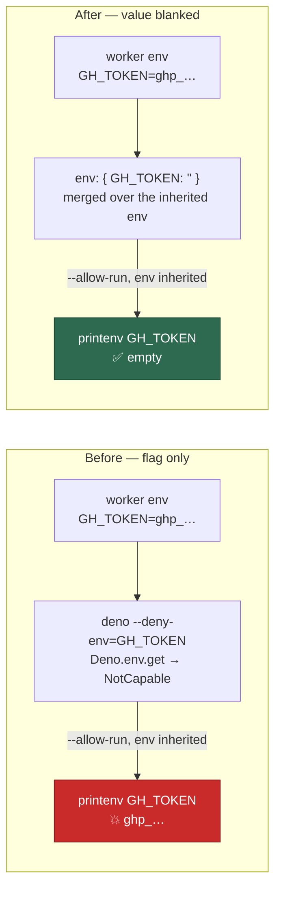

# 🟠 The Playwright MCP secret guard now removes the values, not just the read permission

## Summary

`generateMcpConfig` relied on Deno's `--deny-env` to keep the worker's secrets
away from the Playwright MCP server. That flag is a permission check **inside
the Deno runtime**: the values stay in the process environment, and the very
next flag — `--allow-run`, needed to launch Chromium — lets the server spawn a
child that inherits them verbatim. A hijacked `@playwright/mcp` publish reads
`GH_TOKEN` with one `printenv`, and the guard buys nothing. The generator is on
the live agent path (`lib/agent_mcp_config.ts:126`), not just setup.

The fix blanks every name in `PLAYWRIGHT_MCP_DENIED_ENV` in the server's own
`env` block — the map the MCP client hands the process, and therefore what any
child inherits — and additionally deny-lists the credential stores the
otherwise unscoped `--allow-read` / `--allow-write` could reach. `--deny-env`
stays as defence in depth for the in-process read. Closes #1288.

## Evidence

Backend/CLI change — no web interface to screenshot. Three verifications, all
run on this host (deno 2.9.6, Claude Code client, `@playwright/mcp@0.0.75`):

1. **The client's `env` semantics were verified before landing the fix**, which
   the issue called for explicitly. A probe MCP server (`command` = a Deno
   script that dumps `Deno.env.toObject()`) was launched by the real Claude
   Code client with `env: {"MARKER_FROM_CONFIG":"present"}`: the child saw the
   marker **and** the full inherited environment (62 vars, including a
   `SECRET_CANARY=leaked` exported only by the parent). The client **merges**
   rather than replaces, so blanking overrides the real value and `PATH` is not
   stripped. A second run with `env: {"SECRET_CANARY":""}` showed the child
   reading `''` with `PATH` intact.
2. **The fix was then verified end to end through the same client.** With
   `GH_TOKEN=canary-gh GITHUB_TOKEN=canary-gt ANTHROPIC_API_KEY=canary-anthropic
   VIBE_IMGBB_API_KEY=canary-imgbb` in the parent, a config produced by the
   patched `generateMcpConfig` gave the child `''` for all seven denied names,
   while `PATH`, `HOME` and `PLAYWRIGHT_BROWSERS_PATH=/opt/playwright-browsers`
   survived.
3. **The real MCP server still works under the new argv.** The server was
   spawned with the exact generated `args` (including
   `--deny-read`/`--deny-write` over `~/.ssh`, `~/.config/gh`, `$GH_CONFIG_DIR`,
   `$CLAUDE_CONFIG_DIR`), driven over stdio through `initialize` →
   `browser_take_screenshot`, and wrote a 4254-byte PNG. Chromium launched from
   the baked browser; nothing was denied that the server needs. `--deny-read`
   biting was confirmed separately: a Deno process with `--allow-read
   --deny-read=/home/vibe/.config/gh` fails `NotCapable` on `hosts.yml` while
   other reads succeed.

**Original trigger closed, no trivial bypass.** The issue's trigger is
`printenv <NAME>` (or `sh -c 'curl -d @<(env)'`) from a child of the MCP
server. A child inherits the environment its parent was given, and that
environment is now the merge of the worker's environment with
`{ANTHROPIC_API_KEY:"", GH_TOKEN:"", GITHUB_TOKEN:"", GITHUB_APP_PRIVATE_KEY:"",
GITHUB_APP_PRIVATE_KEY_PATH:"", GIT_SSH_COMMAND:"", VIBE_IMGBB_API_KEY:""}` —
so every name the deny list claimed to protect is empty at any depth of the
process tree, not merely unreadable through `Deno.env.get()`. The blanking is
derived from `PLAYWRIGHT_MCP_DENIED_ENV` itself, so a name cannot be added to
the deny list and silently missed by the scrub, and
`setup_screenshot_test.ts::generateMcpConfig - blanks every denied secret in
the server's own environment (Issue #1288)` fails if one is dropped. The
equivalent file-side bypass named in the issue (`~/.config/gh/hosts.yml`) is
closed for the server process by `--deny-read`/`--deny-write`.

**Residual risk, stated rather than papered over:** every Deno permission binds
the server process only. Chromium must be launched under `--allow-run` and can
read files itself, so a spawned child remains outside this boundary — the
container is what bounds it. This is documented in `resolveDeniedPaths`'s
docstring; an allowlist for `--allow-read` was rejected because the legitimate
read set (Deno cache, npm cache, fontconfig, the clone) varies by host and a
near miss breaks every screenshot.

## Test Plan

Added to `worker/deno/tests/setup_screenshot_test.ts` (all seven fail against
the unfixed generator except where noted, and pass after the fix — observed:
`FAILED | 43 passed | 4 failed` before, `ok | 47 passed | 0 failed` after):

- `worker/deno/tests/setup_screenshot_test.ts::generateMcpConfig - blanks every denied secret in the server's own environment (Issue #1288)`
  — the regression test for the reported flaw: it asserts a `playwright.env`
  entry of `""` for **every** name in `PLAYWRIGHT_MCP_DENIED_ENV`, baked and
  host alike. Against the unfixed code the env block is `undefined` on the host
  path and carries only `PLAYWRIGHT_BROWSERS_PATH` on the baked path, so it
  fails; it passes after the fix.
- `…::generateMcpConfig - blanking the secrets keeps the baked browser pointer (Issue #1288)`
  — the scrub must not drop `PLAYWRIGHT_BROWSERS_PATH`.
- `…::generateMcpConfig - denies read and write of the credential stores (Issue #1288)`
- `…::generateMcpConfig - omits the deny-path flags when there is nothing to deny (Issue #1288)`
  — `--deny-read=` with an empty list would deny every read (this one passes
  before and after; it guards the new flag construction).
- `…::resolveDeniedPaths - covers the credential stores under HOME`
- `…::resolveDeniedPaths - covers the relocated gh config and the app private key`
- `…::resolveDeniedPaths - returns nothing when the environment names no home`
- `…::generateMcpConfig - refuses a denied path Deno cannot express (Issue #1288)`
  — a comma in a path splits the permission list, so the generator throws
  rather than emit a deny list that looks complete and protects nothing.

**Existing test modified (documented as required):**
`…::generateMcpConfig - keeps the OS sandbox when no browser is baked in`
asserted `server.env === undefined` on the host path. The env block is now
always present because it carries the blanked secrets, so that assertion was
narrowed to "no `PLAYWRIGHT_BROWSERS_PATH` when nothing is baked" — the
behaviour the test actually exists to protect. No test was removed or
commented out.

Also updated: `docs/DEPLOYMENT.md` and `docs/CONTAINER.md`, both of which
stated the `--deny-env` guarantee that this change corrects.
