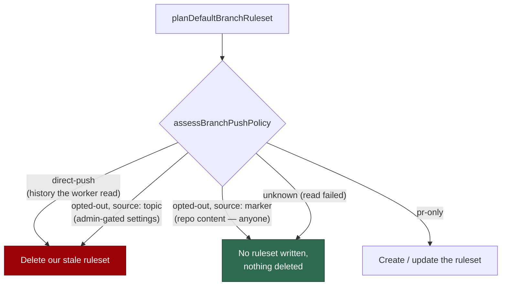

# 🟡 The `.vibe/no-default-branch-ruleset` marker never deletes protection

## Summary

The default-branch ruleset configurator treated the `.vibe/no-default-branch-ruleset`
marker file as strong enough evidence to **delete** the "Vibe Coder default
branch" ruleset. The marker is ordinary repository content: anybody with write
access — or anybody whose PR gets merged — can land it, so one commit removed
the required-status-check gate on the next `setup.sh` run.

`BranchPushPolicy` now records **which** opt-out signal fired, and removal is
gated on evidence the worker trusts:

- `opted-out` gains `source: "topic" | "marker"`
  (`worker/deno/lib/branch_push_policy.ts`).
- `planDefaultBranchRuleset` deletes the worker's own ruleset only for
  `direct-push` (commit history the worker read itself) or an `opted-out`
  verdict whose `source` is `"topic"` — the `direct-push` repository topic is
  repository *settings* and takes admin permission to write
  (`worker/deno/lib/default_branch_ruleset.ts`).
- The marker still suppresses *creating* a ruleset. It simply cannot remove
  protection that already exists, which is the direction the fix refuses.

Closes #1289.

## Evidence

Backend/CLI change — no web interface to screenshot. The evidence is the
regression test, observed red then green:

```text
# before the fix (worker/deno)
ruleset - the marker file never deletes an existing fleet ruleset => FAILED
  [Diff] Actual / Expected
  -   delete
  +   none
FAILED | 27 passed | 1 failed

# after the fix
ok | 42 passed | 0 failed (64ms)
```

Full gate: `./quality.sh` — `Result: PASSED (with skipped checks)` (the three
skips are the pre-existing environment-gated checks: config integration,
pages-liquid, mermaid built output).

**Original trigger is closed, with no trivial bypass.** The trigger was:
land an empty `.vibe/no-default-branch-ruleset` on the default branch, then let
setup delete the ruleset. That input now yields
`{ kind: "opted-out", source: "marker" }`, and `removeOwn` is true only for
`policy.kind === "direct-push"` or `source === "topic"` — so the plan is
`action: "none"` and no `DELETE /repos/{repo}/rulesets/{id}` call is made. The
only other paths to `delete` need evidence an attacker with plain write access
cannot forge: the `direct-push` topic (admin-only repository settings) or a
commit on the default branch that is genuinely not tied to a merged PR — and
that second one is the state the guard exists to detect, where the ruleset would
refuse every push anyway. Writing the marker under a different name or path does
not help: `NO_RULESET_MARKER_PATH` is matched exactly, and any other content
leaves the policy unchanged. An unreadable read still yields `unknown`, which
has never deleted anything.



## Test Plan

- Added `worker/deno/tests/default_branch_ruleset_test.ts::ruleset - the marker file never deletes an existing fleet ruleset`
  — plans and applies against a repo that has both an existing fleet ruleset
  (requiring `gitleaks`) and the marker present, asserting `action: "none"`,
  `deleted === false`, `preserved: ["gitleaks"]`, and zero ruleset writes or
  deletes. It reproduces the flaw: it **fails against the unfixed code**
  (`action` was `delete`) and **passes after the fix**.
- Added `worker/deno/tests/branch_push_policy_test.ts::push_policy - the opt-out names which signal fired`
  — drives the real `assessBranchPushPolicy` and asserts the new `source`
  discriminator is `"topic"` for the topic and `"marker"` for the marker file.
- Existing coverage kept unchanged and still green: the topic opt-out still
  deletes the worker's stale ruleset, the marker still skips creation, an
  unreadable history still deletes nothing.

## Documentation

- `docs/MERGE.md` — the deletion paragraph and the decision flowchart now
  separate "suppress creation" from "remove protection".
- `DESIGN-PRINCIPLES.md` — the Wall bullet states the stronger evidence bar for
  removal.
