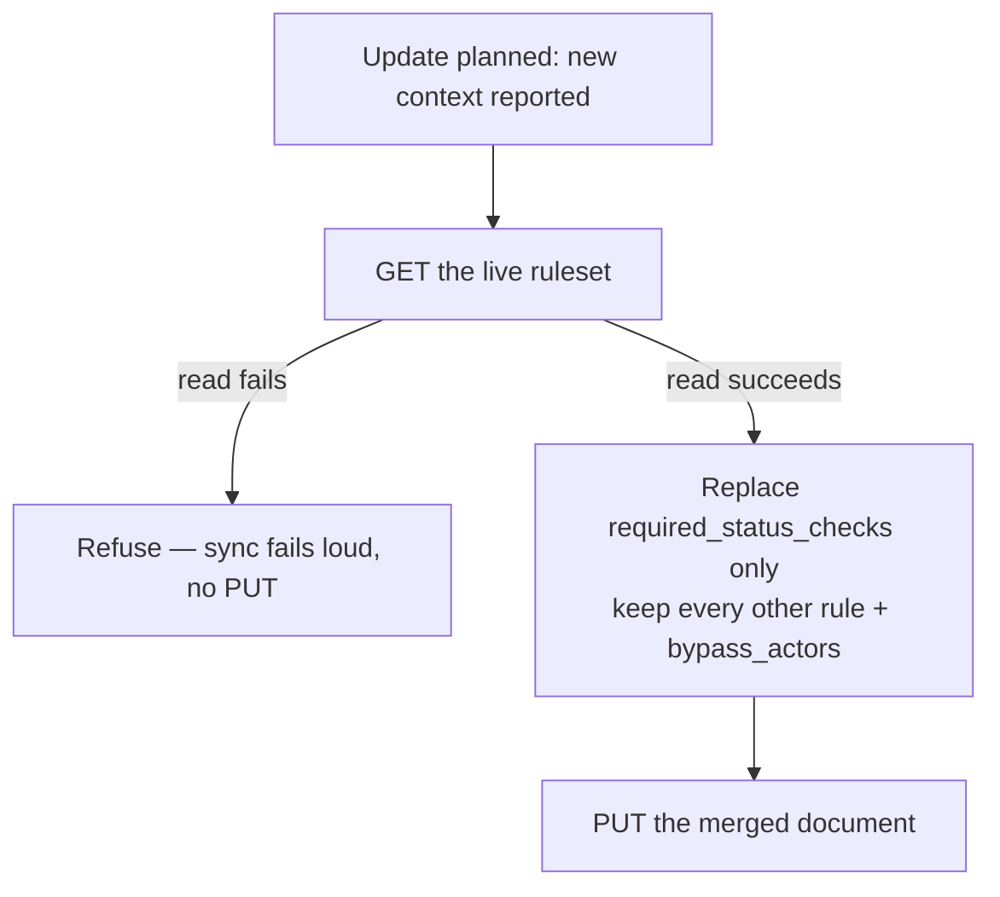

# The ruleset update PUT no longer discards the rules it did not write

## Summary

The default-branch ruleset update is a full-document `PUT`, and its body was
rebuilt from status-check contexts alone. Any other rule an admin had added to
`Vibe Coder default branch` — `pull_request` (required approvals),
`non_fast_forward`, `deletion`, `required_signatures`, `bypass_actors` — was
silently dropped the next time a new check appeared, and the run reported it as
a success because `preserved` counts *contexts* only.

The configurator now reads the live ruleset before it rewrites it, replaces
**only** the `required_status_checks` rule, and carries every other rule and the
bypass-actor list through unchanged. A ruleset whose current rules cannot be
read (403, 404, unparseable body) fails the sync loudly and writes nothing —
"could not see it" is never read as "there was nothing there". Closes #1290.

Changes:

- `worker/deno/lib/repo_rulesets.ts` — new `getRuleset()` reader (every failure,
  a 404 included, is an error), `preservedRulesFromDetail()`,
  `buildDefaultBranchRulesetUpdateBody()`, the `OpaqueRulesetRule` /
  `RulesetDetail` types, and the `isRequiredStatusChecksRule()` guard.
- `worker/deno/lib/default_branch_ruleset.ts` — the `update` branch reads the
  live ruleset and builds the merged body; an unreadable ruleset returns an
  error instead of a plan. `RulesetPlan.preservedRules` reports the rule types
  carried through.
- `worker/deno/setup/branch_protection_sync.ts`,
  `worker/deno/setup/setup_cli.ts` — `preservedRules` is threaded through and
  named in the success line, so a run over a hardened ruleset shows what
  survived rather than reporting a context count that hides the loss.
- `docs/MERGE.md` — new section *The update never weakens the rules it
  rewrites*, with a flowchart of the read-merge-or-refuse decision.

## Evidence

Backend/CLI change — no web interface to screenshot. The evidence is the test
suite, run unattended from `worker/deno`:

```text
deno test --allow-all tests/default_branch_ruleset_test.ts
ok | 33 passed | 0 failed

deno test --allow-all tests/repo_rulesets_test.ts
ok | 22 passed | 0 failed
```

Red against the unfixed code (the four lib/setup files stashed, tests kept):

```text
FAILED | 28 passed | 5 failed
  ruleset - an admin's other rules survive the update PUT
  ruleset - bypass actors survive the update PUT
  ruleset - refuses the update when the live rules cannot be read
  plan - the update body is built from the live ruleset, without writing
  ruleset - a created ruleset carries no rules from anywhere else
```



## Reproduction

- **symptom** — an admin hardens `Vibe Coder default branch` with a
  `pull_request` rule; a new reported check makes the plan `update`, and the
  full-document PUT rewrites the ruleset with `required_status_checks` alone, so
  required reviews, force-push and deletion protection vanish while the run
  prints a success line
- **status** — `verified` — the regression test was observed failing against the
  unfixed code (the PUT body carried only `required_status_checks`) and passing
  after the fix
- **regression test** —
  `worker/deno/tests/default_branch_ruleset_test.ts::ruleset - an admin's other rules survive the update PUT`

## Security

- **Trigger closed, no trivial bypass.** The weakening direction is no longer
  reachable from `planDefaultBranchRuleset`: the `update` branch is the only
  code path that calls `updateRuleset`, and it now builds its body exclusively
  through `buildDefaultBranchRulesetUpdateBody(…, live.value)`, which starts
  from the live ruleset's own rules. The status-check rule is the only element
  it replaces (`preservedRulesFromDetail` filters exactly that type), so a rule
  the module does not model cannot be dropped whatever its type is —
  `pull_request`, `required_signatures`, or one GitHub adds tomorrow.
  `bypass_actors` is copied verbatim. The alternative route to a weak body,
  `buildDefaultBranchRulesetBody`, is now reachable only for `action: "create"`,
  where there is no existing document to lose. The remaining way to reach a PUT
  without having seen the live rules — a failed read — returns an error rather
  than a plan, so no PUT is issued at all.
- **Input validation.** `getRuleset()` validates the repo slug and requires a
  positive integer ruleset id before any `gh` call, matching the adjacent
  writers. The parsed response is validated (`null` / non-object bodies are an
  error) and preserved rules are shape-checked before being written back, so an
  API response cannot inject a non-rule entry into the PUT body.
- **No new secrets, shell interpolation, or endpoints beyond the read of the
  ruleset the worker already owns.**

## Test Plan

Added (`worker/deno/tests/default_branch_ruleset_test.ts`):

- `ruleset - an admin's other rules survive the update PUT` — a live ruleset
  carrying `pull_request` (2 approvals), `non_fast_forward`, `deletion` and
  `required_signatures` is updated with one added context; every rule and its
  parameters survive the PUT and only the status-check rule is rewritten.
- `ruleset - bypass actors survive the update PUT`.
- `ruleset - refuses the update when the live rules cannot be read` — the read
  fails, the sync fails loud, and **no** ruleset write is attempted.
- `plan - the update body is built from the live ruleset, without writing`.
- `ruleset - a created ruleset carries no rules from anywhere else` — the create
  path is unchanged.

Added (`worker/deno/tests/repo_rulesets_test.ts`):

- `repo_rulesets - getRuleset reads one ruleset in full`.
- `repo_rulesets - getRuleset fails loud on a 404, an error, or an unusable body`.
- `repo_rulesets - getRuleset rejects an invalid slug or id without a gh call`.
- `repo_rulesets - the update body keeps every rule it does not model`.
- `repo_rulesets - the update body drops entries that are not rule-shaped`.

Modified (no assertion removed):

- `repo_rulesets - the body targets the default branch and requires up-to-date`
  — selects the checks rule with the new `isRequiredStatusChecksRule` guard,
  because `rules[]` now also models preserved opaque rules. Same assertions.
- `worker/deno/tests/default_branch_ruleset_audit_test.ts` and the
  `default_branch_ruleset` mock — the fake `gh` now serves
  `GET /repos/{repo}/rulesets/{id}`, the read the update path performs.
