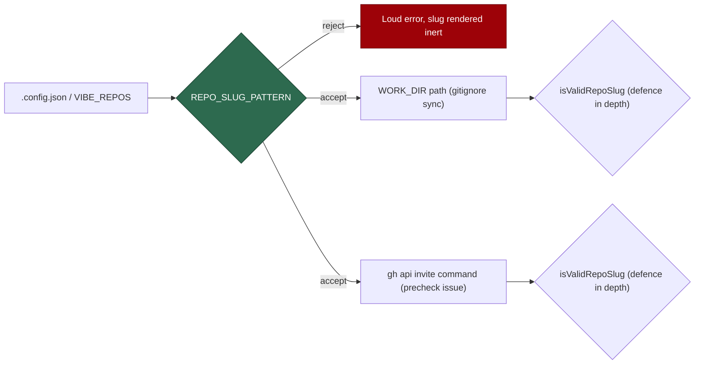

# Validate repo slugs in the setup CLI's own config reader (Issue #1291)

## Summary

The setup CLI reads `.config.json` through its own loader
(`worker/deno/setup/config_setup.ts`), which validated nothing — the worker's
loader (`lib/config.ts`) has always tested every entry against
`REPO_SLUG_PATTERN`, so this was a second reader of the same file with the
guard missing. Two sinks consumed the unvalidated slug:

- **Path traversal** — `syncGitignoreForAllRepos()` derives
  `<workDir>/<repo-name>` from the slug, so `org/..` pointed the `.gitignore`
  and `.gitattributes` enforcers at the work-volume root's parent and `org/`
  at the root itself, outside every clone.
- **Shell injection across a privilege boundary** — the collaborator precheck
  interpolates each slug into `gh api -X PUT repos/<slug>/collaborators/…`
  inside a fenced `bash` block in the issue it files, which a repo **admin** is
  told to paste.

`REPO_SLUG_PATTERN` now lives in the new `worker/deno/lib/repo_slug.ts` (with
`isValidRepoSlug`, `partitionRepoSlugs`, `renderInertRepoSlug` and
`assertValidRepoSlugs`); `lib/config.ts` re-exports it, so every existing
importer is unchanged and the setup CLI gets the same guard without pulling in
the worker's configuration graph. `loadExistingConfig` and the
`VIBE_REPOS` / `VIBE_ADD_REPOS` parse sites reject bad entries by throwing —
reported, never dropped silently — and both sinks keep their own guard as
defence in depth. Closes #1291.

## Evidence

Backend/CLI change with no web interface to screenshot. The evidence is the
regression suite below, plus a green `./quality.sh` (all checks PASSED; `config
integration`, `pages-liquid` and `mermaid built output` SKIPPED for missing
local toolchain/config, as they are on every run in this container).

**Regression test linkage** — added
`worker/deno/tests/setup_repo_slug_guard_test.ts`, which fails against the
unfixed code and passes after the fix:

- `worker/deno/tests/setup_repo_slug_guard_test.ts::loadExistingConfig - rejects traversal and injection slugs (Issue #1291)`
  feeds the issue's own inputs `["org/..", "org/\`id\`/x"]` through the loader
  and asserts refusal. Against the unfixed reader the call resolved with both
  slugs intact — the test failed on the missing throw.
- `worker/deno/tests/setup_repo_slug_guard_test.ts::syncGitignoreForAllRepos - refuses org/.. and writes nothing outside the clone`
  calls the real sync with `org/..` and `org/` against a temp work dir and
  asserts no `.gitignore` / `.gitattributes` was written at the work-dir root
  or its parent. Against the unfixed loop those files were created — the test
  failed on the escaped write.
- `worker/deno/tests/setup_repo_slug_guard_test.ts::buildIssueBody - never emits a pasteable command for an injected slug`
  asserts a backticked slug reaches neither a `gh api` command nor the prose
  intact, while a valid slug still gets its invite line.

**Original trigger is closed, with no trivial bypass.** `org/..` and
`` org/`id`/x `` are both rejected by `REPO_SLUG_PATTERN` at every point where
the setup CLI assembles the repo list: the file reader (`loadExistingConfig`),
and the two environment variables (`VIBE_REPOS`, `VIBE_ADD_REPOS`) parsed by
`mergeNonInteractive`. The pattern is an allowlist — each segment must start
with `[a-zA-Z0-9_-]` and may then contain only `[a-zA-Z0-9._-]` — so no
traversal segment (`..`, `.`, empty), no shell metacharacter (`` ` ``, `$`,
`(`, `)`, `;`, `|`, newline) and no extra `/` can pass. Both downstream sinks
re-apply `isValidRepoSlug` themselves, so even a slug reaching them by another
route derives no path and produces no pasteable command; a rejected slug is
reported through `renderInertRepoSlug`, which maps everything outside the slug
alphabet to `?`, so the *report* cannot carry the injection either. The
`setup_cli.ts` call site that previously swallowed loader errors now prints and
fails, so the refusal cannot be silent.

## Test Plan

Added `worker/deno/tests/setup_repo_slug_guard_test.ts` (12 tests, all calling
the real functions with the attack inputs):

- `isValidRepoSlug` / `renderInertRepoSlug` / `partitionRepoSlugs` — happy
  path, traversal, injection, empty and non-string inputs.
- `loadExistingConfig` — rejects the issue's attack slugs, rejects a non-array
  `repos`, still loads a valid config.
- `mergeNonInteractive` — rejects a bad slug in `VIBE_REPOS` and in
  `VIBE_ADD_REPOS` (naming the variable), still merges valid ones.
- `syncGitignoreForAllRepos` — `org/..` and `org/` fail loudly, nothing is
  written outside the clone, a valid uncloned repo is still just skipped.
- `buildIssueBody` — an injected slug produces no pasteable command, and a body
  whose every slug is invalid carries no bare invite fence.

Existing suites re-run unchanged: `setup_config_setup_test.ts`,
`setup_config_writer_test.ts`, `setup_service_accounts_test.ts`,
`gitignore_sync_test.ts`, `collaborator_precheck_test.ts`, `config_test.ts`,
`add_repo_test.ts`. Full `./quality.sh` passed.

Documentation: `SECURITY.md` gains a "The setup CLI applies the same slug
guard" subsection under Configuration Validation, and
`docs/audits/lib-sweep-coverage.json` claims the new `lib/repo_slug.ts` module
in the chunk-12c slice (enforced by `lib_sweep_coverage_test.ts`).
