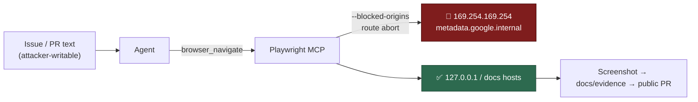

## Summary

The generated Playwright MCP config (`worker/deno/setup/screenshot.ts`) passed
neither `--allowed-origins` nor `--blocked-origins`, and `@playwright/mcp`
defaults to allowing every origin. That config is not setup-only —
`lib/agent_mcp_config.ts:126` builds it for the live agent, whose navigation
target comes from issue and PR text anyone can write. A prompt injection could
therefore `browser_navigate` to `http://169.254.169.254/latest/meta-data/`,
`browser_take_screenshot` into `docs/evidence/`, and have the worker upload
that image to ImgBB and link it in a **public** PR.

This adds `PLAYWRIGHT_MCP_BLOCKED_HOSTS` and `blockedOriginsValue()` and passes
the resulting `--blocked-origins` list in the generated argv. Closes #1292.

## Evidence

Backend/CLI change — no web interface to screenshot. The config generator is
verified by unit tests that call `generateMcpConfig()` / `blockedOriginsValue()`
and assert on the argv they produce.

Blocked hosts (each emitted in bare-host and wildcard-port form, because
`@playwright/mcp` matches a bare host as `*://host/**` — any scheme, **default
port only** — while `http://host:*` covers any port, and neither form covers
the other):

| Host | Endpoint |
|------|----------|
| `169.254.169.254` | AWS / Azure / GCP / OpenStack / DigitalOcean IMDS |
| `169.254.170.2` | AWS ECS task metadata |
| `[fd00:ec2::254]` | AWS IMDS over IPv6 |
| `metadata.google.internal`, `metadata.goog` | GCP |
| `100.100.100.100` | Alibaba Cloud |

A blocklist, not an allowlist: `lib/screenshot_validation.ts` and
`lib/prompt_builder.ts` instruct the agent to serve local pages on `127.0.0.1`,
and UI tasks legitimately navigate arbitrary documentation hosts — an allowlist
would break both. A test pins that loopback stays navigable.

### Original trigger closed, no trivial bypass

The issue's trigger — `browser_navigate` to `http://169.254.169.254/latest/meta-data/`
followed by `browser_take_screenshot` — is closed: `generateMcpConfig()` now
emits `--blocked-origins`, and `@playwright/mcp@0.0.75` turns each entry into a
route that aborts the request with `blockedbyclient`
(`playwright-core .../coreBundle.js:58449`, matcher `originOrHostGlob` at
`:58215`). The obvious variations are enumerated rather than left open: `https`
as well as `http` (bare-host form matches any scheme), non-default ports
(wildcard-port form), the IPv6 IMDS address, and the ECS / GCP / Alibaba
metadata addresses — so a scheme, port or provider swap is not a bypass. A host
carrying the `;` list separator would silently split the list into entries that
match nothing, so that case throws instead.

Residual, stated plainly rather than claimed closed: the package documents that
origin filtering "does not serve as a security boundary and does not affect
redirects", so a page on an allowed host that 302s to the metadata IP is not
intercepted. That needs attacker-controlled redirect infrastructure (not just
issue text), and on AWS IMDSv2 a plain redirected GET returns 401 without the
`PUT`-issued token. The container's bridge gateway is likewise not blockable by
origin, since its address is assigned at runtime. Both are network-layer
concerns, out of scope for this generator.

## Test Plan

Added to `worker/deno/tests/setup_screenshot_test.ts`:

- `worker/deno/tests/setup_screenshot_test.ts::generateMcpConfig - blocks cloud metadata origins so a prompt-injected navigate cannot screenshot instance credentials (Issue #1292)`
  — the regression test. It reproduces the flaw (no `--blocked-origins` in the
  generated argv): observed **failing** against the unfixed code with the
  `args.push("--blocked-origins", ...)` line removed
  (`FAILED | 2 passed | 1 failed`), and **passing** after the fix.
- `worker/deno/tests/setup_screenshot_test.ts::blockedOriginsValue - keeps loopback navigable so local pages can still be screenshotted (Issue #1292)`
  — guards the by-design loopback path the prompts rely on.
- `worker/deno/tests/setup_screenshot_test.ts::blockedOriginsValue - fails loud when a host contains the list separator (Issue #1292)`
  — a `;` in a host throws rather than emitting a list that looks complete and
  blocks nothing.

`deno test worker/deno/tests/setup_screenshot_test.ts worker/deno/tests/agent_mcp_config_test.ts`
→ 58 passed, 0 failed. Full `./quality.sh` run below.

## Documentation

`docs/DEPLOYMENT.md` — the Playwright MCP hardening section now records the
`--blocked-origins` control, the canonical `PLAYWRIGHT_MCP_BLOCKED_HOSTS` knob,
why it is a blocklist, and the redirect caveat.
