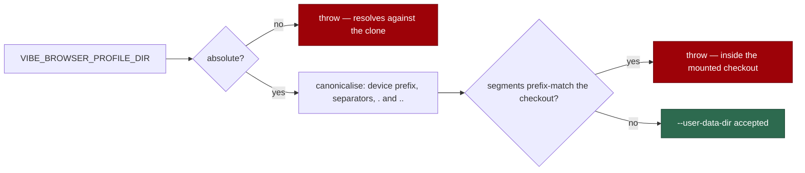

# PR Summary — Issue #1293

## Summary

`assertDisposableProfileDir` is the guard that stops browser profile/cookie/
storage state landing inside the mounted checkout. It compared **raw strings**
against a hard-coded `/`, so three inputs walked straight through it: a Windows
checkout (`startsWith("C:\Users\me\VibeCoder/")` is never true), a POSIX `..`
walk back into the clone, and a relative `VIBE_BROWSER_PROFILE_DIR` (which also
made the MCP server's `--output-dir` relative, putting per-navigation
`page-<ts>.yml` snapshots in the working tree).

Containment is now decided on **whole path segments** after `.`/`..` are
resolved, using the platform's own separators and case rules, and a
non-absolute profile or checkout directory is refused outright. `Closes #1293.`

Key points for a reviewer:

- The comparison is hand-rolled rather than taken from `@std/path`, matching
  `lib/disk_space.ts` and `lib/stale_workdir.ts`, which made the same call:
  nothing in `worker/deno` imports `@std/path` and
  `tests/deno_lock_declared_deps_test.ts::deno.lock - @std/path is not pinned
  (nothing imports it)` actively keeps it out of the lockfile (Issue #3661).
  Importing it would have meant deleting that test.
- Segment-wise comparison, not prefix comparison: `/workspace-scratch` is *not*
  inside `/workspace`, and neither is `C:\Users\me\VibeCoder\..foo` waved
  through by a naive `rel.startsWith("..")` test.
- A `ScreenshotConfig.os` seam lets the Windows semantics be exercised
  deterministically from a Linux CI runner.



## Evidence

Backend/CLI change with no web interface to screenshot — the deliverable is a
setup-time guard in `worker/deno/setup/screenshot.ts`, so the evidence is test
output rather than an image.

**Regression tests, observed failing before the fix and passing after.** Added
to `worker/deno/tests/setup_screenshot_test.ts`, one per trigger in the issue:

- `worker/deno/tests/setup_screenshot_test.ts::generateMcpConfig - refuses a Windows profile directory inside the checkout` (trigger 1)
- `worker/deno/tests/setup_screenshot_test.ts::generateMcpConfig - refuses a profile directory reached through ..` (trigger 2)
- `worker/deno/tests/setup_screenshot_test.ts::generateMcpConfig - refuses a relative profile directory` (trigger 3)
- `worker/deno/tests/setup_screenshot_test.ts::resolveBrowserEnvironment - refuses a relative VIBE_BROWSER_PROFILE_DIR` (trigger 3, at the resolver)

Run against the **unfixed** code (`--no-check`, since the `os` seam did not yet
exist), those tests plus the four supporting cases went red:

```text
generateMcpConfig - refuses a Windows profile directory inside the checkout ... FAILED
generateMcpConfig - refuses a Windows profile directory whose case differs ... FAILED
generateMcpConfig - refuses a profile directory reached through .. ... FAILED
generateMcpConfig - refuses a relative profile directory ... FAILED
generateMcpConfig - refuses a checkout directory that is not absolute ... FAILED
resolveBrowserEnvironment - refuses a relative VIBE_BROWSER_PROFILE_DIR ... FAILED
resolveBrowserEnvironment - refuses a drive-less Windows VIBE_BROWSER_PROFILE_DIR ... FAILED
FAILED | 53 passed | 7 failed
```

The two Windows-hardening tests were separately re-run against the pre-hardening
file and observed red, then green after it:

```text
generateMcpConfig - refuses a Windows device-prefixed profile directory ... FAILED
generateMcpConfig - refuses a Windows path padded with trailing dots ... FAILED
FAILED | 60 passed | 2 failed
=== restored ===
ok | 62 passed | 0 failed
```

After the fix, the whole file and its downstream consumer pass:

```text
deno test tests/setup_screenshot_test.ts tests/agent_mcp_config_test.ts
ok | 69 passed | 0 failed (134ms)
```

**Original trigger closed, with no trivial bypass.** All three inputs from the
issue are now refused by static construction of the changed code path, not by
matching their literal text:

1. `C:\Users\me\VibeCoder\profile` under `C:\Users\me\VibeCoder` — the Windows
   rules split on `[\\/]+`, fold case, and compare segment lists, so the
   checkout's segments are a prefix of the profile's and the guard throws. The
   hard-coded `/` is gone; nothing in the comparison assumes a separator.
2. `/tmp/../home/vibe/auto-issue-work/repo/profile` — `..` is applied while the
   segment list is built, so the path is compared as
   `/home/vibe/auto-issue-work/repo/profile` and throws.
3. `VIBE_BROWSER_PROFILE_DIR=profile` — rejected as non-absolute in
   `resolveBrowserEnvironment`, and again in the guard when a caller injects
   `browserEnvironment` directly, so `defaultOutputDir` can no longer be handed
   a relative path at all.

Near-miss bypasses of the *new* code were considered and closed rather than
left implicit: a sibling directory sharing the checkout's prefix
(`/workspace-scratch`) is correctly allowed because whole segments are
compared; a first segment such as `..foo` cannot masquerade as an escape for
the same reason; `\\?\C:\…` and `\\.\C:\…` device prefixes are rewritten to
their plain form before comparison; trailing dots and spaces (which Windows
strips from a component) are folded away; a drive-relative `C:profile` and a
drive-less `\repo\profile` are refused as non-absolute because the drive they
land on is process state; and `..` cannot pop above the root, matching the OS's
own clamping.

## Acceptance Criteria

<!-- vibe-spec-review inputs="diff+issue-body" -->

The issue states no `## Acceptance Criteria` heading; the criteria below are the
three triggers plus the "suggested fix" and "failure detection" clauses, as the
Spec reviewer derived them from the body.

- **met** — Trigger 1: the guard must fire for a Windows profile inside the checkout — evidence: `worker/deno/setup/screenshot.ts:270` (`WINDOWS_PATH_RULES`) and `worker/deno/tests/setup_screenshot_test.ts::generateMcpConfig - refuses a Windows profile directory inside the checkout` — reviewer: met — reason: the reviewer additionally flagged two narrower Windows spellings (`\\?\C:\…` device prefix, and trailing dots/spaces) that still passed; both were closed in this diff by `canonicalise`/`fold` and are covered by two further tests
- **met** — Trigger 2: a POSIX `..` walk back into the clone must be refused — evidence: `worker/deno/setup/screenshot.ts:313` (`pathParts` applies `..`) and `worker/deno/tests/setup_screenshot_test.ts::generateMcpConfig - refuses a profile directory reached through ..` — reviewer: met
- **met** — Trigger 3: a relative `VIBE_BROWSER_PROFILE_DIR` must be refused, so `defaultOutputDir` cannot yield a relative output dir — evidence: `worker/deno/setup/screenshot.ts:224` and `worker/deno/tests/setup_screenshot_test.ts::resolveBrowserEnvironment - refuses a relative VIBE_BROWSER_PROFILE_DIR` — reviewer: met
- **met** — Suggested fix: compare resolved paths so the separator is platform-correct, and reject a non-absolute `profileDir` in `resolveBrowserEnvironment` — evidence: `worker/deno/setup/screenshot.ts:242-338` — reviewer: met — reason: the reviewer's exact words were "met (deviation, justified)" — the resolution is hand-rolled rather than `@std/path`, because `worker/deno/tests/deno_lock_declared_deps_test.ts:90` asserts `@std/path` is absent from the lockfile (Issue #3661) and importing it would mean deleting that test; it verified the behaviour is equivalent and that `disk_space.ts`/`stale_workdir.ts` set the precedent
- **met** — Failure detection: tests feeding each of the three inputs and asserting the throw — evidence: the three tests named above, plus `generateMcpConfig - allows a sibling directory whose name shares the checkout prefix` as the negative control — reviewer: met
- **unrequested** — a non-absolute `mcpDir`/`scriptDir` now throws, where the issue only asked to reject a non-absolute `profileDir` — evidence: `worker/deno/setup/screenshot.ts:684` — reviewer: unrequested — reason: containment cannot be decided against a relative root, and silently skipping the check there is the fail-silent shape the guard exists to prevent; every production caller already passes an absolute directory (`setup.sh`, `setup.ps1`, `Deno.cwd()`, `agent_mcp_config.ts:126`)
- **unrequested** — Windows case-folding, so `c:/users/ME/vibecoder` matches `C:\Users\me\VibeCoder` — evidence: `worker/deno/setup/screenshot.ts:289` — reviewer: unrequested — reason: without it "platform-correct on Windows" is only half done — a case variant is the same directory to the OS, so the guard would still not fire
- **unrequested** — `os?: typeof Deno.build.os` added to `ScreenshotConfig` — evidence: `worker/deno/setup/screenshot.ts:421` — reviewer: unrequested — reason: a test seam, mirroring the existing `os` seam on `BrowserEnvironmentDeps` and `checkLinuxBrowserDeps`; it is the only way to exercise the Windows trigger from the Linux CI runner, and production callers leave it undefined
- **unrequested** — `mcpDir = "/"` is now checked rather than skipped — evidence: `worker/deno/setup/screenshot.ts:682` — reviewer: unrequested — reason: the old trailing-separator strip turned `/` into `""` and disabled the guard entirely; that is the same fail-silent shape as the reported defect
- **unrequested** — documentation updates — evidence: `docs/CONTAINER.md:182`, `docs/DEPLOYMENT.md:570` — reviewer: unrequested — reason: `VIBE_BROWSER_PROFILE_DIR` now rejects values it used to accept, and "A Code Change Owes a Docs Change" requires the operator-facing surfaces to say so

## Standards Review

<!-- vibe-standards-review inputs="diff+CODING-STANDARDS.md" -->

The reviewer diffed against the milestone base, which carries two sibling
commits from Issues #1291 and #1292. Four of its eight findings
(`lib/repo_slug.ts` test naming and coverage, `setup/config_setup.ts:493`
catch-and-return, and the `--blocked-origins` docs gap) belong to those
commits, not to this change; they are listed here as `clean` for this diff and
left with their own issues.

- **violation** — no `docs/archive/pr-summaries/pr-summary-1293.md` — evidence: `docs/archive/pr-summaries/` at commit `c8a49c4` — reason: fixed here; this file is the deliverable and carries `Closes #1293`
- **violation** — commit subject used `(#1293)` where "Commit Messages" documents `Fix: Description (Issue #42)` — evidence: `CODING-STANDARDS.md:552` — reason: fixed; the commit was amended (local, unpushed) to `Fix: compare resolved paths in assertDisposableProfileDir (Issue #1293)`
- **violation** — redundant `override !== ""` beside a truthiness test on the same value — evidence: `worker/deno/setup/screenshot.ts:224` — reason: fixed; the new guard now reads `if (override && !isAbsolutePath(...))`. The identical pre-existing pair three lines below is left alone as out of scope
- **violation** — generic path semantics housed in the screenshot setup module rather than a shared `lib/` helper — evidence: `worker/deno/setup/screenshot.ts:242-338` — reason: stands, deliberately. There is exactly one consumer, so a shared module would be an abstraction with no second caller (KISS over premature DRY), and the two precedents the reviewer cites (`disk_space.ts:959`, `stale_workdir.ts:506`) both kept their helper local for the same reason. The helpers are private to the module and the file grew by ~90 lines
- **clean** — Australian English throughout the added lines (`canonicalise`, `normalise`, `behaviour`, `defence`)
- **clean** — TDD and test quality: every new test calls the real exported function with the attack input and asserts the refusal; no source grepping, no sleeps, no wall-clock budgets; the `os`/`getEnv`/`dirExists` seams keep them off host state
- **clean** — fail-loud: every rejected input throws with the offending value and the remedy; no path silently skips the check
- **clean** — commit safety: no hidden path, key, or credential file staged
- **clean** — Deno conventions: no new lockfile dependency, `@std/assert` only, `deno fmt`/`deno lint`/`deno check --frozen` all pass
- **clean** — docs updated in the same change (`docs/CONTAINER.md`, `docs/DEPLOYMENT.md`)

## Test Plan

Added to `worker/deno/tests/setup_screenshot_test.ts` (9 new tests, all calling
the real `generateMcpConfig` / `resolveBrowserEnvironment`):

| Test | Covers |
|------|--------|
| `generateMcpConfig - refuses a Windows profile directory inside the checkout` | Trigger 1 |
| `generateMcpConfig - refuses a Windows profile directory whose case differs` | Trigger 1, case-insensitivity |
| `generateMcpConfig - refuses a Windows device-prefixed profile directory` | Trigger 1, `\\?\C:\…` |
| `generateMcpConfig - refuses a Windows path padded with trailing dots` | Trigger 1, trailing `.`/space |
| `generateMcpConfig - refuses a profile directory reached through ..` | Trigger 2 |
| `generateMcpConfig - refuses a relative profile directory` | Trigger 3, at the guard |
| `generateMcpConfig - refuses a checkout directory that is not absolute` | Unverifiable root fails loud |
| `generateMcpConfig - allows a sibling directory whose name shares the checkout prefix` | Negative control — no over-blocking |
| `resolveBrowserEnvironment - refuses a relative VIBE_BROWSER_PROFILE_DIR` | Trigger 3, at the resolver |
| `resolveBrowserEnvironment - refuses a drive-less Windows VIBE_BROWSER_PROFILE_DIR` | `\repo` is drive-dependent |
| `resolveBrowserEnvironment - accepts an absolute Windows VIBE_BROWSER_PROFILE_DIR` | Legitimate value still accepted |

No existing test was modified, commented out, or removed.

Commands run: `deno fmt`, `deno lint`, `deno check --frozen --lock=deno.lock`,
`deno test tests/setup_screenshot_test.ts tests/agent_mcp_config_test.ts`
(69 passed), `tests/deno_lock_declared_deps_test.ts` (unchanged, still green),
and `./quality.sh` — see the gate note below.
