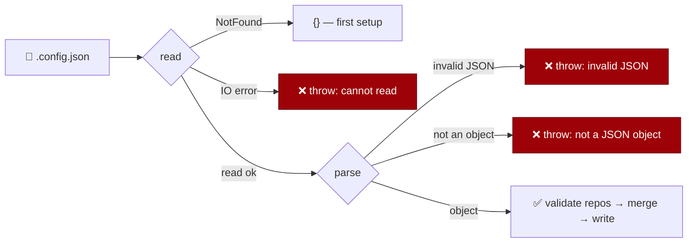

## Summary

`loadExistingConfig` (`worker/deno/setup/config_setup.ts`) wrapped the read and
the parse in one `catch` that returned `{}`, so a missing file, a permission
error and malformed JSON were indistinguishable. Setup rewrites `.config.json`
from scratch, so a truncated write or a hand edit that broke the JSON was not a
failure — it was silently **replaced** by env-derived defaults, dropping
`service_accounts` (the identity guard's allowlist), `repos`, `repo_config` and
any operator-narrowed `authorized_commenters`, after which `mergeNonInteractive`
repopulated the trusted-bot list from `DEFAULT_TRUSTED_INPUT_BOTS` — re-granting
input trust to bot logins the operator had removed.

The loader now distinguishes the cases, matching `readConfigRecord` in
`config_writer.ts`, which already refuses invalid JSON in the same file:

- `Deno.errors.NotFound` → `{}` (first setup writes a fresh file).
- Any other read failure → throws `Cannot read <path>: <cause>`.
- Invalid JSON → throws `<path> contains invalid JSON — fix it by hand …`.
- A JSON array or scalar → throws `<path> is not a JSON object — fix it by hand …`.

Every caller already runs the loader inside a `try` that prints the error and
stops setup (`setup_cli.ts:311`, and the nine `run*Sync` helpers), and
`runConfigSetup` returns `ok: false`, so the throw surfaces as a refusal, not a
crash. No caller change was needed. Closes #1294.

## Evidence

Backend/CLI change — no web interface to screenshot. Evidence is the regression
suite plus the full gate.

- New tests observed **failing against the unfixed code** (4 failed / 2 passed)
  and passing after the fix.
- `./quality.sh` — `Result: PASSED (with skipped checks)`; semgrep, deno tests,
  lint, type check, fmt and markdownlint all PASSED.

**Original trigger closed, no trivial bypass.** The trigger is a `.config.json`
that exists but does not parse — the issue's `{"repos":` is the named case. It
is now closed by construction rather than by pattern: the only path that returns
`{}` is `error instanceof Deno.errors.NotFound` on the read, so every other read
outcome and every parse outcome that is not a JSON object throws. There is no
corrupted-but-accepted input left — a byte-level corruption either still parses
to an object (in which case the operator's keys survive, which is the correct
behaviour) or it throws; and no separate lenient path exists, since
`runNonInteractive` and `runConfigSetup` both reach the file only through this
loader.

## Reproduction

- **symptom** — a `.config.json` broken by a partial write or a hand edit is
  read as `{}` by setup, which then rewrites the file from defaults and
  re-grants `DEFAULT_TRUSTED_INPUT_BOTS` input trust the operator had removed
- **status** — `verified` — the regression tests were observed failing against
  the unfixed loader (`Expected function to reject`, 4 failed) and passing after
  the fix
- **regression test** — `worker/deno/tests/setup_config_load_failloud_test.ts::loadExistingConfig - throws on truncated JSON rather than resetting to defaults`

## Test Plan

New file `worker/deno/tests/setup_config_load_failloud_test.ts` — each test
calls the real loader and asserts on its result:

- `loadExistingConfig - throws on truncated JSON rather than resetting to defaults`
  — the issue's exact input `{"repos":`; asserts the path and the parse failure
  are named. **Fails against the unfixed code** (returned `{}`), passes after.
- `loadExistingConfig - throws on a hand-edited file that is not JSON at all`
- `loadExistingConfig - throws when the file is a JSON array, not an object`
- `loadExistingConfig - throws on an unreadable file rather than returning {}`
  — mode `0o000`; asserts the refusal only when the read really is denied, so a
  root-run container does not produce a false failure.
- `loadExistingConfig - a missing file is still {}` — the one legitimate `{}`.
- `loadExistingConfig - a valid config still loads, security lists intact` —
  `service_accounts`, `authorized_commenters` and `repos` survive.

Existing suites re-run unchanged: `setup_config_setup_test.ts` (including the
pre-existing missing-file test) and `setup_repo_slug_guard_test.ts`.

Docs: `docs/CONFIGURATION.md` now states that setup stops on a `.config.json` it
cannot read, and why.
