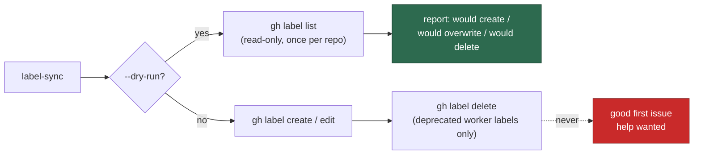

# label-sync: dry run, and GitHub's stock labels are never deleted

## Summary

`label-sync` ran `gh label delete` over every name in `DEPRECATED_LABELS` with
no way to see what a repo would lose first, and that list carried GitHub's own
`good first issue` and `help wanted` — labels the fleet never created and human
maintainers commonly use for their own triage. Deletion is irreversible: the
label's attachment to every issue goes with it. Adding a repo to `repos` was
therefore enough to silently destroy a third party's triage state.

Two changes close it. Closes #1295.

1. **Stock labels are never deleted.** `good first issue` and `help wanted`
   leave `DEPRECATED_LABELS` (`worker/deno/setup/label_definitions.ts:225`) and
   move to a new `PROTECTED_STOCK_LABELS` guard. `removeDeprecatedLabels()`
   filters the deletable set through `isProtectedStockLabel()`, so re-adding one
   of those names to the deprecated list by mistake still deletes nothing.
2. **`dryRun` plans instead of mutating.** `LabelSyncOptions.dryRun` makes the
   whole pass read-only: `syncLabelsForRepo()` fetches the repo's labels once
   with `gh label list --json name` and plans create / overwrite / delete counts
   from that snapshot. No `gh label create`, `edit` or `delete` argv is issued.
   `setup_cli.ts` wires the existing global `--dry-run` flag through
   `label-sync` and prints the plan.

Failing loud is preserved: a repo whose labels cannot be listed returns
`ok: false`, `failures: 1` and the `gh` stderr in a new `error` field rather
than an empty "nothing to change" plan.



## Evidence

Backend/CLI change with no web interface, so there is no screenshot to capture;
the evidence is the test suite and the gate.

**The unfixed code deleting both stock labels**, driven through the real
`removeDeprecatedLabels()` with a stub runner:

```text
removed= 2 deleted= [ "good first issue", "help wanted" ]
```

**Regression tests, fail-then-pass linkage.** Added
`worker/deno/tests/setup_label_sync_test.ts::removeDeprecatedLabels - never deletes GitHub's stock labels (Issue #1295)`,
which reproduces the flaw above — it fails against the unfixed code (which
returns `removed = 2` and deletes both labels) and passes after the fix
(`removed = 0`, `state.deleted` empty). Added
`worker/deno/tests/setup_label_sync_test.ts::removeDeprecatedLabels - dry run issues no gh label delete (Issue #1295)`,
the check the issue's failure-detection section names: it runs the sync with
`dryRun: true` against a stub runner and asserts no `gh label delete` argv was
issued. It fails against the unfixed code, where `dryRun` does not exist and
every deprecated label is deleted regardless.

**The original trigger is closed with no trivial bypass.** The trigger was
"adding a repo to `repos` runs the destructive pass". `removeDeprecatedLabels()`
now builds its delete list as
`DEPRECATED_LABELS.filter((l) => !isProtectedStockLabel(l))`, so no code path
reaches `gh label delete` with a stock label name — the guard sits on the single
loop that issues the deletion, not on the data feeding it, so editing
`DEPRECATED_LABELS` cannot reintroduce it, and `isProtectedStockLabel()`
normalises case and surrounding whitespace so `"Help Wanted"` or `" help wanted "`
match too. Under `dryRun`, `syncSingleLabel()` and `removeDeprecatedLabels()`
return before any `runner([...])` call that mutates, and the only command the
dry-run path can issue is `gh label list` (plus the pre-existing read-only
`gh api .../languages` UI probe), so there is no mutating branch left to reach.

**Quality gate:** `./quality.sh` — `Result: PASSED (with skipped checks)`
(skips are the pre-existing `config integration`, `pages-liquid` and
`mermaid built output` stages).

## Test Plan

Added to `worker/deno/tests/setup_label_sync_test.ts`:

- `removeDeprecatedLabels - never deletes GitHub's stock labels (Issue #1295)`
  — the security regression test.
- `removeDeprecatedLabels - dry run issues no gh label delete (Issue #1295)`
  — the issue's named failure-detection test.
- `syncLabelsForRepo - dry run issues no mutating gh call (Issue #1295)` — no
  create, edit or delete argv, and the plan still reports the real counts.
- `syncLabelsForRepo - dry run fails loud when the label listing fails` —
  `ok: false`, `failures: 1`, `gh` stderr surfaced.
- `syncSingleLabel - dry run plans without creating or editing (Issue #1295)`.
- `fetchRemoteLabelNames - returns lower-cased existing label names` and
  `- throws rather than reporting an empty repo`.

Added to `worker/deno/tests/setup_label_definitions_test.ts`:

- `DEPRECATED_LABELS - excludes GitHub's stock labels (Issue #1295)`.
- `isProtectedStockLabel - matches stock labels case-insensitively`.

**Existing tests modified (documented, not weakened):**

- `DEPRECATED_LABELS - contains expected deprecated labels` dropped its two
  `good first issue` / `help wanted` assertions — that is the behaviour change
  this PR makes, and the new test above asserts the opposite explicitly.
- `removeDeprecatedLabels - removes deprecated labels that exist` swapped its
  `good first issue` fixture for `answered`, another retired worker label, so it
  still proves two deprecated labels are deleted.
- `worker/deno/tests/process_add_repo_test.ts` — three `LabelSyncResult` stubs
  gained `dryRun: false`, mechanically required by the new required field.
