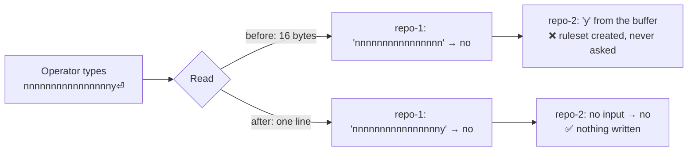

# PR Summary — Issue #1296

## Summary

Setup's `milestone/**` ruleset question read a fixed 16 bytes from stdin, so
anything the operator typed beyond that — the newline and everything after it —
stayed in the terminal buffer and was consumed as the **next** repository's
answer. `nnnnnnnnnnnnnnnny` (17 characters) declined the first repository and
approved the second one, whose question was never shown: a ruleset written on a
repository nobody was asked about, with an audit trail claiming consent.

The answer is now read one whole line at a time.
`worker/deno/setup/consent_prompt.ts` consumes bytes up to the first newline and
discards the remainder of whatever arrived with it, so input the operator did
not direct at a question can never satisfy it. The prompt's terminal edges
(reader, `isTerminal`, writer) are injectable, so the behaviour is testable
without a TTY.

Closes #1296.

## Evidence

Backend/CLI change with no web interface, so no screenshot applies — the
evidence is the regression tests below plus the full quality gate.

- `deno test worker/deno/tests/setup_consent_prompt_test.ts` — 11 passed, 0
  failed.
- `deno test worker/deno/tests/milestone_ruleset_read_test.ts` — 32 passed, the
  existing ruleset-consent tests still green with the new seam signature.
- `./quality.sh` — `Result: PASSED (with skipped checks)`; semgrep, deno lint,
  type check, fmt and the full test suite all PASSED.

**Trigger closed, no trivial bypass.** The 16-byte buffer is gone: the read loop
terminates only on the first `\n` or on end-of-input, and everything after that
newline in the same chunk is dropped rather than retained. So the original input
`nnnnnnnnnnnnnnnny\n` is consumed entirely by the first prompt, which declines,
and the second prompt reaches EOF and returns `null` — which `isAffirmative`
treats as no consent. The equivalent bypasses are closed with it: a longer paste
is still consumed to the end of its line (only the first 1024 bytes are decoded,
and a truncated over-long answer can never equal `y`/`yes`), a second pre-typed
line (`y\ny\n`) is discarded rather than carried over, and a chunk boundary
falling mid-answer or mid-UTF-8-character is reassembled rather than split into
a short answer plus a leftover tail. There is no path left by which bytes typed
before a question is asked can answer it.

## Reproduction

- **symptom** — a 17-character answer at the first repository's ruleset prompt
  left `y` in the buffer, which approved the second repository's ruleset without
  its question ever being shown
- **status** — `verified` — the regression test was observed failing against the
  unfixed 16-byte read (6 of 11 tests red, including the two consent-carryover
  cases) and passing after the fix (11/11 green)
- **regression test** —
  `worker/deno/tests/setup_consent_prompt_test.ts::readConsentLine - a 17-character answer does not answer the next question`

## Test Plan

New file `worker/deno/tests/setup_consent_prompt_test.ts` (11 tests), each
driving the real reader through an injected byte source:

- `readConsentLine - a 17-character answer does not answer the next question` —
  the exact trigger from the issue; the second prompt sees no answer. **Fails
  against the unfixed 16-byte read, passes after the fix.**
- `readConsentLine - a second line typed ahead never answers a later prompt` —
  `y\ny\n` answers once, not twice.
- `readConsentLine - accepts the affirmative answers, trimmed and case-folded`
  and `- declines on no, on a bare Enter and at EOF` — the happy and declining
  paths, including the `[y/N]` default.
- `readConsentLine - assembles an answer split across reads`,
  `- decodes multi-byte characters split across reads`,
  `- honours a final line with no trailing newline` — chunk-boundary edge cases.
- `readConsentLine - a pasted answer longer than the cap still declines` — a
  5000-byte line is consumed whole and leaks nothing to the next prompt.
- `askCreateMilestoneRuleset - one long answer cannot approve the next repo`,
  `- a yes on its own line approves`, `- never asks without a terminal` — the
  fix wired into the actual setup prompt, including the unchanged no-TTY
  refusal.

No existing tests were modified or removed.

## Note for reviewers

`worker/deno/setup/prerequisite_installer.ts:169` has the same flaw with a
256-byte buffer. It is out of scope here and is filed as
stSoftwareAU/VibeCoder#1346, which points at the new `consent_prompt.ts` helper
as the fix.
