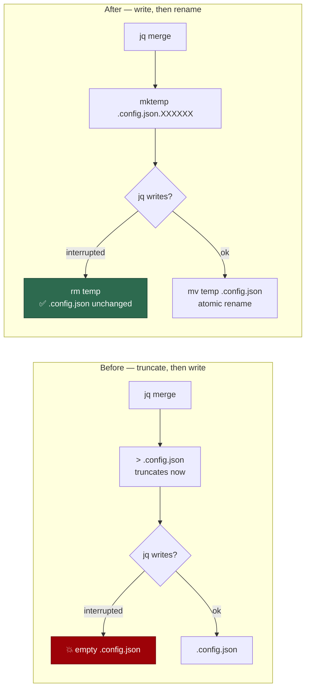

# PR Summary — Issue #1298

## Summary

`write_interactive_config` in `setup.sh` ended with
`echo "$config" | jq '.' > "$CONFIG_FILE"`. The redirection truncates the
host's only credential-bearing config file when the pipeline is set up —
**before** `jq` has produced a byte — so a `jq` that fails, is OOM-killed, hits
a full disk, or catches a `SIGINT` leaves `.config.json` empty, taking
`repos`, `allowed_authors`, `service_accounts`, `ssh_key_path`,
`gh_config_dir` and the just-entered `imgbb_api_key` with it. With
`set -euo pipefail` in force the script then aborts over the wreckage, and
nothing holds the previous contents.

The rewrite is now atomic: the merged document is written to a sibling
`mktemp` file and renamed over the target. `mv` within one directory is a
rename, so the original survives until the replacement is complete, and every
step fails loud with the config named and unchanged. This matches what
`worker/deno/lib/file_utils.ts` `atomicWrite` already does on the Deno side —
the launcher shell was the outlier. Closes #1298.



## Evidence

Backend/CLI change — no web interface to screenshot. The evidence is the
regression suite, which drives the real `setup.sh`.

`worker/deno/tests/setup_config_atomic_write_test.ts` sources the real
`setup.sh` (source-safe via its `BASH_SOURCE` guard), points `CONFIG_FILE` at a
fixture, puts a `jq` stub on `PATH` that delegates to the real `jq` for the
merge steps and fails on the final `jq '.'`, then calls the real
`write_interactive_config`.

Against the unfixed line:

```text
write_interactive_config - keeps the existing config when the rewrite fails ... FAILED
error: AssertionError: Values are not equal.   (the fixture was truncated to 0 bytes)
write_interactive_config - merges the interactive answers on success ... FAILED
```

After the fix:

```text
write_interactive_config - keeps the existing config when the rewrite fails ... ok (9ms)
write_interactive_config - merges the interactive answers on success ... ok (6ms)
write_interactive_config - is a no-op when nothing was answered ... ok (3ms)
ok | 3 passed | 0 failed
```

`./quality.sh` — `Result: PASSED (with skipped checks)`; the skips are the
environment-gated ones (`config integration`, `pages-liquid`,
`mermaid built output`). `shellcheck -e SC1091 -e SC2034 setup.sh` is clean.

### Regression-test linkage

Added
`worker/deno/tests/setup_config_atomic_write_test.ts::write_interactive_config - keeps the existing config when the rewrite fails`,
which reproduces the flaw — it **fails against the unfixed code** (the fixture
comes back empty instead of holding its original JSON) and **passes after the
fix**. The failure was observed in both directions, in that order.

### Original trigger closed, no trivial bypass

The trigger was the redirection itself: `> "$CONFIG_FILE"` opens the target
with `O_TRUNC` at pipeline setup, so every failure mode downstream of that
point — a failing `jq`, a signal, ENOSPC, a `jq` upgrade rejecting the
document — destroys the file. `$CONFIG_FILE` is no longer the redirection
target of any statement in `write_interactive_config`; the only write to it is
`mv "$tmp" "$CONFIG_FILE"`, a same-directory rename, which the kernel performs
atomically and which cannot leave a partial file. Each of the three steps
(`mktemp`, the `jq` write, the `mv`) is tested for a non-zero status, removes
the temp file, reports the config as unchanged, and exits 1 — so no failure
path reaches the rename with an incomplete document, and none can be
reconciled as success. `mktemp` creates with `O_EXCL` and mode `0600`, so no
pre-positioned symlink at a predictable path is followed and the API key is
never world-readable — matching `atomicWrite`'s `DEFAULT_FILE_MODE`. There is
no equivalent bypass: no other statement in the function writes to
`$CONFIG_FILE`.

## Test Plan

- **Added** `worker/deno/tests/setup_config_atomic_write_test.ts`:
  - `write_interactive_config - keeps the existing config when the rewrite fails`
    — a `jq` stub that fails on the final `jq '.'`; asserts the fixture is
    byte-for-byte unchanged, the exit is non-zero, the message names the config
    file, and no temp file is left beside it. This is the regression test.
  - `write_interactive_config - merges the interactive answers on success` —
    the answers land, unanswered keys (`allowed_authors`, `service_accounts`,
    `ssh_key_path`) survive, the temp file is gone, and the result is `0600`.
  - `write_interactive_config - is a no-op when nothing was answered` — the
    early return leaves the file untouched.
- **Modified** `worker/deno/lib/integration_test_manifest.ts`: the new suite
  spawns `bash` against the real `setup.sh`, so the Issue #907 manifest must
  claim it — `integration_test_manifest_test.ts` fails otherwise. CI runs it;
  the worker's gate excludes it with the other script-driving suites.
- **Unchanged**: no existing test was modified or removed.
