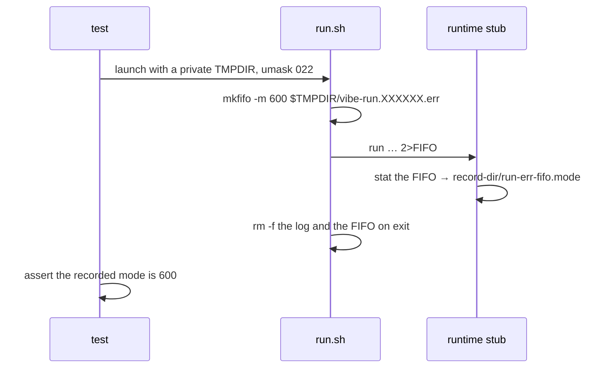

# Create the container-stderr FIFO owner-only

## Summary

`run.sh` armed its container-stderr capture (Issue #711) by creating a FIFO
beside the `mktemp` run log. `mktemp` gives the log 0600; `mkfifo` with no `-m`
does not inherit that — it creates 0666 masked by the umask, so under the usual
022 the FIFO landed **0644, world-readable**, in a world-readable temporary
directory. Every byte the container runtime client writes to stderr for the
whole run passes through it.

A reader on a FIFO is destructive as well as passive: bytes another local
account consumes are bytes `tee` never sees, so a second reader both discloses
the stream and silently truncates the evidence the launcher is about to hand its
outcome recorder as the cause of a refused start.

The fix is `mkfifo -m 600` — POSIX, honoured by both the BSD (macOS) and GNU
`mkfifo`, and, unlike a follow-up `chmod`, it closes the window rather than
narrowing it.

Closes #1299.

## Evidence

Backend/CLI change with no web interface to screenshot, so the evidence is the
regression test, run red against the unfixed launcher and green after the fix.

Red — `worker/deno/tests/run_sh_launcher_test.ts::run.sh - the stderr capture
FIFO is private to this account (Issue #1299)` against the unfixed `mkfifo`
line:

```text
error: AssertionError: Values are not equal: the capture FIFO must be owner-only
    [Diff] Actual / Expected
-   644
+   600
FAILED | 0 passed | 1 failed | 86 filtered out (1s)
```

Green after `mkfifo -m 600`:

```text
run.sh - the stderr capture FIFO is private to this account (Issue #1299) ... ok (1s)
ok | 1 passed | 0 failed | 86 filtered out (1s)
```

Full `run.sh` launcher suite: `ok | 87 passed | 0 failed (1m40s)`. The other
suites sharing the harness stub (`launcher_failure_evidence`,
`launcher_termination`, `container_launch`, `launcher_parity`,
`launcher_egress_probe`): `ok | 102 passed | 0 failed | 5 ignored`.
`./quality.sh` passed end to end (`Result: PASSED (with skipped checks)`).

How the mode is observed — the FIFO only exists while the container run is in
flight, so the recording runtime stub reads it from inside the run:



The test runs `run.sh` under an explicit `umask 022`
(`PERMISSIVE_UMASK_LAUNCHER`): the umask is inherited, so a launcher that
declines to set the mode is only distinguishable from one that sets it when the
umask would have let the wider mode through — without that, a CI runner with a
stricter umask would make the test pass against the unfixed code.

**Original trigger closed, no trivial bypass.** The trigger was: as a second
local account, poll `${TMPDIR:-/tmp}` for `vibe-run.*.err` during a launch and
`cat` it. `mkfifo -m 600` sets the mode in the creating syscall, so the FIFO is
never visible at any wider mode — there is no window between creation and a
`chmod` to race, and the mode no longer depends on the inherited umask, which
can only ever remove bits from 600, never add them. `run.sh` creates the FIFO in
exactly one place (`run.sh:1536`) and never re-`chmod`s or recreates it, so
there is no second path to the same resource. The sibling `RUN_LOG` was already
0600 by `mktemp`, and both are removed on exit by the existing cleanup
(`run.sh:332`).

## Test Plan

- Added `worker/deno/tests/run_sh_launcher_test.ts::run.sh - the stderr capture
  FIFO is private to this account (Issue #1299)` — reproduces the flaw
  (observed failing at `644` against the unfixed code, passing at `600` after
  the fix).
- Extended `worker/deno/tests/fixtures/launcher_harness.ts`: the runtime stub's
  `run` branch records each capture FIFO's octal mode under
  `run-err-fifo.mode`, and the new `runErrFifoModes()` accessor reads it. GNU
  `stat -c '%a'` is tried first and BSD `stat -f '%Lp'` second, so the harness
  reports the same thing on Linux and macOS hosts.
- No existing test was modified or removed.
