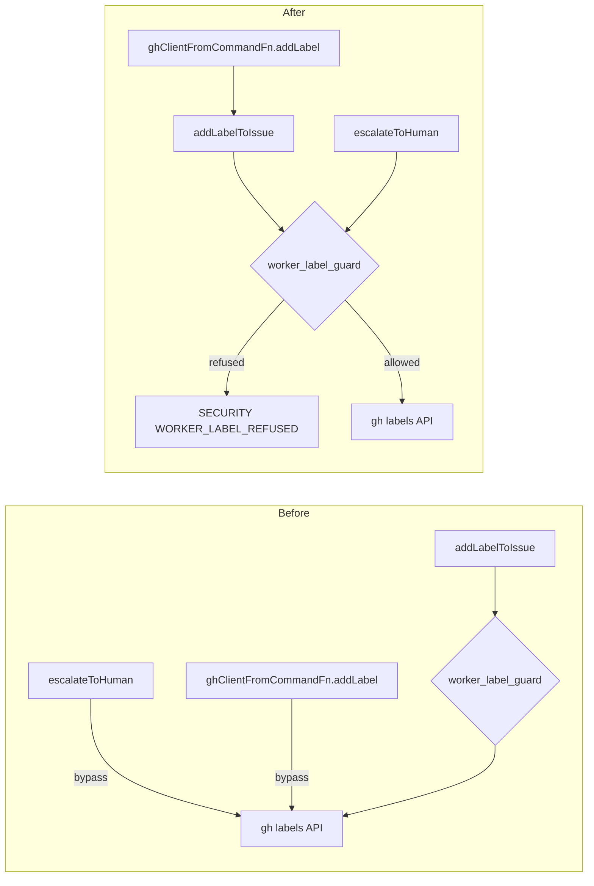

# PR Summary — Issue #13

## Summary

Two label-adding call sites reached the GitHub labels API without passing
through the worker label allowlist guard (`assertWorkerCanApplyLabel` in
`worker/deno/lib/worker_label_guard.ts`), so the invariant "every
worker-applied label is checked against the allowlist" held only for
`addLabelToIssue` callers. Both call sites now route through the guard.
Closes #13.

- **`worker/deno/lib/needs_human_escalation.ts`** — `escalateToHuman` called
  `ghClient.addLabel(repo, number, needsHumanLabel)` directly. A new step 0
  asserts the label against the guard before any label mutation. When the guard
  refuses, both the `ensureLabelExists` create and the `addLabel` are skipped,
  a `[SECURITY] [WORKER_LABEL_REFUSED]` audit line is emitted by the guard, a
  `logger.warn` records the refusal, and the returned outcome reports
  `labelAdded: false`. The explanation comment is still posted — refusing a
  label must not silently swallow a human-visible escalation.
- **`worker/deno/lib/label_clarification.ts`** — `ghClientFromCommandFn`'s
  `addLabel` hand-rolled the REST-POST-with-CLI-fallback against `ghCommandFn`.
  It now delegates to `addLabelToIssue` (same REST/CLI behaviour, Issue #976)
  and rethrows the returned error, preserving the throwing
  `GitHubClient.addLabel` contract.

Behaviour for the labels actually used today (`needs-human`,
`needs-screenshot`) is unchanged — both are on the allowlist.

Docs updated: `docs/AGENT-ACCOUNTABILITY.md` no longer claims `addLabelToIssue`
is the sole guard call site, and its flowchart names both chokepoints.

## Evidence

Backend/CLI change only — no web interface to screenshot. The evidence is the
regression tests below, run with `deno test`.

Guard coverage before and after:



**Regression tests fail against the unfixed code and pass after the fix.** With
the two library files reverted (`git stash` of
`needs_human_escalation.ts` + `label_clarification.ts`) and the new test file
kept:

```
escalateToHuman - refuses a label outside the worker allowlist => FAILED
  AssertionError: Values are not equal.  - [ "top-priority" ]  + []
ghClientFromCommandFn - addLabel refuses a label outside the worker allowlist => FAILED
  AssertionError: Expected function to reject.
FAILED | 2 passed | 2 failed
```

With the fix applied:

```
running 4 tests from ./tests/label_guard_call_sites_test.ts
escalateToHuman - refuses a label outside the worker allowlist ... ok
escalateToHuman - still applies the allowlisted needs-human label ... ok
ghClientFromCommandFn - addLabel refuses a label outside the worker allowlist ... ok
ghClientFromCommandFn - addLabel still applies the allowlisted needs-human label ... ok
ok | 4 passed | 0 failed
```

**Original trigger closed, with no trivial bypass.** The latent trigger was a
future change passing a dynamic or model-influenced label string to either call
site. Both call sites now assert before any mutation: `escalateToHuman` gates
its two label mutations behind `assertWorkerCanApplyLabel(needsHumanLabel, …)`
at the top of the function, so no label value can reach `ghClient.addLabel` or
`ensureLabelExists` without passing the allowlist; and `ghClientFromCommandFn`
no longer holds a `ghCommandFn` label path of its own — its only route to the
API is `addLabelToIssue`, which asserts first. There is no equivalent bypass in
either file: after this change no `gh api … /labels` or `gh issue edit
--add-label` invocation remains outside `addLabelToIssue`. Case variants are
covered because `isWorkerAppliableLabel` lower-cases before matching
(Issue #3088), and the separate next-scan `label_security.ts` backstop is
unchanged.

**Quality gate.** `./quality.sh` passes every check except `deno tests`, which
reports 7 failures in `tests/fleet_health_test.ts`,
`tests/optional_feature_env_test.ts` and `tests/setup_workdir_reminder_test.ts`.
These are pre-existing and unrelated — verified by stashing all changes on this
branch and re-running those suites on the clean tree, where they fail
identically. The full suite is otherwise green: `14305 passed | 7 failed`.

## Test Plan

New file `worker/deno/tests/label_guard_call_sites_test.ts`:

- `worker/deno/tests/label_guard_call_sites_test.ts::escalateToHuman - refuses a label outside the worker allowlist`
  — reproduces the flaw for the `needs_human_escalation.ts` call site: passes
  the reserved `top-priority` label and asserts no `addLabel`, no
  `ensureLabelExists`, a `[WORKER_LABEL_REFUSED]` audit line, and that the
  escalation comment still posts. Fails against the unfixed code (the label is
  applied), passes after the fix.
- `worker/deno/tests/label_guard_call_sites_test.ts::ghClientFromCommandFn - addLabel refuses a label outside the worker allowlist`
  — reproduces the flaw for the `label_clarification.ts` call site: asserts
  `addLabel("org/repo", 7, "work-on")` rejects and that no `gh` command is
  issued at all. Fails against the unfixed code (resolves, REST POST issued),
  passes after the fix.
- `worker/deno/tests/label_guard_call_sites_test.ts::escalateToHuman - still applies the allowlisted needs-human label`
  — happy path: the allowlisted label is still ensured, added and commented.
- `worker/deno/tests/label_guard_call_sites_test.ts::ghClientFromCommandFn - addLabel still applies the allowlisted needs-human label`
  — happy path: the REST POST argv is unchanged from the pre-fix behaviour.

Existing suites re-run unchanged and green: `tests/label_manager_test.ts`
(including `ghClientFromCommandFn - addLabel uses REST POST (Issue #2210)` and
the `postClarifyingQuestions` escalation tests),
`tests/needs_human_escalation_test.ts`, `tests/worker_label_guard_test.ts`,
`tests/needs_human_direct_label_check_test.ts`. No existing test was removed or
commented out.
