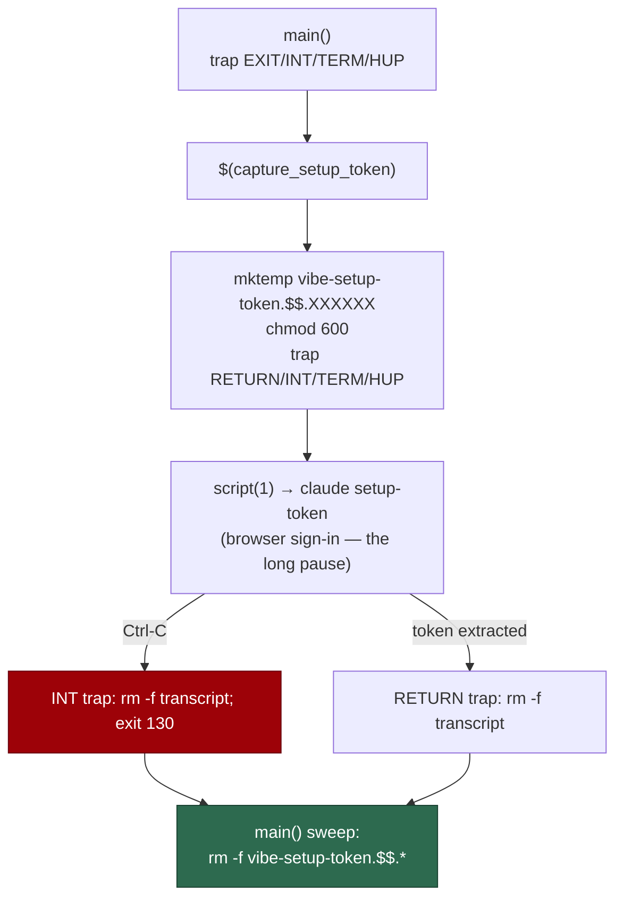

# Remove the `claude setup-token` transcript on every exit path

## Summary

`capture_setup_token` in `setup.sh` gives the Claude CLI a pty with
`script(1)`, which logs the whole session — so the transcript holds the
`sk-ant-oat01-…` OAuth token in full. The transcript was removed by a plain
`rm -f` on the success path only. A Ctrl-C at the browser sign-in — the longest
interactive pause in the whole of `setup.sh` — killed the shell before that
line ran and left the long-lived credential at rest in `${TMPDIR:-/tmp}`,
outside the 0700 credential directory the preflight audits and therefore
invisible to the rotation story.

Cleanup is now registered with the file's creation, so every exit path takes
it:

- `capture_setup_token` sets `trap 'rm -f "$transcript"' RETURN` plus `INT`,
  `TERM` and `HUP` traps immediately after `mktemp`/`chmod 600`. The function
  runs inside a command substitution, so these are that subshell's own traps.
  The old success-path `rm -f` is gone — the `RETURN` trap covers it.
- `main()` installs `EXIT`/`INT`/`TERM`/`HUP` traps that call
  `remove_setup_token_transcripts`, a backstop for the signal that kills the
  whole run mid-capture, and for any path where the subshell dies before its
  own trap runs.
- The transcript name now carries the shell's PID
  (`vibe-setup-token.$$.XXXXXX`). `$$` stays the **top-level** shell's PID even
  inside the command substitution, so the sweep matches only transcripts this
  run created and can never delete one a concurrent `setup.sh` is still reading
  its own token out of.

Traps are installed inside `main()` rather than at file scope, so sourcing
`setup.sh` (which the tests do) still has no side effects.

`setup.ps1` already deletes its transcript in a `finally` block
(`setup.ps1:596`), so there is no parity gap to close.

Closes #1300.



## Evidence

Backend/CLI change with no web interface, so there is nothing to screenshot.
The evidence is the regression test, run against the unfixed and the fixed
code.

Against the **unfixed** `setup.sh`:

```text
capture_setup_token - Ctrl-C at the sign-in leaves no transcript holding the token ... FAILED
  [Diff] Actual / Expected
-   [ { contents: "<the transcript line carrying the fake credential>",
-       name: "vibe-setup-token.hGBvSU" } ]
+   []
FAILED | 1 passed | 2 failed
```

After the fix:

```text
capture_setup_token - Ctrl-C at the sign-in leaves no transcript holding the token ... ok
capture_setup_token - returns the token and leaves no transcript on the success path ... ok
remove_setup_token_transcripts - removes this run's transcripts and no other run's ... ok
ok | 3 passed | 0 failed
```

`shellcheck -e SC1091 -e SC2034 setup.sh` and `bash -n setup.sh` are clean.

**The original trigger is closed, with no trivial bypass.** The trigger was:
run `./setup.sh`, accept the "Run `claude setup-token` now? [Y/n]" offer,
press Ctrl-C at the browser sign-in, then find the token with
`grep -o 'sk-ant-oat01-[A-Za-z0-9_-]*' ${TMPDIR:-/tmp}/vibe-setup-token.*`.
`SIGINT` from the terminal is delivered to the whole foreground process group,
and both members that can hold the path now trap it: the capture subshell
removes `$transcript` in its own `INT` trap, and the top-level shell removes
`vibe-setup-token.$$.*` in `main()`'s. The near-miss variants are covered by
the same registration point — `SIGTERM`/`SIGHUP` (a closed terminal, a `kill`)
have their own traps, an `exit`/`set -e` death anywhere in the run reaches
`main()`'s `EXIT` trap, and a failure inside `capture_setup_token` reaches the
`RETURN` trap. The only remaining gaps are the ones no userspace cleanup can
close: `SIGKILL`, and the sub-millisecond window between `mktemp` and the
`trap` on the next line. Nothing in the fix is keyed to the test's inputs — the
traps are unconditional and the sweep is a PID-scoped glob, so any transcript
this run creates is covered.

## Test Plan

- Added `worker/deno/tests/setup_token_transcript_cleanup_test.ts`:
  - `worker/deno/tests/setup_token_transcript_cleanup_test.ts::capture_setup_token - Ctrl-C at the sign-in leaves no transcript holding the token`
    — the regression test. It sources the real `setup.sh`, stubs `script(1)` on
    `PATH` so the stub writes a fake `sk-ant-oat01-…` transcript, signals the
    waiting shell and then dies from `SIGINT` itself (exactly what Ctrl-C does
    to `claude`), and asserts no `vibe-setup-token.*` survives in the test's own
    `TMPDIR`. It reproduces the flaw: **it fails against the unfixed code**
    (the transcript with the token is left behind, as quoted above) **and
    passes after the fix**.
  - `worker/deno/tests/setup_token_transcript_cleanup_test.ts::capture_setup_token - returns the token and leaves no transcript on the success path`
    — the success path still returns the token, and the removed `rm -f` has not
    regressed into a leak.
  - `worker/deno/tests/setup_token_transcript_cleanup_test.ts::remove_setup_token_transcripts - removes this run's transcripts and no other run's`
    — the sweep clears both transcripts of this run, is idempotent and quiet,
    and leaves a concurrent run's `vibe-setup-token.999999.*` untouched.
- Registered the new file in `worker/deno/lib/integration_test_manifest.ts`:
  it spawns `bash` against the real `setup.sh`, so the classifier claims it and
  `integration_test_manifest_test.ts` requires it to be listed. Like every
  other `setup.sh`-driving suite it therefore runs in CI rather than in the
  local gate.
- Re-ran the neighbouring suites that source `setup.sh`:
  `setup_parity_test.ts`, `setup_ps1_test.ts`, `export_scrub_gate_test.ts` and
  `setup_consent_prompt_test.ts` — 49 passed, 0 failed.
  `setup_provider_credential_flow_test.ts` and
  `setup_credential_provisioning_test.ts` fail identically **before and after**
  this change in this container (`CONFIG_FILE and CONFIG_PATH are both set and
  name different files` — inherited worker environment, verified by stashing
  the change and re-running).
