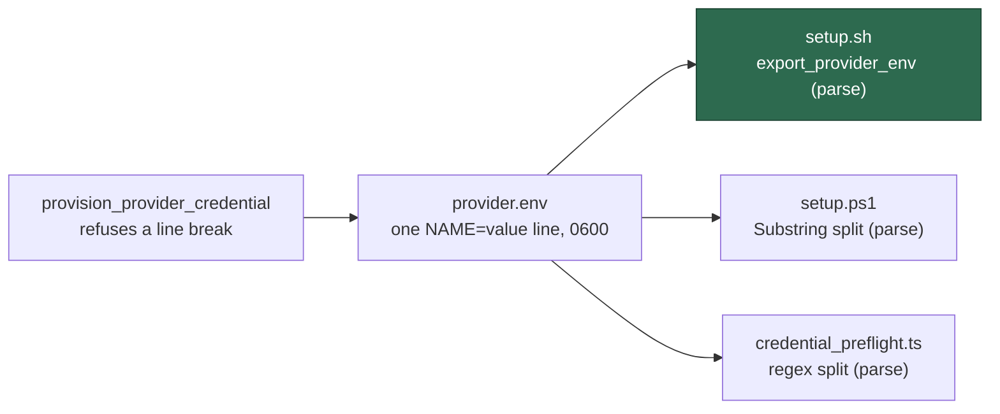

# provider.env is read as data, never sourced (Issue #1301)

## Summary

`setup.sh` wrote a provisioned credential as a plain `NAME=value` line and then
read it back with `source`, which is a full bash parse. A credential holding a
space set the variable to its **first word** and ran the remainder as a command;
`$(...)` and backticks were substituted at read time; a `#` truncated the value
silently. The stored token looked correctly provisioned behind setup's ✓ and the
worker met the truncated credential unattended as an unexplained auth error.

The fix makes the file data on both sides:

- **Read** — new `export_provider_env` in `setup.sh` performs the same parse
  `setup.ps1` (`setup.ps1:512-517`) and
  `worker/deno/lib/credential_preflight.ts:236-252` already perform: split each
  line on the first `=`, take the remainder verbatim, `export "NAME=value"` as a
  single argument. `claude_credential_is_valid` uses it in place of
  `set -a; source "$file"`, so nothing in the credential is ever evaluated.
- **Fail loud** — a file holding no `NAME=value` line is now reported and
  condemned (`print_error` + return 1) instead of being read as an empty
  environment and passing off whatever else the CLI could find.
- **Write** — `provision_provider_credential` refuses a value containing a line
  break. One line is the entire file format for all three readers, so writing a
  multi-line value would store a truncated token behind a success message.

Closes #1301.

### Why not `printf '%q'`

The issue suggested quoting the write with `printf '%s=%q\n'`. That would break
the other two readers, which do no unquoting: `setup.ps1` takes
`$line.Substring($separator + 1)` verbatim, so `sk-ant\ x` would be stored with
its backslash, and the Deno parser strips only one leading/trailing quote
character. `provider.env` is a cross-language data file, so the durable fix is to
stop the one evaluator evaluating it, not to add shell syntax the non-shell
readers cannot undo.



## Evidence

Backend/CLI change with no web interface, so there is nothing to screenshot; the
evidence is the regression suite, run against the unfixed and the fixed code.

**Red, against the unfixed `setup.sh`** — all three new tests failed. The first
one showed the vulnerability exactly as reported: the stubbed `claude` recorded
`ANTHROPIC_API_KEY` as `<unset>`, because
the stored line parses as a prefix assignment on the command `BBB` rather than as
an assignment of the whole value, and both injected `touch` payloads ran.

```text
claude_credential_is_valid - exports a metacharacter credential verbatim and runs none of it
error: AssertionError: Values are not equal.
-   <unset>
+   sk-ant-oat01-AAA BBB; touch /tmp/…/pwned-semicolon; $(touch /tmp/…/pwned-substitution)#tail
provision_provider_credential - refuses a credential holding a newline
error: AssertionError: WROTE=yes
claude_credential_is_valid - reports a file holding no NAME=value line
error: AssertionError: VALID=yes
FAILED | 0 passed | 3 failed
```

**Green, after the fix**:

```text
deno test --allow-all tests/setup_provider_env_parse_test.ts
ok | 3 passed | 0 failed (25ms)
```

**Full gate** — `./quality.sh` PASSED (20 checks; `config integration`,
`pages-liquid` and `mermaid built output` skipped by the gate itself).
`shellcheck -e SC1091 -e SC2034 setup.sh` is clean, and the
`# shellcheck disable=SC1090` that covered the `source` is gone with it.

### Original trigger is closed, with no trivial bypass

The reported trigger — exporting `VIBE_LAUNCHAGENT_DEEPSEEK_API_KEY` with a value
ending in `; touch /tmp/pwned` and running `./setup.sh` — is closed. The value is
still stored verbatim, but the only shell that read it back now reaches it
through `export_provider_env`, which never invokes the parser: the line is split
with parameter expansions (`${line%%=*}` / `${line#*=}`) and handed to `export`
as one already-assembled `NAME=value` argument, so no metacharacter in the value
is ever a token. There is no equivalent bypass, because there is no remaining
evaluation site: `grep -n 'source "\$' setup.sh` and `grep -n 'set -a' setup.sh`
both return nothing, `eval` is never applied to credential material, and the
`export` argument is a single word regardless of the value's contents. Quoting
the value on write would have left the evaluator in place; removing the evaluator
closes the class, not just the reported input. The secondary silent-truncation
path (a line break) is refused at the write instead of being stored, so no
credential can be written that the readers would parse as something shorter than
what was supplied.

## Test Plan

New — `worker/deno/tests/setup_provider_env_parse_test.ts`, three behavioural
tests that source the real `setup.sh` and call its real functions:

- `worker/deno/tests/setup_provider_env_parse_test.ts::claude_credential_is_valid - exports a metacharacter credential verbatim and runs none of it`
  — the regression test for this issue. It provisions
  `sk-ant-oat01-AAA BBB; touch …; $(touch …)#tail`, runs the real validation path
  against a stubbed `claude` that records the credential it was handed, and
  asserts the recorded value equals the supplied value byte for byte and that
  neither injected payload created its marker file. It **fails against the
  unfixed code** (the CLI is handed `<unset>` and both payloads run) and
  **passes after the fix**.
- `worker/deno/tests/setup_provider_env_parse_test.ts::provision_provider_credential - refuses a credential holding a newline`
  — asserts a multi-line value returns non-zero, names the newline in the error,
  and writes no file. Fails against the unfixed code, which wrote it.
- `worker/deno/tests/setup_provider_env_parse_test.ts::claude_credential_is_valid - reports a file holding no NAME=value line`
  — a credential file with only a comment and a bare token is reported and
  condemned rather than passing on an empty environment. Fails against the
  unfixed code, which returned valid.

Existing suites re-run unchanged and green:
`setup_credential_provisioning_test.ts`, `setup_provider_credential_flow_test.ts`
and `setup_parity_test.ts` (46 tests) — including the assertion that a normal key
is still stored as the exact one-line `NAME=value` form those readers expect,
which is what keeps the cross-language file format intact. No existing test was
modified or removed.

## Files changed

- `setup.sh` — `export_provider_env`; `claude_credential_is_valid` parses instead
  of sourcing and condemns an unparseable file; `provision_provider_credential`
  refuses a line break.
- `worker/deno/lib/integration_test_manifest.ts` — registers the new suite, which
  drives `setup.sh` (the manifest gate fails otherwise).
- `docs/SETUP.md` — states that `provider.env` is data, parsed the same way by
  all three readers, and that a line break is refused.
- `worker/deno/tests/setup_provider_env_parse_test.ts` — new.
