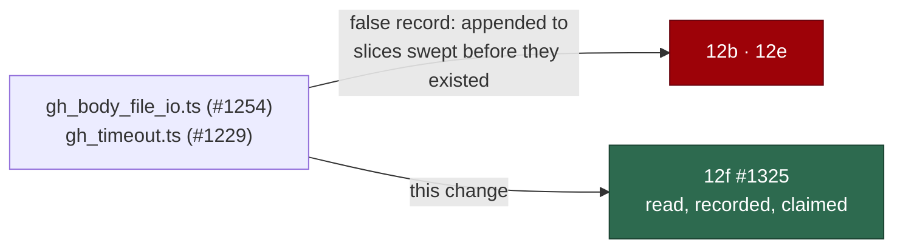

## Summary

`gh_body_file_io.ts` and `gh_timeout.ts` entered `worker/deno/lib/` after the
chunk-12 sweep recorded its coverage, so the coverage gate went red on this
milestone branch. It was made green by appending the two paths to slices 12b and
12e — sweeps that ran before either module existed, which is a false record in a
security-audit ledger and exactly what the issue said not to do.

This change does the honest version: both modules were **read**, the result is
recorded in a new sweep record, and they move to a new slice `12f` that names
the sweep that actually read them. A new enumeration rule stops the shortcut
recurring — any slice of twenty modules or fewer (the shape every top-up slice
takes) must name each module it claims in its own record. Closes #1325.

## Evidence

Backend/CLI only — no web interface to screenshot. The evidence is the test run
and the measurements recorded in the sweep record.



Sweep result — `docs/audits/security-sweep-1325-gh-body-file-io-and-timeout.md`:

- **Verified, measured** — the masked `--input` temp file is created mode `600`;
  `GH_COMMAND_TIMEOUT=0` and `=Infinity` both fall back to the 60 s default
  rather than disabling the control; an unreadable body raises
  `UnredactableBodyError` and refuses the call rather than publishing unscanned;
  no production caller supplies its own `signal`, so the default `gh` budget is
  unavoidable.
- **F1, filed as #1364** — masked `gh api --input` bodies leave
  `gh-input-*.json` in `TMPDIR` forever; the fix belongs at the spawn site's
  lifecycle, not in the writer.
- **F2, accepted** — an oversized `GH_COMMAND_TIMEOUT` can extend the budget
  without limit; the environment is host-trust and the fail-closed direction is
  handled.
- **F3, accepted** — `--paginate` is matched anywhere in argv, so a body whose
  text is `--paginate` takes the 300 s budget; no control is bypassed and `gh`
  still receives byte-identical arguments.

Test run after the final edit:

```text
cd worker/deno && deno test -A --no-check tests/lib_sweep_coverage_test.ts
ok | 17 passed | 0 failed (15ms)
```

Fail direction, observed rather than assumed: with slice `12f` added and its
record not yet written,
`every small sweep slice's record names each module it
claims` and
`every sweep record the ledger names exists in the tree` both went red; writing
the record turned them green.

## Quality gate

`./quality.sh` was run in full. Every stage passes except `deno tests`, which
fails on `plan_coverage_gate_bounds_1245_test.ts` — a **pre-existing** failure
on `milestone/fix-scan-issues-20260906`, already filed as #1366. Verified
independent of this change: with the working tree stashed (`git stash -u`),
`deno test -A --no-check tests/plan_coverage_gate_bounds_1245_test.ts` still
reports `FAILED | 4 passed | 1 failed`. Nothing else in the suite fails against
this branch.

## Test Plan

Added to `worker/deno/tests/lib_sweep_coverage_test.ts`:

- `unnamedSmallSliceModules - a small slice's record must name each module it claims`
  — the shortcut this rejects.
- `unnamedSmallSliceModules - a record naming every claimed module reports nothing`.
- `unnamedSmallSliceModules - a slice past the enumeration limit describes its modules collectively`
  — the five original slices stay legal.
- `unnamedSmallSliceModules - a record that was not supplied fails loud` — a
  missing record reports every claim instead of passing for want of evidence.
- `unnamedSmallSliceModules - a slice still pointing at its issue is skipped` —
  a `claimed` slice has no record yet.
- `every small sweep slice's record names each module it claims` — the same rule
  against the real ledger and the real records.

Unchanged and still passing: the eleven existing coverage tests, including
`every worker/deno/lib module is claimed by exactly one sweep slice`.

## Note for the reviewer — why this PR targets the milestone branch

Issue #1325 was filed with no GitHub milestone, so the worker based its branch
on `main` (it has since been assigned to **Fix scan issues 20260906**). Neither
module exists on `main`; adding their paths to the ledger there would make the
gate red the other way (`stale` entries naming modules that are not on disk).
The fix can only be correct on `milestone/fix-scan-issues-20260906`, where both
modules live and where their sibling issues #1229 and #1254 landed, so the
branch is cut from that base and the PR targets it.
