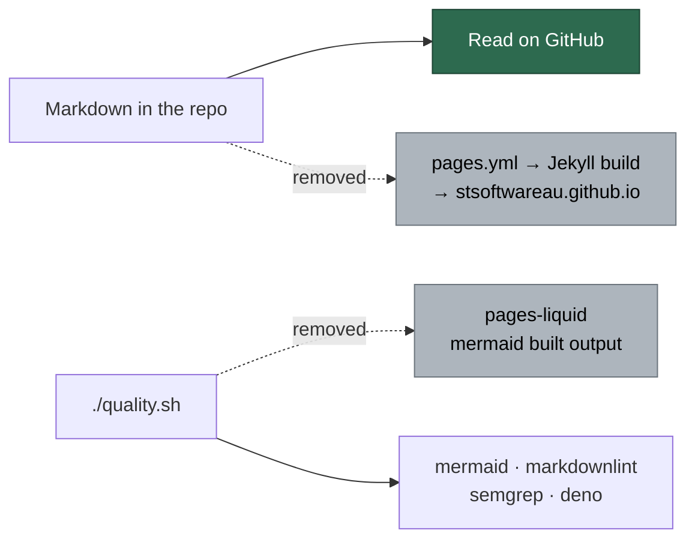

## Summary

Removed the GitHub Pages publishing pipeline. The Jekyll site existed for one
reason — this repository was private, and publishing the READMEs was the only
way to read them. The repository is public, so GitHub renders every Markdown
file directly, including the Mermaid diagrams the layout used to load a CDN
script for. Closes #1344.

Deleted: `.github/workflows/pages.yml`, the four Ruby build scripts, the Jekyll
site files (`_config.yml`, `_layouts/`, `_includes/`, `_data/page_titles.yml`,
`assets/favicon.svg`, `404.html`), the two Pages-only worker commands
(`check-pages-liquid`, `check-mermaid-built-output`), the five modules behind
them, and 20 tests that asserted on files that no longer exist. Every doc that
described the pipeline was updated, and `.release-floor` moves to `1.5.0` so
the next merge to `main` mints the minor.

**69 files changed, 244 insertions, 5528 deletions** — 38 files deleted.



### Three things deliberately kept

| Kept | Why |
| --- | --- |
| `worker/deno/lib/issue_comment_pages.ts` (+ its test) | The issue's accepted scope listed it for deletion on the strength of its name. It paginates GitHub **issue comments** and is imported by 11 live modules including `lib/github.ts`. Nothing to do with GitHub Pages. |
| `defuseLiquid` in `lib/handover_note.ts` | The handover note is committed into **monitored** repositories, which may still publish their own `docs/` through Pages. This repository stopping does not make the escaping dead. |
| `Gemfile`, `Gemfile.lock`, the `bundle-audit` job, the Ruby container base | Blocked — see below. Tracked in #1376. |

### What is blocked, and why

Deleting `Gemfile`/`Gemfile.lock` means deleting the `bundler-audit` job that
scans them, and that is a **modification** to `.github/workflows/dependency-audit.yml`:

```text
! [remote rejected] refusing to allow an OAuth App to create or update workflow
  `.github/workflows/dependency-audit.yml` without `workflow` scope
```

`mod.ts gh-auth --operation check-scopes` confirms the token:
`scopes=admin:public_key,gist,read:org,repo,user workflow=NO repo=yes`. Deleting
a workflow file **is** permitted without the scope, which is how `pages.yml`
could go; creating or updating one is not. Rather than ship a `Gemfile`-less
tree with a `bundler-audit` job that would turn the weekly audit red, the Ruby
ecosystem stays intact and **#1376** carries it — it needs `needs-human`
triage to grant the scope or apply the edits by hand.

## Evidence

Backend/CLI change with no web interface to screenshot — the only visual
surface this repository had is the one being removed. Evidence is the gate and
the tests.

`./quality.sh < /dev/null` — **PASSED** (with skipped checks) after the final
edit:

```text
  benchmark audit PASSED   mermaid          PASSED   deno tests      PASSED
  workflow hygiene PASSED  markdownlint     PASSED   deno lint       PASSED
  source targets  PASSED   semgrep          PASSED   deno type check PASSED
  release-tag ruleset PASSED                         deno fmt        PASSED
  config integration SKIPPED
```

Three audit ledgers that name real files were reconciled rather than left to
rot: `docs/audits/lib-sweep-coverage.json` (5 entries), the generated
`docs/audits/dependency-inventory.md` (4 Pages-only actions), and
`mod_test.ts`'s command count (150 → 148).

## Acceptance Criteria

<!-- vibe-spec-review inputs="diff+issue-body" -->

- **met** — Delete `.github/workflows/pages.yml` and `.github/scripts/inject_page_metadata.rb` — evidence: `worker/deno/tests/pages_publishing_removed_test.ts::Pages publishing pipeline files are removed` — reviewer: met
- **partial** — Delete the Jekyll site files (`_config.yml`, `Gemfile`, `Gemfile.lock`, `404.html`, `_layouts/`, `_includes/`, `_data/page_titles.yml`, `assets/favicon.svg`) — evidence: all deleted except `Gemfile`/`Gemfile.lock`, pinned by `pages_publishing_removed_test.ts:31-36` — reviewer: partial — reason: dropping the Ruby manifests requires modifying `.github/workflows/dependency-audit.yml`, which the worker token has no `workflow` scope to push; tracked in #1376
- **partial** — Delete the Pages-only quality-gate checks, including `issue_comment_pages.ts` — evidence: 7 of 8 removed, wiring stripped from `lib/quality_gate.ts` and `mod.ts`; `lib/issue_comment_pages.ts` kept — reviewer: partial — reason: the reviewer confirmed the criterion is unmet as written but that keeping the module is correct — it is issue-comment pagination imported by 11 live modules, and the issue's own assumption says non-Pages modules stay
- **partial** — Delete the named tests, including `issue_comment_pages_test.ts` — evidence: 12 of 13 named files deleted; `issue_comment_pages_test.ts` kept — reviewer: partial — reason: it covers the retained pagination module, so deleting it would drop live coverage
- **met** — Update every doc that describes the pipeline so none points at the removed site — evidence: `docs/DEPLOYMENT.md` (section + TOC), `docs/AGENT-ACCOUNTABILITY.md`, `docs/INTERNALS.md`, `docs/PROMPT-BEST-PRACTICES-CHECKLIST.md`, `docs/CONTAINER.md`, `docs/CONTAINER-IMAGE.md`, `docs/workflows/issue-processing.md`, `CODING-STANDARDS.md`, `CONTRIBUTING.md`, `prompts/issue/prompt.md`; guarded by `pages_publishing_removed_test.ts::no published doc links at the retired Pages site` — reviewer: partial — reason: the reviewer named eight stale sites (`docs/CONTAINER.md`, `docs/CONTAINER-IMAGE.md`, `docs/workflows/issue-processing.md`, `lib/handover_note.ts`, `lib/container_manifest.ts`) it saw in the diff it was given; all were fixed in the follow-up commit after the review, so the criterion is met on the branch as pushed
- **met** — Bump `.release-floor` to `1.5.0` so the next merge to `main` mints 1.5.0 — evidence: `.release-floor`, verified by the reviewer against `.github/scripts/next-release-tag.sh` — the newest tag is 1.4.20, so the floor is minted exactly — reviewer: met
- **met** — Done when `./quality.sh` passes — evidence: full gate run in the foreground after the final edit, PASSED — reviewer: missing — reason: the reviewer had no JSR cache in its sandbox and could not execute the gate; it was run here and passed
- **met** — Done when a repository-wide search finds no remaining reference to the Pages workflow, the Jekyll build, or the site URL — evidence: `pages_publishing_removed_test.ts::no published doc links at the retired Pages site`, which now walks `docs/` recursively — reviewer: partial — reason: the reviewer's two findings were the flat `readDir` (fixed — the walk is recursive and skips only frozen `docs/archive/`) and the surviving Jekyll references, all fixed after the review except `Gemfile`/`Gemfile.lock`, which #1376 owns
- **unrequested** — Deleted three Ruby scripts beyond the listed one: `normalise_heading_ids.rb`, `strip_unpublished_links.rb`, `wrap_pr_summary_raw.rb` — reviewer: unrequested — reason: `pages.yml` and `inject_page_metadata.rb` were their only callers, so they were dead the moment the workflow went
- **unrequested** — Deleted eight test files beyond the listed set (`wrap_pr_summary_raw_test.ts`, `wrap_published_markdown_test.ts`, `notfound_page_favicon_test.ts`, `notfound_redirect_origin_test.ts`, `default_layout_main_landmark_test.ts`, `default_layout_title_no_page_icon_test.ts`, `page_heading_emoji_matches_favicon_test.ts`, `idle_task_page_icon_test.ts`) and one case from `container_extension_example_docs_test.ts` — reviewer: unrequested — reason: each reads a file this change deletes (`404.html`, `_layouts/default.html`, `_data/page_titles.yml`), so each would fail on a missing fixture; the reviewer correctly notes `notfound_redirect_origin_test.ts` guarded an open-redirect in `404.html` — the page it guarded no longer exists
- **unrequested** — Removed the "Jekyll-safe Markdown (Liquid escaping)" section from `prompts/issue/prompt.md` — reviewer: unrequested — reason: it instructs every future run to wrap prose in `raw` blocks for a build that no longer exists; leaving it would keep costing tokens and mangling summaries
- **unrequested** — Added a `nosemgrep` suppression at `worker/deno/tests/issue_3642_ci_install_pin_test.ts:195` — reviewer: unrequested — reason: pre-existing code semgrep only scans once the file changes; the regex comes from this repo's own committed `renovate.json`, which is the point of the test, and the gate blocks the PR otherwise
- **unrequested** — Reconciled `docs/audits/lib-sweep-coverage.json` and `docs/audits/dependency-inventory.md` — reviewer: unrequested — reason: both are ledgers of real files, enforced by `lib_sweep_coverage_test.ts` and `supply_chain_gate_test.ts`; leaving them stale fails the gate

## Standards Review

<!-- vibe-standards-review inputs="diff+CODING-STANDARDS.md" -->

- **violation** — A test grepped source instead of running it: `mod.ts` was read as text and scanned for the command strings, which the standards forbid outright — evidence: `worker/deno/tests/pages_publishing_removed_test.ts:105` — reason: fixed here; it now calls `createDefaultRegistry().list()` and asserts on the names the real registry holds, so a registration moved behind a helper cannot slip past
- **violation** — Docs still justified the Ruby base image by the deleted `.rb` scripts, breaching "A Code Change Owes a Docs Change" — evidence: `docs/CONTAINER.md:48`, `docs/CONTAINER-IMAGE.md:30`, `worker/deno/lib/container_manifest.ts:123` — reason: fixed here; all three now say the requirement is a leftover of the removed pipeline and name #1376
- **violation** — Two comments still cited the Jekyll build and the deleted page-title manifest, while the identical sentence elsewhere in the same change was corrected — evidence: `worker/deno/lib/handover_note.ts:27`, `docs/workflows/issue-processing.md:506` — reason: fixed here; both now name only the markdownlint globs
- **violation** — `.github/zizmor.yml`'s suppression comment was narrowed to npm installs while `dependency-audit.yml` is still suppressed and still runs `gem install`, breaching the file's own "every ignore names the reason" rule — evidence: `.github/zizmor.yml:9` — reason: fixed here; the `gem install` clause is restored
- **violation** — The `/index.md` removal left two trailing blank lines, against the Boy Scout Rule — evidence: `.gitignore:44` — reason: fixed here
- **violation** — `.release-floor` is a hidden path outside the five-entry allowlist in the standards — evidence: `.release-floor` — reason: stands, and is not this branch's to fix: the file was already tracked at the base commit alongside `.deno-version` and `.node-version`, and `.gitignore:24` negates it with a documented reason (Issue #808). The drift is between the standards text and what the repo already tracks; widening it here would be worse than naming it
- **violation** — Two of the new tests assert on filesystem state and doc prose rather than calling a function — evidence: `worker/deno/tests/pages_publishing_removed_test.ts:63`, `:83` — reason: stands, deliberately. The property under test *is* the absence of files and of a dead URL; there is no function whose return value expresses it, and the repo already tests this class the same way (`lib_sweep_coverage_test.ts`, `dependabot_config_test.ts`, `container_extension_example_docs_test.ts`). The reviewer's alternative, `check-resurrected-files`, only catches a file the *default branch* deleted coming back on a branch — it says nothing once this merges
- **violation** — No `docs/archive/pr-summaries/pr-summary-1344.md` existed, and with it the record of ~19 deleted test files — evidence: `docs/archive/pr-summaries/` — reason: fixed here; this file is that record, and the Test Plan below names every deletion and why each was forced
- **clean** — Australian English throughout the added prose (the only `color:` hits are Mermaid `style` syntax); no `.env`, `.config*.json`, `*.pem`, `*.key` or credential file staged and no `git add -f`/`--no-verify`; commit messages reference the issue and carry the `Vibe-Coder-Run-Id` trailer; no dangling reference to any deleted module outside the frozen `docs/archive/`; the deleted test files appear in no test manifest, so none was owed an update; the new test mutates no process state, sleeps on nothing and asserts no wall-clock budget, so it is parallel-safe; the two removed gate checks are deleted outright rather than stubbed to a passing status — nothing was converted to a silent skip

## Test Plan

- **Added** `worker/deno/tests/pages_publishing_removed_test.ts` — three tests
  against the real checkout: every Pages path is absent, no published doc links
  at the retired site (walking `docs/` recursively, exempting the frozen archive
  and the release note that must name what was retired), and `mod.ts` registers
  neither removed command. Written first and observed failing against the
  unremoved tree, then green after the deletions.
- **Modified** `worker/deno/tests/mod_test.ts` — command count 150 → 148, with
  the two removed commands' assertions dropped.
- **Modified** `worker/deno/tests/issue_3642_ci_install_pin_test.ts` — the
  expected pin set loses `http-server@14.1.1` and `pa11y-ci@3.1.0`, which lived
  only in `pages.yml`.
- **Modified** `worker/deno/tests/container_extension_example_docs_test.ts` —
  dropped the case asserting a `_data/page_titles.yml` entry.
- **Modified** `preserved_wip_branch_test.ts`, `markdownlint_check_test.ts`,
  `renovate_config_test.ts` — comment corrections only, no assertion changes.
- **Deleted** 20 test files, every one of which asserted on a file this change
  removes. No test was commented out or weakened.
- **Full gate**: `./quality.sh < /dev/null` PASSED.
