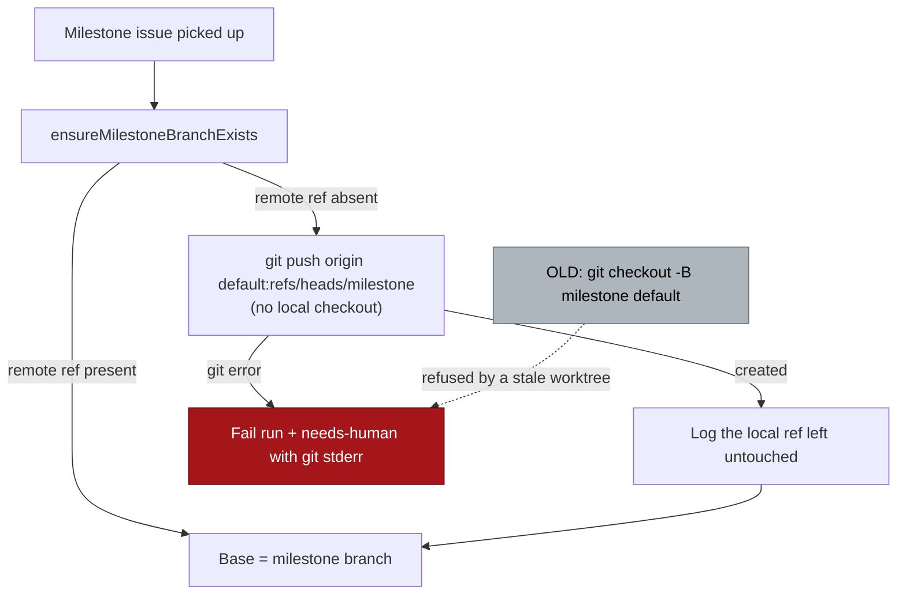

# Self-heal milestone branch setup when a stale local checkout blocks creation

## Summary

`ensureMilestoneBranchExists` created a missing milestone branch by checking it
out locally (`git checkout -B <milestone> <default>`) and pushing that branch.
Git refuses `checkout -B` outright when another worktree holds the branch name
— `fatal: 'milestone/x' is already used by worktree at …` — so both recovery
paths failed and the setup phase escalated with `needs-human`.
NEAT-AI-Ockham#133 died that way three times in one day (01:54, 06:06 and 11:54
UTC) on a host whose clone carried a stale, never-pushed local checkout of the
milestone branch.

The branch is now created **on origin**, by pushing the default branch ref
straight to the milestone ref name
(`git push origin origin/main:refs/heads/milestone/x`). No local checkout takes
part, so no local state can block it — and the stale local tip still never
reaches the remote, which is the Issue #4002 invariant. The blocking checkout is
left exactly as it was and named in one log line; nothing is deleted or reset.

Closes #1345.



## Evidence

Backend/git change with no web interface to screenshot. The evidence is a real
git reproduction: `tests/milestone_branch_worktree_block_test.ts` builds a bare
remote plus a clone, puts the milestone branch in the failing state (local-only
branch checked out in a second worktree), and **asserts as a precondition that
`git checkout -B` is genuinely refused** before exercising the fix.

Against the unfixed code the first two tests failed with production's own words:

```text
error: AssertionError: expected ok, got: Failed to create milestone branch
milestone/133-blocked from main: git fetch origin milestone/133-blocked exited
128: fatal: couldn't find remote ref milestone/133-blocked | git checkout -B
milestone/133-blocked main exited 128: fatal: 'milestone/133-blocked' is
already used by worktree at '/tmp/issue-1345-…/stale-worktree' | git checkout -B
milestone/133-blocked origin/main exited 128: fatal: …
FAILED | 3 passed | 2 failed
```

After the fix all of them pass, and `./quality.sh` passes in full (deno tests,
lint, type check, fmt, semgrep, mermaid, markdownlint, every chokepoint check).

## Acceptance Criteria

<!-- vibe-spec-review inputs="diff+issue-body" -->

- **met** — when the remote milestone ref is absent, `ensureMilestoneBranchExists`
  creates it on origin by pushing the default branch ref directly, with no local
  checkout; the function returns ok and the run bases its PR on it instead of
  adding `needs-human` — evidence:
  `worker/deno/lib/git_branch.ts` (push loop over `origin/<default>` then
  `<default>`),
  `worker/deno/tests/milestone_branch_worktree_block_test.ts::ensureMilestoneBranchExists - creates the branch on origin when a stale worktree holds the name`
  — reviewer: met
- **met** — the stale local checkout that blocked creation is left untouched;
  one line names it; nothing is deleted or reset — evidence:
  `worker/deno/lib/milestone_local_branch.ts` (read-only inspection),
  `worker/deno/tests/milestone_branch_worktree_block_test.ts::ensureMilestoneBranchExists - leaves the blocking checkout untouched and logs it`
  — reviewer: met
- **met** — assumption: fix this deadlock class only, no generic detector for a
  repeated escalation — evidence: no such detector in the diff — reviewer: met
- **unrequested** — the creation refreshes `origin/<default>` with an extra
  `git fetch` and falls back across two source refs — reviewer: unrequested —
  reason: kept, because creating the milestone branch from a possibly stale
  local base is the fault next door; it mirrors the Issue #1501 precedent in
  `createFeatureBranchFromBase`, runs only on the branch-missing path, and the
  fallback is now warned about rather than silent
- **unrequested** — `worker/deno/lib/milestone_local_branch.ts` is a new module
  with three exports rather than an inline `console.warn` — reviewer:
  unrequested — reason: the "log one line" requirement needs worktree-porcelain
  parsing and honest handling of a git command that fails; a separate module
  keeps `git_branch.ts` focused and makes those paths testable
- **unrequested** — the line is emitted for any local ref of that name, printing
  "not checked out" for one that blocked nothing — reviewer: unrequested —
  reason: kept deliberately; the ref is what the run declined to touch, and
  reporting only the worktree case would hide the same stale state one command
  before it wedges
- **unrequested** — `buildPushCreateBranchArgs` validates both halves of the
  refspec (`git_ref_args.ts`) with its own tests — reviewer: unrequested —
  reason: the branch name is interpolated into a refspec where a `:` would
  redirect the push; the file's Issue #3714 convention requires the guard
- **unrequested** — `tests/support/git_repo_fixture.ts`,
  `capturingWarningsAsync` in `tests/support/warnings.ts`, and the
  `docs/audits/lib-sweep-coverage.json` entry — reviewer: unrequested —
  reason: the first two remove fixture copies this change would otherwise have
  made a third and fourth; the ledger entry is mandatory — `lib_sweep_coverage`
  fails the gate for any `lib/` module no sweep slice claims

## Standards Review

<!-- vibe-standards-review inputs="diff+CODING-STANDARDS.md" -->

- **violation** — fail-loud: a failed `git fetch origin <default>` was collected
  into diagnostics that the success path discards, and it silently flipped the
  creation onto the possibly stale local ref — evidence:
  `worker/deno/lib/git_branch.ts:401` — reason: fixed here; the fallback now
  warns, covered by
  `milestone_branch_worktree_block_test.ts::a failed default-branch fetch is warned about, not swallowed`
- **violation** — fail-loud: `inspectLocalMilestoneBranch` returned "no local
  branch" / "not checked out" when git could not be asked at all — evidence:
  `worker/deno/lib/milestone_local_branch.ts:56` — reason: fixed here; the
  report is now `absent` / `present` / `unknown`, and `unknown` is logged as
  "Could not inspect …"
- **violation** — DRY: the git remote/clone fixture was a third byte-identical
  copy, and `console.warn` was swapped by hand despite
  `tests/support/warnings.ts` — evidence:
  `worker/deno/tests/milestone_branch_worktree_block_test.ts:20` — reason: fixed
  here; `tests/support/git_repo_fixture.ts` now serves all three milestone
  suites (two copies deleted) and `capturingWarningsAsync` was added to the
  existing helper
- **violation** — module/test convention: the new `lib/` module had no
  `tests/<module>_test.ts` and its error paths were untested — evidence:
  `worker/deno/lib/milestone_local_branch.ts:1` — reason: fixed here;
  `worker/deno/tests/milestone_local_branch_test.ts` covers absent, present,
  worktree-held, non-repository, and both describe branches
- **violation** — docs-with-code: two test names and three comments still
  described the removed `checkout -B` behaviour — evidence:
  `worker/deno/tests/milestone_branch_selfheal_test.ts:98`,
  `worker/deno/tests/milestone_branch_ensure_test.ts:137` — reason: fixed here,
  along with the stale mock return string at
  `worker/deno/tests/issue_worker_test.ts:568`
- **violation** — commit message form: the first commit's subject carried no
  issue reference — evidence: commit `195414a` — reason: stands (rewriting a
  pushed commit is not worth it); its body carries `Closes #1345` and the
  run-id trailer, and the follow-up commit uses the documented form
- **clean** — ref-injection hardening (`assertSafeRefComponent` on both halves
  of the refspec, `--end-of-options`), commit safety (no hidden or credential
  paths staged), Australian English throughout, Deno-native tooling only, real
  tests that drive git rather than grep source, no wall-clock or polling
  assertions, `git_branch.ts` kept focused by extracting the new module

## Test Plan

Added:

- `worker/deno/tests/milestone_branch_worktree_block_test.ts` — the regression
  suite: creation succeeds while a stale worktree holds the branch name (with
  the `checkout -B` refusal asserted as a precondition); the blocking checkout
  is left untouched and named in exactly one line; no line when no local ref
  exists; the default-branch fetch fallback is warned about.
- `worker/deno/tests/milestone_local_branch_test.ts` — the new module's happy,
  error and edge paths, including a non-repository directory reporting
  `unknown` rather than `absent`.
- `worker/deno/tests/git_ref_args_test.ts` — three cases for
  `buildPushCreateBranchArgs` (refspec shape, `:` rejected in either half,
  dash-leading and empty refs rejected).

Modified (behaviour change, documented):

- `worker/deno/tests/milestone_branch_selfheal_test.ts` — the two Issue #4002
  tests asserted that the stale **local** branch was reset. The branch is no
  longer created locally, so those assertions now check the invariant #4002
  actually protects — the stale tip and its merge commit never reach the remote
  — plus the new #1345 rule that the local branch is left untouched.
- `worker/deno/tests/milestone_branch_ensure_test.ts` — two assertions expected
  `git checkout` in the failure message; the failing command is now `git push`.
- `worker/deno/tests/issue_worker_test.ts` — mock return string aligned with the
  production wording.

Full `./quality.sh` run: PASSED.
