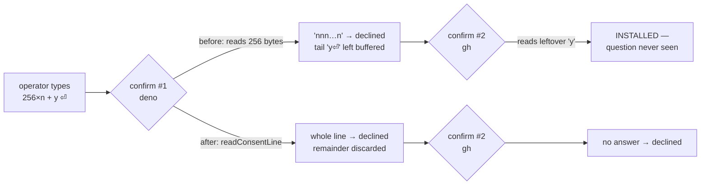

# Read one whole line per prerequisite install prompt (Issue #1346)

## Summary

`defaultConfirm` in `worker/deno/setup/prerequisite_installer.ts` read a fixed
256-byte buffer. Anything the operator typed or pasted past that — the newline
and everything after it — stayed in the terminal buffer and was consumed as the
answer to the **next** failing prerequisite. The installer asks once per failing
tool, so an over-long answer whose tail is `y` installed a package on the host
in answer to a question the operator never saw.

`terminalConfirm()` now reads through `readConsentLine()` / `isAffirmative()`
from `worker/deno/setup/consent_prompt.ts`, which consume exactly one line and
discard the remainder, and takes its reader/writer as injectable seams so the
behaviour is testable without a TTY.

`consent_prompt.ts` was added by #1296 on
`milestone/fix-scan-issues-20260906-part-2`, which has not reached `main` yet.
It is carried in here **byte-identical** (sha1 `e717442…`, verified against
`f61ebcb6`), so the eventual milestone merge is an identical add that resolves
cleanly instead of a second copy of the same logic.

Closes #1346.



## Evidence

Backend/CLI change with no web interface, so there is nothing to screenshot. The
evidence is the regression test observed red then green, plus the full gate.

The two new tests were run against the unfixed fixed-buffer read and failed —
the second confirm returned `true`, and `offerMissingPrerequisites` reached
`runStep` for `gh`:

```
offerMissingPrerequisites - one over-long answer installs nothing => …:674:6
error: Error: runStep must not be called
    at installAndRecheck (…/setup/prerequisite_installer.ts:273:30)
FAILED | 22 passed | 2 failed (22ms)
```

After the fix, the same command passes:

```
$ deno test --allow-all tests/setup_prerequisite_installer_test.ts < /dev/null
ok | 24 passed | 0 failed (9ms)
```

`./quality.sh` — `Result: PASSED (with skipped checks)` (the skip is the
pre-existing `config integration` check, unrelated to this change).

## Security

- **Regression test that fails before and passes after** — added
  `worker/deno/tests/setup_prerequisite_installer_test.ts::offerMissingPrerequisites - one over-long answer installs nothing`,
  which reproduces the flaw: it drives two consecutive confirms from one
  over-long answer and asserts neither tool is installed. It failed against the
  unfixed code (the injected `runStep` threw, because `gh`'s install ran on the
  buffered tail) and passes after the fix. The unit-level companion,
  `worker/deno/tests/setup_prerequisite_installer_test.ts::terminalConfirm - an over-long answer cannot answer the next question`,
  fails the same way before the fix.
- **Original trigger closed, no trivial bypass** — the exact trigger
  (`"n".repeat(256) + "y\n"`) is now read by `readConsentLine`, which loops
  until it sees a newline and returns only the bytes before it, so the whole
  256-plus-`y` string is one answer and is not `y`/`yes`. There is no buffer
  size to overrun: any answer, of any length, ends at its first newline and the
  rest of that read is dropped. A longer paste cannot arrive early either — the
  next prompt's read starts after the discarded remainder, and at worst returns
  no answer, which declines. Over-long answers are truncated at
  `MAX_ANSWER_BYTES` for decoding only, which can only make an answer
  non-affirmative. `isAffirmative` keeps the allowlist of exactly `y` and `yes`,
  so `null` (EOF), a bare Enter, and every other string decline.

## Test Plan

Added to `worker/deno/tests/setup_prerequisite_installer_test.ts`:

- `terminalConfirm - an over-long answer cannot answer the next question` — one
  over-long line through an injected byte-stream reader, two consecutive
  confirms, second must not consent.
- `offerMissingPrerequisites - one over-long answer installs nothing` — the same
  input driven through the real driver over two failing tools; both outcomes
  must be `declined` and no install step may run.
- `terminalConfirm - a plain yes still consents, and EOF declines` — happy path
  (`y`, `YES`) plus the edge cases (bare Enter, EOF).

No existing test was modified or removed; the file's other 21 tests still pass.
