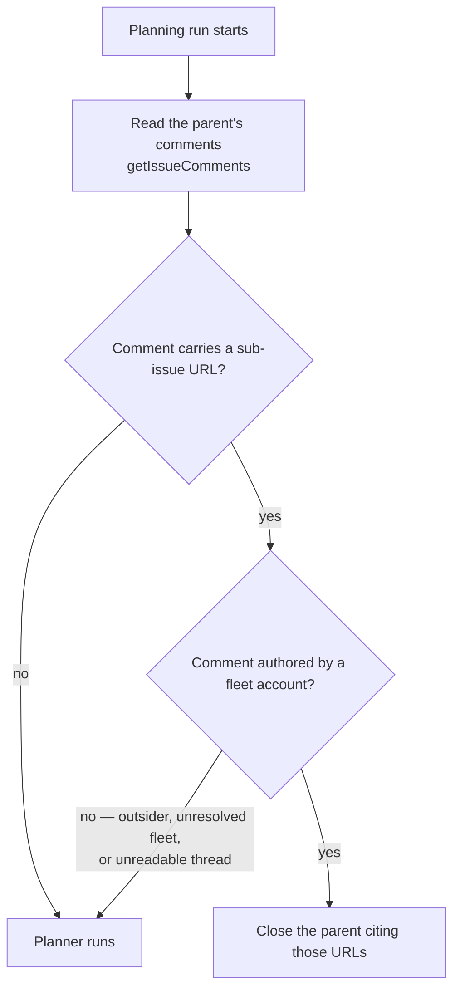

# Verify who wrote the comment before closing a planning parent (Issue #1352)

## Summary

The planning processor's first pre-check recovered sub-issue URLs from
`ctx.issueComments` — the flattened, boundary-framed blob of **every** comment
on the planning issue, with no per-comment author. Any account that can comment
on the repository could post a single `https://github.com/<owner>/<repo>/issues/<n>`
URL and the next planning run would skip Claude entirely and close the parent as
completed, citing that issue as its plan. A benign cross-reference ("related to
#500") tripped the same path by accident.

The recovery now re-reads the thread through `ghClient.getIssueComments` (the
authoritative read — it carries the author), attributes **each comment**
through `selectFleetAuthoredComments()` against the fleet identity
(`resolveFleetMaintenanceAuthorSet` — this host's login ∪ `fleet_pr_authors` ∪
`service_accounts`), and extracts URLs **per comment**, so an outsider's link
elsewhere in the thread cannot ride in on a fleet comment's verification.

Fail direction matches the sibling close-out checks fixed in #1244: an
unattributable comment — outsider author, unresolvable fleet set, unreadable
thread — is discarded and logged loudly, so the planner runs rather than the
parent being closed. A re-planned parent is recoverable; a parent closed against
somebody else's issue loses the work.

Closes #1352.

### Original trigger is closed, with no trivial bypass

The planted comment (`"Related to https://github.com/org/repo/issues/999"` from
login `drive-by`) no longer reaches the close path: URLs are collected per
comment and every candidate comment must pass `isFleetAuthor()` against the
resolved fleet login set before its URLs count. The equivalent bypasses are
closed by construction rather than by pattern:

- **A different URL shape or a benign cross-reference** — the check is on the
  comment's author, not on the text, so no wording gets through.
- **Hiding the URL in a fleet-authored comment's quoted text** — URLs are taken
  per comment, so only the URLs inside the fleet-authored comment body count;
  quoting an outsider's comment inside a fleet comment is the one residual path
  and requires a fleet account to do the quoting.
- **Removing the fleet configuration to make the set unresolvable** — an empty
  fleet set discards every comment (`selectVerified` returns `[]`), so the
  planner runs; it never falls back to trusting the text.
- **The flattened blob** — no longer consulted by this decision at all; the
  decision reads `getIssueComments`, and an unreadable thread yields no URLs.

## Evidence

Backend/CLI change — no web interface to screenshot. Verified by unit tests and
the full quality gate.

- `./quality.sh` — **PASSED** (deno tests, lint, type check, fmt, semgrep,
  markdownlint, mermaid all green).
- `deno test tests/planning_processor_test.ts` — 117 passed, 0 failed.
- Red-then-green: with the fix's helper present but the pre-check still reading
  the blob, `processIssuePlanning - an outsider comment carrying an issue URL
  does not close the parent (Issue #1352)` fails (`AssertionError` — Claude was
  never invoked and the planted URL was published as a sub-issue); with the
  pre-check wired to the verified read it passes.

## Test Plan

Regression test for the reported flaw (fails against the unfixed pre-check,
passes after the fix):

- `worker/deno/tests/planning_processor_test.ts::processIssuePlanning - an outsider comment carrying an issue URL does not close the parent (Issue #1352)`
  — feeds an outsider-authored comment carrying a repo issue URL through
  `processIssuePlanning` and asserts Claude **is** invoked, no sub-issue is
  claimed, and nothing written to the parent cites the planted URL.

Unit coverage for the new helper:

- `worker/deno/tests/planning_processor_test.ts::recoverFleetAuthoredSubIssueUrls - keeps only the fleet-authored comment's URLs`
  — happy path plus the outsider discard and the self-URL exclusion, and asserts
  the discard is logged.
- `worker/deno/tests/planning_processor_test.ts::recoverFleetAuthoredSubIssueUrls - discards every URL when the fleet set is unresolved`
  — an empty fleet set recovers nothing, loudly.
- `worker/deno/tests/planning_processor_test.ts::recoverFleetAuthoredSubIssueUrls - an unreadable thread recovers nothing, loudly`
  — a rejected read fails towards running the planner, with the cause named in
  the log.

Existing tests modified (business-logic change — documented, not removed):

- `processIssuePlanning - recovers when sub-issues exist from prior run`
  (#1175) and
  `processIssuePlanning - recovery path repairs missing Failure Detection sections and completes`
  (#3272) now serve the prior run's summary through the mock
  `getIssueComments`, authored by this host (`testbot`), instead of relying on
  the author-free `issueComments` blob. Both still assert the same behaviour:
  the recovery closes the parent without invoking the planner.
