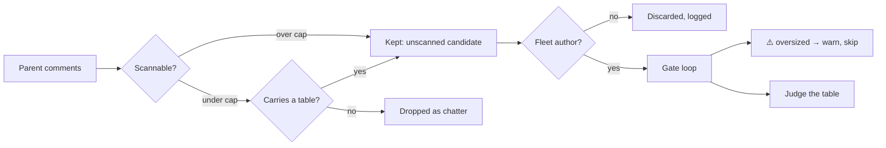

# Restore the loud oversized-candidate skip in the plan-coverage gate (Issue #1358)

## Summary

`plan_coverage_gate_bounds_1245_test.ts::runPlanCoverageGate - an oversized
comment is skipped loudly and a real table still decides` failed on
`milestone/fix-scan-issues-20260906`, turning `./quality.sh` red for every issue
worked off that branch. Two faults, one in the test and one in the gate:

1. **The test's comments carried no author.** The #1244 author gate discards
   every unattributable comment, so `selectFleetAuthoredComments()` dropped the
   compliant table before the oversized-candidate loop ran and the gate returned
   `passed: false`. Fixed in the test: both comments now carry a fleet login and
   the call passes `authorOptions: { fleetAuthors: [FLEET_LOGIN] }`, matching
   every other `runPlanCoverageGate` test in `plan_coverage_gate_test.ts`.

2. **The gate had gone silent on oversized comments** — a genuine fail-silent
   regression, not a test artefact. The #1244 candidate filter kept only
   comments where `extractCoverageTable(body) !== null`, but
   `extractCoverageTable()` returns `null` for *any* body past
   `MAX_COVERAGE_SCAN_CHARS` — it rejects without scanning. So an oversized
   comment was dropped by the filter and never reached the loop that logs the
   skip. An unscanned candidate was being treated exactly like a candidate that
   carried no table, which is the silence Issue #1245 closed and
   `docs/workflows/planning-and-questions.md:519-525` still documents as logged.
   The filter now keeps an oversized body as a candidate, so the existing loud
   `skipped an oversized candidate without scanning it` warning fires again.

The scan bound itself is unchanged, and no test was weakened or removed.

Closes #1358.

## Evidence

Backend/CLI change with no web interface, so the evidence is test output rather
than a screenshot.

Before (clean checkout of the milestone branch):

```
runPlanCoverageGate - an oversized comment is skipped loudly ... FAILED
error: AssertionError: Values are not equal: the genuine table still decides
-   false
+   true
FAILED | 4 passed | 1 failed
```

After adding the fleet author to the test (fault 1 fixed, fault 2 exposed):

```
error: AssertionError: skipping a candidate must be reported, never silent
FAILED | 0 passed | 1 failed | 4 filtered out
```

After the gate fix:

```
deno test --allow-all tests/plan_coverage_gate_bounds_1245_test.ts tests/plan_coverage_gate_test.ts
ok | 37 passed | 0 failed (68ms)
```

How an oversized comment now reaches the loud skip:



## Test Plan

- Modified `worker/deno/tests/plan_coverage_gate_bounds_1245_test.ts` — the
  `runPlanCoverageGate` oversized-candidate test now gives both comments the
  fleet author `vibe-bot` and passes `authorOptions`, so it exercises the scan
  cap rather than dying on the #1244 author gate. Its assertions are unchanged:
  the gate still must pass on the genuine table, report one row, and warn about
  the oversized candidate.
- Re-ran `worker/deno/tests/plan_coverage_gate_test.ts` unchanged to confirm the
  candidate-filter change does not regress the #1244 author behaviour (an
  outsider's table still fails, an unresolved fleet still discards every
  comment).
- Full local gate: `./quality.sh`.
</content>
</invoke>
