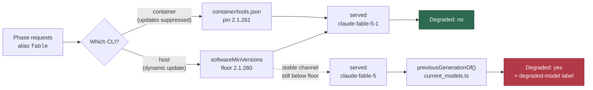

# Fable-preferring phases now get Fable 5.1, and a stale Fable is reported

## Summary

The eight Fable-preferring phases request the `fable` alias and were still being
served `claude-fable-5`. Three causes, all fixed here. Closes #1362.

1. **The image pinned a CLI that has never heard of 5.1.**
   `container/tools.json` pinned `2.1.223`, whose bundled alias table contains
   no `claude-fable-5-1` string at all. In the container the software-update
   step is suppressed entirely (`skipSoftwareUpdateFromEnv` — the image *is* the
   update mechanism), so this pin, not the version floor, is what a fleet run
   actually gets. Bumped to **2.1.261**, checksums re-verified per architecture.
2. **The host floor was too low.** `softwareMinVersions.claude` pinned `2.1.170`
   — the `--model fable` release, far below the 5.1 table. Raised to **2.1.260**.
3. **The downgrade was silent.** `modelsMatch()` matches at tier-family level,
   so `claude-fable-5` satisfied `fable` and the run reported `Degraded: no`.
   A run whose served models are all a previous generation of the expected tier
   is now degraded, naming the served and the current model.

No phase default pins `claude-fable-5-1` — the alias still does the work, which
is what the alias-follows-the-latest rule is for.

### Why 2.1.260 and not 2.1.257

Read out of the shipped CLI bundles rather than assumed:

| CLI | `fable` resolves to | Evidence |
|-----|---------------------|----------|
| 2.1.223 (the old pin) | `claude-fable-5` | binary contains no `claude-fable-5-1` string |
| 2.1.257 | `claude-fable-5-1` | changelog: "Added Claude Fable 5.1 (`claude-fable-5-1`), now the default Fable model" |
| 2.1.260+ | `claude-fable-5-1` | changelog: fixes context after tool results re-sent **uncached** every tool-call turn, and a mid-session effort change invalidating the cache |

The alias table in 2.1.261 and 2.1.263 reads `fable: {default:
"claude-fable-5-1"}` / `latest_per_family: {fable: "claude-fable-5-1"}`. The
whole saving of 5.1 is the $0.25/MTok cache-read rate, so 2.1.257–2.1.259 serve
the right model with the saving thrown away — the threshold sits at the fix, not
at the release.

**Why the image pins 2.1.261 and not 2.1.263.** 2.1.263 was 23.3h old at the
time of the bump, inside the 24h external-dependency quarantine; 2.1.261 was
55.6h old and is at or above 2.1.260. Verified rather than assumed: both
artefacts were downloaded from the pinned GCS release path, SHA-256'd into
`container/tools.json` and `docs/audits/dependency-inventory.md`, and the arm64
binary was executed — it reports `2.1.261 (Claude Code)` and its bundled table
resolves `fable` to `claude-fable-5-1`.

**Host mode is bounded by the update channel.** A host in the default `dynamic`
mode runs bare `claude update`, which follows the CLI's `stable` channel;
`stable` was 2.1.236 when this landed, so such a host logs "below required
floor" once per interval (loudly, by design — `verifyFloorAfterUpdate`) until
`stable` reaches 2.1.260 or the host pins a version with `update_mode: frozen`.
Documented in `docs/CONFIGURATION.md` and `docs/MODEL-AND-CACHING.md` rather
than left for an operator to discover.

## Evidence

Backend/CLI change with no web surface, so no screenshot. The verification is
the rendered run-stats comment: this is the shape of the `#1344` comment that
triggered the issue, re-rendered through the changed code with the same figures.

```text
## Planning run model stats

- **Requested model:** `fable`
- **Served model(s):** `claude-fable-5`
- **Planning invocations:** 1
- **Tokens:** input 15 · output 6,395 · cache write 51,050 · cache read 448,116
- **Prompt cache:** 89.8% (read 448,116 · write 51,050 · uncached 15)
- **Estimated cost (USD, estimate only):** ~$1.41
  - `claude-fable-5`: $1.41 — input $0.0002 · output $0.3197 · cache write $0.6381 · cache read $0.4481
- **Degraded:** ⚠️ yes — served model `claude-fable-5` is a previous-generation `fable` (current: `claude-fable-5-1`)
```

Where the three parts sit — which CLI a run gets has two answers, and the
detector is the safety net under both:



Full `./quality.sh` gate run after the final edit: **PASSED** (config
integration skipped — no `.config.json` in the checkout).

## Test Plan

Added:

- `worker/deno/tests/current_models_test.ts` — `previousGenerationOf()` over
  bare, dated and current Fable ids, a newer-than-reference id, untracked tiers,
  a bare alias, unparseable input; plus an invariant test that every
  `CURRENT_TIER_MODELS` row names a priced id of its own tier and is not stale
  against itself.
- `worker/deno/tests/planning_run_stats_test.ts` — seven `assessDegradation`
  cases for the previous-generation rule: bare and dated Fable 5 degrade and
  name both models, the current Fable is healthy, a partly-current run stays
  healthy (same leniency as the tier rule), multiple stale ids are all named, an
  operator-pinned older generation is not flagged, and a tier with no
  current-model reference is never flagged.

Modified (business-logic change, documented): fixtures that stood for "the
expected model served this run" used `claude-fable-5-20250101`, which is now
degraded by definition. They move to the current-generation id
(`claude-fable-5-1-20260901`) in `planning_run_stats_test.ts`,
`grill_me_run_stats_test.ts`, `phase_run_stats_test.ts`,
`quorum_run_stats_test.ts`, `planning_processor_test.ts`,
`quorum_processor_test.ts` and `fable_globally_disabled_cycle_test.ts`. The two
`modelsMatch` unit tests that deliberately assert a *dated Fable 5* variant
still match keep their original ids. `config_test.ts` asserts the new `2.1.260`
default floor.

The container pin bump is covered by the existing `container_manifest_test.ts`,
`container_provider_deepseek_test.ts` and `supply_chain_gate_test.ts` suites
(107 + 43 passed), which check the manifest shape and that the tree's pins match
`docs/audits/dependency-inventory.md`. Its correctness evidence is the executed
artefact, not a unit test: the pinned arm64 binary reports `2.1.261 (Claude
Code)` and its alias table resolves `fable` to `claude-fable-5-1`.

Suite: `deno task test:unit` — parallel pass 18,471 passed / 0 failed, serial
pass 32 passed / 0 failed.

## Acceptance Criteria

<!-- vibe-spec-review inputs="diff+issue-body" -->

- **met** — diagnose why `fable` still resolves to `claude-fable-5` — evidence: `docs/MODEL-AND-CACHING.md` version table, checked against the upstream changelog by the reviewer — reviewer: met
- **met** — raise `softwareMinVersions.claude` to the version that delivers 5.1 — evidence: `worker/deno/lib/config_defaults.ts:450`, `worker/deno/tests/config_test.ts` — reviewer: partial — reason: the reviewer flagged that 2.1.260 is above the CLI's `stable` channel (2.1.236), so a host in `dynamic` mode cannot reach it; verified and accepted as correct-but-bounded — lowering the floor to `stable` would accept a CLI that serves Fable 5, defeating the issue. The limit is now documented in `docs/CONFIGURATION.md` and `docs/MODEL-AND-CACHING.md`, and the container path (below) is what the fleet actually runs on.
- **met** — pin `claude-fable-5-1` in phase defaults only if no CLI delivers 5.1 — evidence: `DEFAULT_CLAUDE_MODEL_TOP_TIER = "fable"` unchanged — reviewer: met
- **met** — observable outcome: Fable-preferring runs post `Served model(s): claude-fable-5-1` — evidence: `container/tools.json:45` bumped 2.1.223 → 2.1.261 with re-verified checksums; the pinned binary was executed and resolves `fable` to `claude-fable-5-1` — reviewer: missing — reason: the reviewer saw the pre-fix tree, where only the floor moved and the container suppresses software updates entirely, so nothing changed what the fleet installs. The finding was correct and is the reason this commit exists; the image pin now moves too.
- **met** — a served previous-generation Fable marks the run degraded, with a reason naming served and current — evidence: `worker/deno/lib/planning_run_stats.ts::assessPreviousGeneration`, `worker/deno/tests/planning_run_stats_test.ts` (7 cases), rendered comment in Evidence above — reviewer: met
- **unrequested** — `container/tools.json` + `docs/audits/dependency-inventory.md` CLI pin bump — reviewer: unrequested — reason: not named in the issue's accepted scope, but it is the only lever that reaches a containerised fleet, so the issue's own observable outcome is unreachable without it.
- **unrequested** — exporting `parseClaudeModernVersion` from `token_usage.ts` — reviewer: unrequested — reason: reuse of the existing version parser instead of a second copy that could drift.
- **unrequested** — `docs/audits/lib-sweep-coverage.json` claims the new module — reviewer: unrequested — reason: forced by `lib_sweep_coverage_test.ts`, which fails on any unclaimed `lib/` module.
- **unrequested** — ~40 test-fixture rewrites from `claude-fable-5-20250101` to `claude-fable-5-1-20260901` — reviewer: unrequested — reason: required by the new rule; fixtures meaning "the expected model served this run" must name a current-generation id. The reviewer noted no legacy suite now exercises a Fable-5-served happy path — that path is exercised deliberately by the new degraded cases instead.

## Standards Review

<!-- vibe-standards-review inputs="diff+CODING-STANDARDS.md" -->

- **violation** — doc comment pointed at a test file the rename had deleted — evidence: `worker/deno/lib/current_models.ts:34` — reason: fixed here (now names `current_models_test.ts`).
- **violation** — new ledger entry inserted out of the file's alphabetical order — evidence: `docs/audits/lib-sweep-coverage.json:647` — reason: fixed here; the slice's 416 paths are sorted again.
- **violation** — ten-line inline narrative restating the helper's own JSDoc (DRY / token economy) — evidence: `worker/deno/lib/planning_run_stats.ts:415-425` — reason: fixed here; cut to a two-line pointer.
- **violation** — thirteen lines of CLI changelog prose on a one-value default (DRY across five copies) — evidence: `worker/deno/lib/config_defaults.ts:436-448` — reason: fixed here; the rationale now lives once in `docs/MODEL-AND-CACHING.md` and the comment links it.
- **violation** — `as string` casts and a `?? current` fallback erasing `undefined`, which could render "previous-generation `claude-fable-5-1` (current: `claude-fable-5-1`)" instead of failing loudly — evidence: `worker/deno/lib/planning_run_stats.ts:307-309` — reason: fixed here; `previousGenerationOf` now returns `{tier, current}` from one parse, so both casts and the fallback are gone.
- **violation** — consuming option's doc still showed the old default — evidence: `worker/deno/lib/software_updates.ts:98` — reason: fixed here; it now points at `OPERATIONAL_DEFAULTS` as the single source of truth.
- **clean** — Australian English throughout; tests call real code (no source-grepping); no wall-clock or absolute-timing assertions; new module 66 lines, single responsibility; `parseClaudeModernVersion` reused rather than re-implemented; Deno-native tooling only; no hidden paths, key material or credential files staged; every commit references Issue #1362 and carries a `Vibe-Coder-Run-Id` trailer; the floor change was swept through `DESIGN-PRINCIPLES.md`, `docs/CONFIGURATION.md`, `docs/INTERNALS.md`, `docs/USAGE.md`, `docs/MODEL-AND-CACHING.md` and `types.ts`.

## Notes for the reviewer

- The fleet aggregate (`planning_run_aggregation.ts::isMismatch`) still answers
  its own question — "was the Fable *tier* substituted across runs" (#2698) —
  and is deliberately untouched. The generation check is a per-run signal.
- Consequence of the new verdict: any run still served Fable 5 carries the
  `degraded-model` label and a degraded stats comment. That is the intended
  visibility, and it is cleared by the image pin — **not** by the version floor,
  which the container never evaluates. A fleet on the current image must be
  rebuilt onto the new tag for the flag to go quiet; that is the same rebuild
  any pin bump needs.
- The `deepseek` provider deliberately shares the Claude artefact but keeps its
  own pin ("holding `deepseek` on a known-good CLI version while `claude` moves
  ahead is the point of the second pin"), so it stays at 2.1.223.
