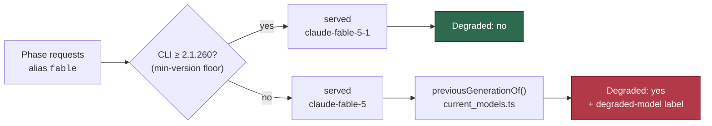

# Fable-preferring phases now get Fable 5.1, and a stale Fable is reported

## Summary

The eight Fable-preferring phases request the `fable` alias and were still being
served `claude-fable-5`. Two causes, both fixed here. Closes #1362.

1. **The CLI floor was too low.** `softwareMinVersions.claude` pinned `2.1.170`
   — the `--model fable` release. The Claude CLI resolves the alias from its own
   bundled table, so the floor decides which Fable generation a run gets, and
   `2.1.170` is far below the 5.1 table. Raised to **2.1.260**.
2. **The downgrade was silent.** `modelsMatch()` matches at tier-family level,
   so `claude-fable-5` satisfied `fable` and the run reported `Degraded: no`.
   A run whose served models are all a previous generation of the expected tier
   is now degraded, naming the served and the current model.

No phase default pins `claude-fable-5-1` — the alias still does the work, which
is what the alias-follows-the-latest rule is for.

### Why 2.1.260 and not 2.1.257

Read out of the shipped CLI bundles rather than assumed:

| CLI | `fable` resolves to | Evidence |
|-----|---------------------|----------|
| 2.1.223 (the image) | `claude-fable-5` | binary contains no `claude-fable-5-1` string |
| 2.1.257 | `claude-fable-5-1` | changelog: "Added Claude Fable 5.1 (`claude-fable-5-1`), now the default Fable model" |
| 2.1.260+ | `claude-fable-5-1` | changelog: fixes context after tool results re-sent **uncached** every tool-call turn, and a mid-session effort change invalidating the cache |

2.1.263's alias table reads `fable: {default: "claude-fable-5-1"}` /
`latest_per_family: {fable: "claude-fable-5-1"}`. The whole saving of 5.1 is the
$0.25/MTok cache-read rate, so 2.1.257–2.1.259 serve the right model with the
saving thrown away — the floor sits at the fix, not at the release.

## Evidence

Backend/CLI change with no web surface, so no screenshot. The verification is
the rendered run-stats comment: this is the shape of the `#1344` comment that
triggered the issue, re-rendered through the changed code with the same figures.

```text
## Planning run model stats

- **Requested model:** `fable`
- **Served model(s):** `claude-fable-5`
- **Planning invocations:** 1
- **Tokens:** input 15 · output 6,395 · cache write 51,050 · cache read 448,116
- **Prompt cache:** 89.8% (read 448,116 · write 51,050 · uncached 15)
- **Estimated cost (USD, estimate only):** ~$1.41
  - `claude-fable-5`: $1.41 — input $0.0002 · output $0.3197 · cache write $0.6381 · cache read $0.4481
- **Degraded:** ⚠️ yes — served model `claude-fable-5` is a previous-generation `fable` (current: `claude-fable-5-1`)
```

Where the two halves sit:



Full `./quality.sh` gate run after the final edit: **PASSED** (config
integration skipped — no `.config.json` in the checkout).

## Test Plan

Added:

- `worker/deno/tests/current_models_test.ts` — `previousGenerationOf()` over
  bare, dated and current Fable ids, a newer-than-reference id, untracked tiers,
  a bare alias, unparseable input; plus an invariant test that every
  `CURRENT_TIER_MODELS` row names a priced id of its own tier and is not stale
  against itself.
- `worker/deno/tests/planning_run_stats_test.ts` — seven `assessDegradation`
  cases for the previous-generation rule: bare and dated Fable 5 degrade and
  name both models, the current Fable is healthy, a partly-current run stays
  healthy (same leniency as the tier rule), multiple stale ids are all named, an
  operator-pinned older generation is not flagged, and a tier with no
  current-model reference is never flagged.

Modified (business-logic change, documented): fixtures that stood for "the
expected model served this run" used `claude-fable-5-20250101`, which is now
degraded by definition. They move to the current-generation id
(`claude-fable-5-1-20260901`) in `planning_run_stats_test.ts`,
`grill_me_run_stats_test.ts`, `phase_run_stats_test.ts`,
`quorum_run_stats_test.ts`, `planning_processor_test.ts`,
`quorum_processor_test.ts` and `fable_globally_disabled_cycle_test.ts`. The two
`modelsMatch` unit tests that deliberately assert a *dated Fable 5* variant
still match keep their original ids. `config_test.ts` asserts the new `2.1.260`
default floor.

Suite: `deno task test:unit` — parallel pass 18,471 passed / 0 failed, serial
pass 32 passed / 0 failed.

## Notes for the reviewer

- The fleet aggregate (`planning_run_aggregation.ts::isMismatch`) still answers
  its own question — "was the Fable *tier* substituted across runs" (#2698) —
  and is deliberately untouched. The generation check is a per-run signal.
- Consequence of the new verdict: until a container's CLI reaches 2.1.260, its
  Fable-preferring runs will carry the `degraded-model` label and a degraded
  stats comment. That is the intended visibility; the floor bump is what clears
  it, and it self-heals on the next software-update pass because a below-floor
  version bypasses the 7-day interval gate.
