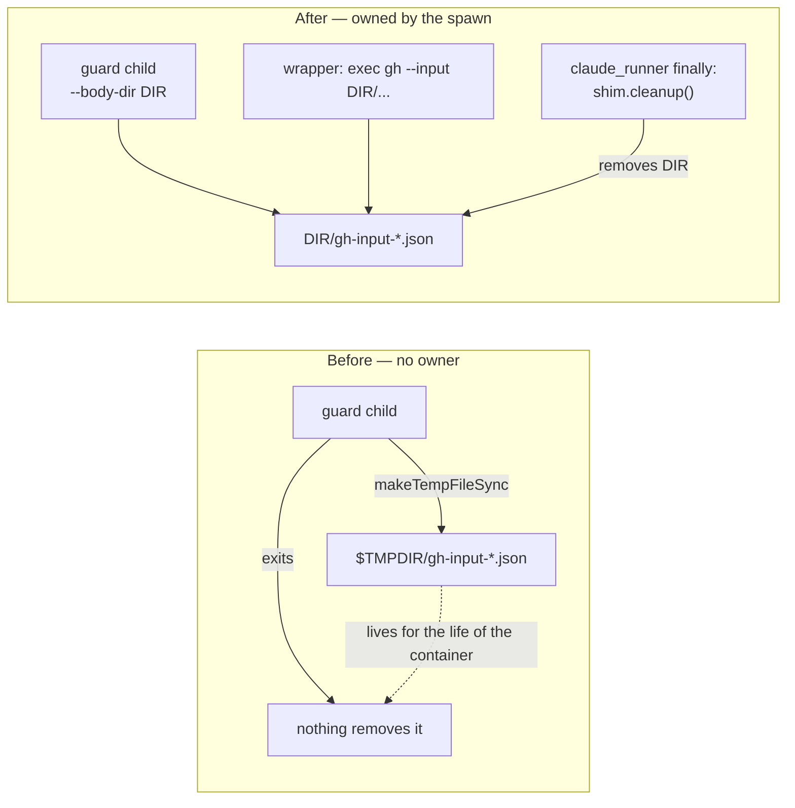

# Masked `gh api --input` bodies now die with the shim (Issue #1364)

## Summary

The `gh` guard materialised a redacted `--input` body with a bare
`Deno.makeTempFileSync()`, so every masked body landed in `TMPDIR` with nothing
owning it. The copy has to outlive the guard process — the `gh` child reads it
after the guard has exited — so the writer itself cannot delete it.

The caller now names the directory. `gh_guard_cli.ts` takes a `--body-dir <dir>`
flag and writes the masked copy there; the wrapper passes its own per-spawn 0700
directory (the one that already buffers the verdict) and grants the guard child
write access to **that path alone** (`--allow-write=<dir>`). The masked body is
therefore removed with the shim directory, which `claude_runner.ts` deletes in
its `finally` once the agent child has exited — success and failure paths alike.
A guard invoked with no `--body-dir` refuses a body that needs masking
(`GH_BODY_UNREDACTABLE`) rather than leaving one loose.

Closes #1364.

## Evidence

Backend/CLI change only — no web interface to screenshot. The evidence is the
reproduction below plus the tests listed in the test plan; `./quality.sh` passes
in full (all 18 checks, `config integration` skipped as usual).

Lifetime of the masked body, before and after:

## Reproduction

- **symptom** — a masked `gh api --input` body was written to `TMPDIR` and never
  removed
- **status** — `verified` — the two new regression tests were observed failing
  against the unfixed code and passing after the fix. The ownerless file itself
  was reproduced directly:
  `deno run --allow-read --allow-write=/tmp/repro1364 worker/deno/lib/gh_guard_cli.ts --active --allow-repo o/r -- api repos/o/r/issues/1/comments --input /tmp/repro1364/b.json`
  left `/tmp/repro1364/gh-input-4808c8162c120d45.json` behind with no owner. Run
  with the production permission set (`--allow-read` only, as the wrapper
  invokes it) the same command died with
  `NotCapable: Requires write access to <TMP>`, so the masked-body path also
  refused every legitimate `gh api --input` call whose body needed masking —
  that is fixed here too, with write access narrowed to the shim's own
  directory.
- **regression test** —
  `worker/deno/tests/gh_guard_shim_test.ts::gh-guard-shim #1364 - a masked --input body is delivered from the shim's own directory and leaves TMPDIR clean`

## Test Plan

Added:

- `worker/deno/tests/gh_guard_shim_test.ts::gh-guard-shim #1364 - a masked
  --input body is delivered from the shim's own directory and leaves TMPDIR
  clean` — end-to-end through the real wrapper and a stub `gh`: the delivered
  body is redacted, its path is inside the shim directory, the scratch `TMPDIR`
  is empty, and the file is gone after `shim.cleanup()`.
- `worker/deno/tests/gh_guard_cli_test.ts::gh-guard-cli #1364 - the masked
  --input copy lands in the caller's --body-dir` — the copy is created under the
  named directory and vanishes when the caller removes it.
- `worker/deno/tests/gh_guard_cli_test.ts::gh-guard-cli #1364 - a masked --input
  body with no --body-dir is refused, never written loose` — fail-loud, not a
  silent temp file.
- `worker/deno/tests/gh_guard_cli_test.ts::gh-guard-cli #1364 - --body-dir
  requires a value` — malformed invocation still fails closed (exit 2).

Modified (documented business-logic change — the default writer no longer picks
its own `TMPDIR` location):

- `worker/deno/tests/gh_guard_cli_test.ts::gh-guard-cli #92 - masks a secret in a
  real --input body, pointing --input at the redacted copy` — now passes
  `--body-dir` and drops its manual `Deno.remove` of the masked copy, since the
  directory it owns is removed instead. Its assertions are otherwise unchanged.

Commands run:

- `deno test --allow-all tests/gh_guard_cli_test.ts tests/gh_guard_shim_test.ts`
  — 48 passed.
- `./quality.sh < /dev/null` — PASSED (with skipped checks).

## Docs

`SECURITY.md` §6a said the guard child's *only* permission is `--allow-read`;
that is no longer true, so both the permission bullet and the redaction bullet
now describe `--body-dir`, the narrowed `--allow-write=<dir>`, and the lifetime
of the masked copy.
