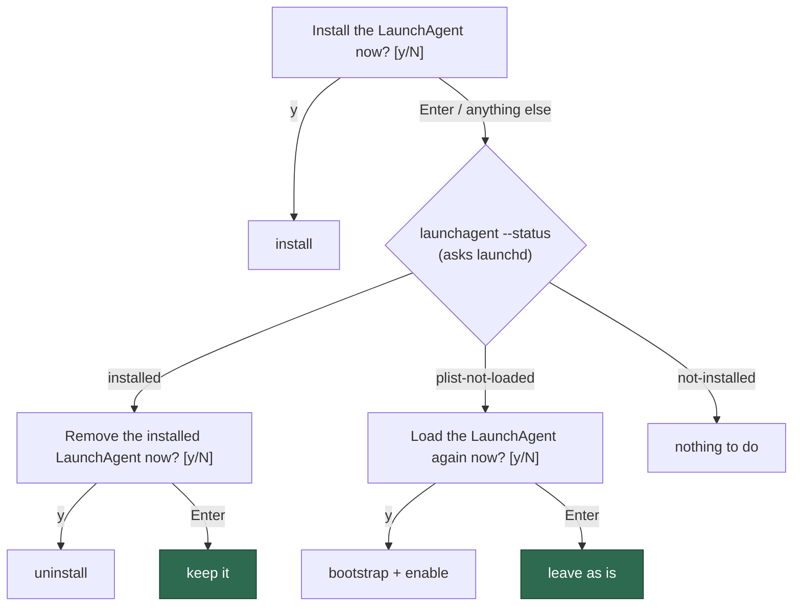

# Enter leaves the LaunchAgent as it is, and status asks launchd

## Summary

`./setup.sh`'s removal prompt read `Remove the installed LaunchAgent now?
[Y/n]`, so an operator re-running setup for an unrelated reason (a credential,
a repo, a pin) uninstalled the worker by walking the wizard with Enter — twice
on GRQ-25, the second time leaving the host dead until someone noticed the next
day. Both LaunchAgent prompts now obey the rule the install prompt already
states in its own comment: the safe answer is the one that changes nothing, so
it is the one Enter gives you. Only an explicit `y` removes.

The second half of the issue is why the host could not be recovered by
re-running setup. `launchagent --status` and the prompt both `stat`'d the
plist, which survives a `launchctl bootout`, so a host with no service running
reported `installed`; and `setupLaunchAgent()` compared plist *content* and
stopped at "already up to date" without ever bootstrapping. Status now asks
launchd (`launchctl print gui/<uid>/<label>`) and reports the third state it was
hiding, `plist-not-loaded`; setup reloads such a plist instead of calling it up
to date; and the prompt offers that repair rather than an uninstall.

Closes #1369.



## Evidence

Backend/CLI change — no web interface to screenshot. The behaviour is driven
end to end by tests instead: the shell prompts run in a bash subprocess with
`run_setup_cli` stubbed, and the launchd interaction runs through an injected
`LaunchctlDriver`, so both are exercised on Linux without touching a host's
agents.

```text
deno task test tests/setup_launchagent_prompt_test.ts \
  tests/setup_launchagent_state_test.ts tests/setup_launchagent_test.ts
ok | 33 passed | 0 failed | 3 ignored (604ms)

./quality.sh
Result: PASSED (with skipped checks)   # 18 checks, only "config integration" skipped
```

## Reproduction

- **symptom** — a bare Enter at `Remove the installed LaunchAgent now? [Y/n]`
  uninstalled the worker; afterwards `--status` still said `installed` and
  re-running setup said "already up to date" without loading anything
- **status** — `verified` — the prompt tests were observed failing against the
  unfixed `setup.sh` (`3 passed | 3 failed`, Enter reaching
  `CALLED:launchagent --uninstall`) and passing after the fix
- **regression test** —
  `worker/deno/tests/setup_launchagent_prompt_test.ts::setup.sh - a bare Enter does NOT remove the installed LaunchAgent (Issue #1369)`

## Acceptance Criteria

<!-- vibe-spec-review inputs="diff+issue-body" -->

- **met** — Enter leaves things as they are; the removal prompt is `[y/N]` and
  only an explicit `y` removes (`-` and typos keep the agent) — evidence:
  `setup.sh:1279` and
  `worker/deno/tests/setup_launchagent_prompt_test.ts::setup.sh - only an explicit yes removes the LaunchAgent (Issue #1369)`
  — reviewer: met
- **met** — status tells the truth about "installed": it asks
  `launchctl print gui/<uid>/<label>` and reports `plist-not-loaded` —
  evidence: `worker/deno/setup/launchagent.ts::getLaunchAgentStatus`,
  `worker/deno/tests/setup_launchagent_state_test.ts::getLaunchAgentStatus - a plist launchd has forgotten is not 'installed' (Issue #1369)`
  — reviewer: partial — reason: the reviewer saw the first commit, where the
  new status had no consumer and `prompt_launchagent_setup` still used
  `[[ -f …plist ]]`; commit `aba8f94` moved the prompt onto
  `launchagent --status`, so an unloaded plist is now described honestly and
  offered the repair. `isLaunchAgentInstalled()` is deliberately left as the
  directory-scoped plist test — it answers "is there a plist to remove", which
  is the question `removeLaunchAgent` needs.
- **met** — an unloaded-but-present plist is reloaded rather than reported as
  up to date — evidence: `worker/deno/setup/launchagent.ts::reloadIfUnloaded`,
  `worker/deno/tests/setup_launchagent_state_test.ts::reloadIfUnloaded - an unloaded plist is bootstrapped and enabled (Issue #1369)`
  — reviewer: met
- **met** — item 3, `.config.json` keys another tool added
  (`agent_transcript_enabled`, `log_dir`) survive a setup rewrite — evidence:
  `worker/deno/tests/setup_config_preservation_test.ts::runConfigSetup - preserves agent_transcript_enabled and log_dir (Issue #1369)`
  — reviewer: met — reason: the issue flagged this as unconfirmed; both keys go
  through the operator-key passthrough untouched, so the loss is not
  reproducible on the current code and the regression test pins it.
- **unrequested** — `setup.ps1`'s scheduled-task removal prompt flipped from
  `[Y/n]` to `[y/N]`, and the marker assertion that covers it — reviewer:
  unrequested — reason: the Windows task is the LaunchAgent's twin and the two
  scripts are kept in prompt parity (the install prompts already share the
  `[y/N]` default and a parity test); fixing one and leaving the other with the
  destructive default would reintroduce the same footgun on Windows.

## Standards Review

<!-- vibe-standards-review inputs="diff+CODING-STANDARDS.md" -->

- **violation** — PR Summary and Evidence: the branch shipped no
  `docs/archive/pr-summaries/pr-summary-1369.md` — evidence:
  `docs/archive/pr-summaries/pr-summary-1369.md` — reason: fixed; this file is
  it, with the closing keyword, the evidence and the test plan.
- **violation** — Never Fail Silently: `launchctl enable`'s result was
  discarded, so a job that bootstrapped but stayed disabled reported a
  successful reload — evidence: `worker/deno/setup/launchagent.ts:493` —
  reason: fixed in `aba8f94`; `bootstrapAgent` checks it and fails loud, covered
  by `reloadIfUnloaded - a job launchd refuses to enable fails loud (Issue #1369)`.
- **violation** — Never Fail Silently: the fresh-install path still returned
  `ok: true` ("could not load automatically") for the same fault the new reload
  path failed on — evidence: `worker/deno/setup/launchagent.ts:297` — reason:
  fixed; both paths now go through `bootstrapAgent` and both fail loud with the
  same manual-load instruction. This is a deliberate behaviour change: a plist
  written but never loaded is a host with no worker, which is the silent
  failure this issue is about.
- **violation** — DRY: the bootstrap → legacy `load` → `enable` sequence existed
  twice with divergent error handling — evidence:
  `worker/deno/setup/launchagent.ts:467` — reason: fixed; `bootstrapAgent` is
  the single loading path, and `reloadIfUnloaded` is its `print`-guarded caller.
- **violation** — the module doc claimed a word ("recognised") the file never
  uses — evidence: `worker/deno/tests/setup_launchagent_state_test.ts:15` —
  reason: fixed.
- **violation** — A Code Change Owes a Docs Change: `docs/DEPLOYMENT.md` still
  transcribed `[Y/n]` and told the operator to "answer **Y** (the default)" —
  evidence: `docs/DEPLOYMENT.md:533` — reason: fixed; both the LaunchAgent and
  scheduled-task sections now show the current prompts, their defaults, and the
  reload offer.
- **violation** — TDD: the prompt-marker test reads `setup.sh`/`setup.ps1`
  source rather than running them — evidence:
  `worker/deno/tests/setup_launchagent_prompt_test.ts:227` — reason: stands, and
  it is one test beside four behavioural ones. The marker shown to the operator
  *is* the contract being pinned (prior art at the Issue #26 install-prompt
  test directly above it), the `setup.sh` branch behaviour is covered by real
  subprocess runs, and there is no PowerShell host in the container to execute
  `setup.ps1` against.
- **clean** — Australian English throughout the added lines; no hidden or
  credential-shaped path staged; both commits carry `Issue #1369` and a
  `Vibe-Coder-Run-Id` trailer; launchd logic in Deno TypeScript with the shell
  limited to prompt orchestration; doc comments with `@param`/`@returns` on
  every new export; new state tests call real functions through an injected
  seam with no sleeps, no ambient `$HOME` and no host mutation; `deno fmt`,
  `deno lint` and the full `./quality.sh` gate pass.

## Test Plan

- Added `worker/deno/tests/setup_launchagent_state_test.ts` — 9 tests over
  `getLaunchAgentStatus`, `reloadIfUnloaded` and `bootstrapAgent`: the
  forgotten-plist state, the loaded state, no-plist (launchd not asked), the
  bootstrap + enable sequence, the legacy-`load` fallback, and both loud
  failures (cannot load, cannot enable).
- Extended `worker/deno/tests/setup_launchagent_prompt_test.ts` — the removal
  prompt now has the same coverage the install prompt had (Enter keeps, only
  `y`/`Y`/`yes`/`YES` removes, `-` and typos keep), plus three tests for the
  `plist-not-loaded` host: the repair is offered instead of the uninstall,
  Enter changes nothing, and the warning never describes an unloaded agent as a
  worker running every 5 minutes.
- Added
  `worker/deno/tests/setup_config_preservation_test.ts::runConfigSetup - preserves agent_transcript_enabled and log_dir (Issue #1369)`
  for the issue's third, unconfirmed item.
- Existing `worker/deno/tests/setup_launchagent_test.ts` unchanged and passing;
  no test was removed or disabled.
