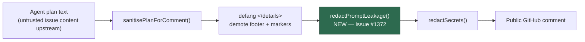

## Summary

The Quorum planning path published a drafting/judging model's raw plan text to a
public GitHub comment after only `redactSecrets()` — it never called
`redactPromptLeakage()`, the LLM07 System Prompt Leakage backstop the equivalent
question-answering sink (`answer_sanitiser.ts`) has chained since Issue #189.
Secret-shape redaction does not recognise instruction-shaped prose, and the
plan-specific defangs in `sanitisePlanForComment()` only demote structural
markers, so an issue that told a drafter to echo its instructions or this run's
`BOUNDARY_<nonce>` walked that text straight into a public comment (CWE-200).

`sanitisePlanForComment()` (`worker/deno/lib/quorum_processor.ts:158`) now
chains `redactPromptLeakage()` ahead of `redactSecrets()`. That single function
is the only route every published surface takes — the winning plan
(`quorum_processor.ts:212`), the runner-up and judge's reasoning via `details()`
(`:216`, `:220`), the degradation detail (`:230`) and each unjudged plan
(`:240`) — so one chokepoint closes every sink. Closes #1372.

## Evidence

Backend-only change — no web interface to screenshot. Verified by tests:

- `deno test worker/deno/tests/quorum_processor_test.ts` — 22 passed, 0 failed.
- `./quality.sh` — every check PASSED (lint, type check, fmt, semgrep,
  markdownlint, mermaid and the chokepoint guards) except `deno tests`, whose
  only two failures are pre-existing on `main` and unrelated to this diff:
  `worker/deno/tests/gh_guard_shim_test.ts` Issue #1448 cases at `:1416` and
  `:1479`. Reproduced on a clean `main` checkout at commit `4aada087` — they
  assume the container's default Deno seed directory is absent. Filed as #1531;
  this branch touches neither file.

Regression linkage: both new tests were run against the unfixed code and failed
(`an echoed instruction phrase must not survive to a public comment` —
`Values are not equal: true / false`), then pass after the one-line chokepoint
change. Named test identifier:
`worker/deno/tests/quorum_processor_test.ts::quorum comment - echoed prompt scaffolding is redacted before it is published (Issue #1372)`.

**Original trigger is closed, with no trivial bypass.** The issue's trigger is a
plan containing echoed prompt scaffolding or the run's boundary nonce. Every
byte published by `buildQuorumComment()` now passes through
`sanitisePlanForComment()`, which masks the `<coding_guidelines>` block, any
`BOUNDARY_<nonce>`-shaped marker and any paragraph echoing a known
sentence-length instruction phrase, replacing them with
`***PROMPT-LEAK-REDACTED***`. There is no second path from `QuorumPlan.text` to
a comment:
`grep -rn "winner\.text\|plan\.text\|runnerUp\.text\|\.reasoning"
worker/deno/lib/`
shows `quorum_processor.ts` lines 212/216/230/240 as the only consumers, and all
four route through the sanitiser. Wrapping, markdown emphasis and case do not
bypass it — matching runs over normalised, whitespace- collapsed text — and
redaction is applied to the whole string after the structural defangs, so a leak
split by one of the substitutions is still caught.

## Test Plan

Added to `worker/deno/tests/quorum_processor_test.ts`:

- `quorum comment - echoed prompt scaffolding is redacted before it is published (Issue #1372)`
  — calls `sanitisePlanForComment()` with an instruction phrase and a boundary
  nonce; asserts both are gone, the placeholder is present, and legitimate plan
  prose survives byte-for-byte.
- `quorum comment - every published plan surface is prompt-leak redacted (Issue #1372)`
  — drives `buildQuorumComment()` on a judged run (winner, runner-up, judge
  reasoning) and a degraded run (degradation detail, unjudged plan); asserts no
  surface leaks and each plan's genuine content still reaches the comment.

No existing tests were modified or removed.
