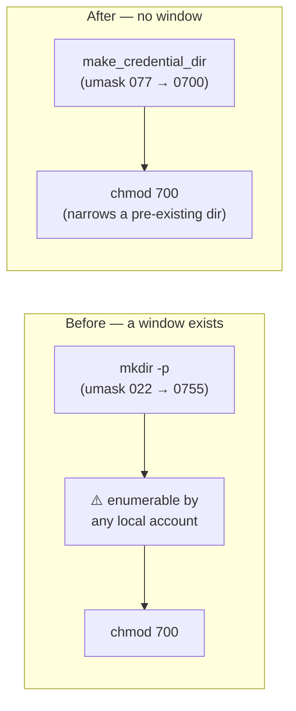

## Summary

`setup.sh` created every credential directory with a bare `mkdir -p` — under
the host's ambient umask, commonly 022 — and only narrowed it to `700` on the
following line. Between those two calls the directory existed world-readable
and world-executable, so a co-resident local account on a shared host could
enumerate it; worse, every parent `mkdir -p` created on the way (for a nested
`VIBE_CREDENTIAL_DIR`, or `~/.vibe-coder` itself) is never `chmod`'d at all, so
its loose mode was permanent rather than a window.

A new `make_credential_dir()` helper wraps the `mkdir -p` in a `umask 077`
subshell, so the directory — and every parent created with it — is owner-only
from the instant it exists. The subshell umask is used rather than
`mkdir -m 700` precisely because `-m` applies only to the final component and
would have left the parents exposed. The following `chmod 700` stays: it is
what narrows a directory that already existed with a loose mode.

All four credential-directory creation sites now use it: the per-provider
directory, the `gh` directory in `provision_vibe_credentials`, the interactive
`gh`-copy path, and the interactive `gh` config directory (the last creates the
directory that `gh auth login` then writes `hosts.yml` into, i.e. the same root
cause and the same credential-directory class).

Closes #1374.

## Evidence

Backend/CLI change with no web interface to screenshot. The evidence is the
three regression tests below, observed red against the unfixed `setup.sh` and
green after the fix, plus the full `./quality.sh` gate (`Result: PASSED (with
skipped checks)`, `config integration` skipped by the gate itself as it always
is locally).

Red against the unfixed code (`deno test tests/setup_credential_provisioning_test.ts`):

```text
interactive_credentials_flow - the copied gh directory is owner-only from creation
AssertionError: the copied gh directory existed group/world-readable before it was narrowed
    [Diff] Actual / Expected
-   [
-     "/tmp/4082c4b0ee12c096/.vibe-coder/credentials/gh (755)",
-     "/tmp/4082c4b0ee12c096/.vibe-coder/credentials/claude (755)",
-   ]
+   []

FAILED | 1 passed | 3 failed | 21 filtered out
```

Green after the fix:

```text
provision_vibe_credentials - every credential directory is owner-only from creation ... ok (12ms)
provision_vibe_credentials - parents created for the credential directory stay owner-only ... ok (9ms)
interactive_credentials_flow - the copied gh directory is owner-only from creation ... ok (13ms)

ok | 25 passed | 0 failed (2s)
```

**How the window is observed.** The mode a directory is *finally* left with
cannot see a window that closes before the assertion runs, so the tests resolve
`mkdir` to a shim on the child's `PATH` that runs the real `mkdir` and records
the mode each directory has at the instant it is created. The tests still call
the real `provision_vibe_credentials` and `interactive_credentials_flow` from
`setup.sh` — nothing greps the source.



**Original trigger closed, with no trivial bypass.** The trigger was running
credential provisioning on a host with a permissive default umask. Every
`mkdir` in `setup.sh` that creates a credential directory now runs inside
`make_credential_dir`'s `umask 077` subshell, so the ambient umask cannot widen
the created mode whatever it is set to — a umask can only remove permission
bits, never add them, and `mkdir`'s 0777 request is masked to 0700 before the
directory becomes visible in the namespace. The only executable `mkdir -p` left
in `setup.sh` is the one inside that helper (the other two matches are its
comment), so no credential path bypasses it; the nested-parent test pins the case `mkdir -m 700` would have
missed.

## Test Plan

Added to `worker/deno/tests/setup_credential_provisioning_test.ts` (all three
fail against the unfixed `setup.sh` and pass after the fix):

- `worker/deno/tests/setup_credential_provisioning_test.ts::provision_vibe_credentials - every credential directory is owner-only from creation`
  — reproduces the flaw for the provider and `gh` directories: the shim records
  `0755` at creation before the fix, `0700` after.
- `worker/deno/tests/setup_credential_provisioning_test.ts::provision_vibe_credentials - parents created for the credential directory stay owner-only`
  — a nested `VIBE_CREDENTIAL_DIR` whose parents were left `0755` permanently
  before the fix.
- `worker/deno/tests/setup_credential_provisioning_test.ts::interactive_credentials_flow - the copied gh directory is owner-only from creation`
  — the interactive `gh`-copy path.

Shared helpers changed: `provision()` and `interactiveFlow()` now run the child
under `umask 022`, so a mode assertion reflects what `setup.sh` chose rather
than what the test runner's own umask happened to hide, and `provision()` takes
an optional `PATH` override so a caller can supply the observer.

Also run: `./quality.sh` (full gate, PASSED), `shellcheck -x setup.sh` (clean).
