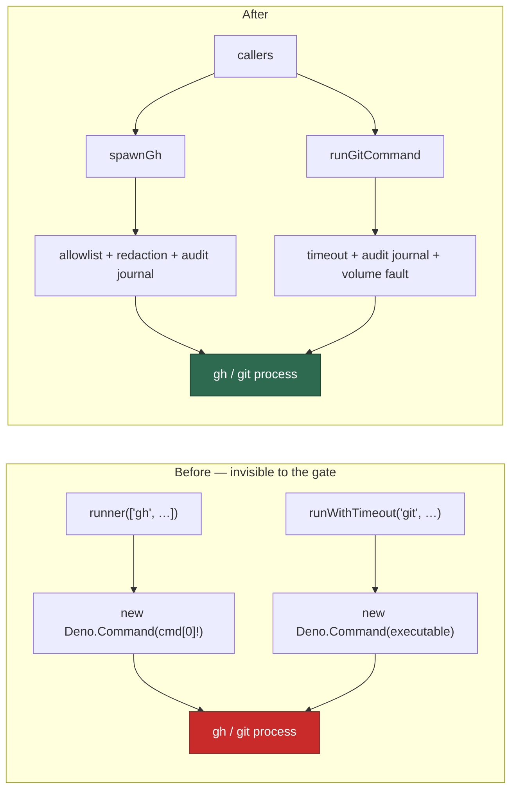

# Close the `gh`/`git` spawn chokepoint's indirection blind spot

## Summary

`GH_SPAWN_PATTERN`/`GIT_SPAWN_PATTERN` matched a **literal**
`new Deno.Command("gh"/"git", …)` only. Seven `worker/deno/lib` modules reached
the same binary through a variable — `Deno.Command(cmd[0]!, …)` fed by
`runner(["gh", …])`, and `runWithTimeout("gh"/"git", …)` — so they spawned
outside the per-run write-repo allowlist, the audit journal and the git
timeout while the quality gate reported a clean scan.

This change fixes both halves: every one of those callers now routes through
`spawnGh`/`runGitCommand`, and the two checks learn the indirection shapes so
the class stays closed. Closes #1378.

**Routed through the chokepoint** (the four sites named in the issue, plus
three more the new rule surfaced, all identical in kind):

| Module | Was | Now |
| --- | --- | --- |
| `repo_visibility.ts` | `Deno.Command(cmd[0]!, …)` | `spawnGh` |
| `language_detector.ts` | `Deno.Command(cmd[0]!, …)` | `spawnGh` |
| `workflow_auditor.ts` | `Deno.Command(cmd[0]!, …)` | `spawnGh` |
| `recent_activity.ts` | `Deno.Command(command, …)` | `spawnGh` / `runGitCommand` |
| `shell_helpers.ts` | `runWithTimeout("gh", …)` | `spawnGh` |
| `release_check.ts` | `runWithTimeout("gh"/"git", …)` | `spawnGh` / `runGitCommand` |
| `worktree_progress.ts` | `runWithTimeout("git", …)` | `runGitCommand` |

The three `createDefaultRunCommand` copies only ever ran `gh`, so the
`Deno.Command` fallback is gone entirely rather than kept behind a delegation
guard — any other binary is now refused loudly.

**Gate extension** (`spawn_chokepoint_scan.ts`): scanning moved from per-line
to whole-content, so a call split over several lines still matches, and
`IndirectSpawnRules` adds two signals per binary — the generic wrapper called
with the literal binary (`runWithTimeout("gh", …)`), and an indirect
`Deno.Command` construction in a module that also hands that binary to a
runner as the head of an argv. The second signal is file-level and therefore
approximate, so a module importing its chokepoint is treated as delegating
(that is exactly what the already-compliant `purge_stale_workflow_issues.ts`
and `process_add_repo.ts` runners look like).

**Chokepoint timeout fix** (`git_timeout.ts`): aborting the signal *kills* the
child rather than throwing, so a timed-out call resolved with git's signal
exit code (143) and `isGitTimeout` never fired. `runGitCommand` now inspects
the controller after `output()` resolves and reports `TIMEOUT_EXIT_CODE`. This
was required to move `worktree_progress.ts` onto the chokepoint without losing
its timeout reporting — and it was a live defect in the chokepoint itself.



## Evidence

Backend/CLI change with no web interface, so no screenshot applies. The
evidence is the gate's own whole-tree assertions plus the routing tests.

Against the **unfixed** modules (verified by stashing the `lib/` changes and
re-running):

```
FAILED | 0 passed | 5 failed   tests/spawn_chokepoint_indirection_1378_test.ts
FAILED | 18 passed | 2 failed  gh/git chokepoint tree scans
FAILED | 0 passed | 1 failed   git timeout regression
```

After the fix:

```
ok | 5 passed | 0 failed   tests/spawn_chokepoint_indirection_1378_test.ts
ok | 14 passed | 0 failed  gh/git chokepoint checks (incl. the whole-tree scans)
ok | 10 passed | 0 failed  tests/spawn_chokepoint_scan_test.ts
ok | 15 passed | 0 failed  tests/git_timeout_test.ts
ok | 128 passed | 0 failed the seven re-routed modules' own suites
```

### Regression tests, and the linkage

Added `worker/deno/tests/spawn_chokepoint_indirection_1378_test.ts::repo_visibility - the default runner reaches the gh chokepoint`,
which reproduces the flaw: it stubs the `gh` chokepoint's own process boundary
and asserts the call arrives there. Against the unfixed code the stub is never
reached — the module built its own `Deno.Command` — so the test **fails before
the fix and passes after it**. The four sibling tests in the same file do the
same for `language_detector`, `shell_helpers`, `release_check` and
`recent_activity`.

Added `worker/deno/tests/gh_spawn_chokepoint_check_test.ts::scanContentForGhSpawn - flags a gh spawn routed through a variable (Issue #1378)`
and `worker/deno/tests/git_spawn_chokepoint_check_test.ts::scanContentForGitSpawn - flags the generic wrapper called with git (Issue #1378)`,
which fail against the unfixed literal-only patterns (they return no
violations) and pass after. The pre-existing whole-tree assertions
(`the worker tree has no direct gh spawns` / `… git spawns`) fail against the
unfixed tree and pass after, which is the structural regression test for the
class.

Added `worker/deno/tests/git_timeout_test.ts::git timeout - runGitCommand reports a killed call as a timeout (Issue #1378)`,
which hangs git on a sleeping `core.fsmonitor` hook and asserts
`TIMEOUT_EXIT_CODE`; it fails against the unfixed `git_timeout.ts` (code 143)
and passes after.

### The original trigger is closed, with no trivial bypass

The trigger was: a `gh`/`git` call reaching the binary through a variable, so
it ran with no allowlist check and no audit-journal entry, and the gate could
not see it. Every such call site in `worker/deno/lib` and
`worker/deno/commands` now goes through `spawnGh`/`runGitCommand`, which
enforce those controls before the process starts, and the gate's whole-tree
scan is green with the new rules armed — so re-introducing the shape fails the
build rather than passing silently. The obvious bypasses are covered: a
literal spawn is the original pattern; a wrapper call with the literal binary
is `wrapperPattern`; an indirect construction paired with a `"gh"`/`"git"`
argv head is the file-level rule; and a multi-line spelling of any of them now
matches because scanning is whole-content rather than per-line.

Two residual gaps are named explicitly rather than hidden —
`GH_INDIRECT_KNOWN_GAPS` (`software_updates.ts`, whose `gh extension install`
would be **refused** by the fail-closed write allowlist today because
`classifyGhMutation` has no `extension` root verb) and
`GIT_INDIRECT_KNOWN_GAPS` (`benchmark.ts`, throwaway fixture repositories, the
same case `excludeTests` already forgives). Both are exempt from the
indirection signal only; a literal spawn in either still fails the gate. They
carry follow-up stSoftwareAU/VibeCoder#1396, and the doc comments state the
sets must shrink, never grow.

## Test Plan

- `worker/deno/tests/spawn_chokepoint_indirection_1378_test.ts` — **new**: five
  behavioural tests that each re-routed `gh` caller reaches the chokepoint.
- `worker/deno/tests/spawn_chokepoint_scan_test.ts` — multi-line literal match,
  wrapper match, indirect-pairing match, other-binary and chokepoint-import
  negatives, no-rules negative, and `indirectExempt` forgiving the indirection
  but not a literal spawn.
- `worker/deno/tests/gh_spawn_chokepoint_check_test.ts` /
  `git_spawn_chokepoint_check_test.ts` — wrapper shape, variable shape, and the
  compliant delegating runner, per binary.
- `worker/deno/tests/git_timeout_test.ts` — a killed git call is reported as a
  timeout.
- Re-ran the seven re-routed modules' existing suites plus
  `milestone_health_cache_test.ts` unchanged.

No existing test was removed, disabled or weakened.
