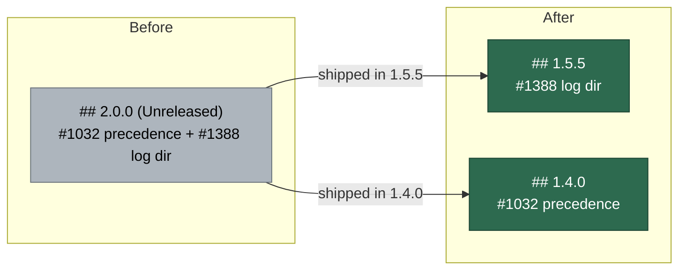

## Summary

`docs/RELEASE-NOTES.md` headed the Issue #1032 config-precedence flip — the
`.config.json` key wins over the matching `VIBE_*` variable — as **2.0.0** and
still carried the pre-merge *"Unreleased. The change is on
`milestone/configuration-one-source-of-truth`"* blockquote. It is neither: the
milestone merged in PR #1191 and the behaviour first shipped in tag **1.4.0**
(`git tag --contains 47818f7 | sort -V | head -1` → `1.4.0`). Five manuals
repeated the wrong label as "since 2.0.0" and linked the 2.0.0 anchor.

Relabelled to 1.4.0 across `README.md`, `docs/RELEASE-NOTES.md`,
`docs/CONFIGURATION.md`, `docs/SETUP.md`, `docs/DEPLOYMENT.md` and
`docs/CONTAINER.md`, with all six anchor links repointed at
`#140--the-config-file-wins-over-the-environment`, and the stale
"ships in 2.0.0" comment in `worker/deno/tests/agent_provider_test.ts` corrected.

The same 2.0.0 section also bundled the Issue #1388 log-directory change, which
shipped separately in **1.5.5** (`git tag --contains 85c8679 | sort -V | head -1`).
Relabelling the section wholesale would have moved that change from one wrong
version to another, so it was lifted into its own `## 1.5.5` section and the
page reordered newest first.

Forward-looking references to 2.0.0 as the release that *stops reading* the
deprecated variables are untouched (`worker/deno/lib/config_precedence.ts:19`,
`worker/deno/lib/optional_feature_env.ts:49`,
`worker/deno/tests/agent_provider_test.ts:196`) — that release is still to come.
`.release-floor` stays at `1.5.0`.

Closes #1380.

## Evidence

Documentation-only change with no web interface to screenshot. The evidence is
the new documentation-drift test, observed red against the unfixed docs and
green after:

```text
# before the docs fix
RELEASE-NOTES.md - the config-precedence note names a release that exists ... FAILED
  AssertionError: the config-precedence change shipped already, so its release
  note must name a released version at or below the floor (1.5.0), not
  "2.0.0 — the config file wins over the environment"
RELEASE-NOTES.md - no section is still marked Unreleased ... FAILED
docs - no manual dates the shipped precedence flip to an unreleased version ... FAILED
FAILED | 2 passed | 3 failed

# after
ok | 5 passed | 0 failed
```

Full gate: `./quality.sh < /dev/null` → **PASSED** (18 checks; `config
integration` skipped as it always is locally). And the outcome the issue asked
for:

```console
$ grep -rn "2\.0\.0" README.md docs/ | grep -v archive
$   # no output — no doc claims the shipped behaviour arrived in 2.0.0
```

The release note's version story before and after:



## Test Plan

- Added `worker/deno/tests/config_precedence_release_docs_test.ts` (4 tests):
  - drives the real `resolveSetting` to confirm the file really does win — the
    premise that makes the note a record of *shipped* behaviour — then asserts
    the config-precedence heading names a release in the series that exists;
  - asserts no section is still marked `**Unreleased.**`;
  - asserts every `RELEASE-NOTES.md#…` link in the six docs resolves to a
    heading that is really in the file (catches the anchor rename);
  - asserts no paragraph or table row about the precedence flip dates it to a
    version above the floor.
- Corrected a second stale "the 2.0.0 flip" comment the spec reviewer found at
  `worker/deno/tests/config_precedence_test.ts:191`.
- Re-ran `worker/deno/tests/agent_provider_test.ts` and
  `worker/deno/tests/config_precedence_test.ts` — unchanged behaviour, both pass.
- `./quality.sh < /dev/null` — PASSED.

## Acceptance Criteria

<!-- vibe-spec-review inputs="diff+issue-body" -->

- **met** — Relabel the shipped #1032 behaviour from "in/since 2.0.0" to 1.4.0 in `README.md`, `docs/RELEASE-NOTES.md`, `docs/CONFIGURATION.md`, `docs/SETUP.md`, `docs/DEPLOYMENT.md` and `docs/CONTAINER.md` — evidence: `README.md:89`, `docs/RELEASE-NOTES.md:86`, `docs/CONFIGURATION.md:357,1650,2376`, `docs/SETUP.md:1172`, `docs/DEPLOYMENT.md:955`, `docs/CONTAINER.md:1422`; the reviewer fact-checked the version independently (`git describe --contains 47818f7` → `1.4.0`) — reviewer: met
- **met** — Remove the stale "no 2.0.0 tag exists yet / the floor moves to 2.0.0" Unreleased note under the release-notes heading — evidence: `docs/RELEASE-NOTES.md:86`, covered by `worker/deno/tests/config_precedence_release_docs_test.ts::RELEASE-NOTES.md - no section is still marked Unreleased (Issue #1380)` — reviewer: met
- **met** — `grep -rn "2.0.0" README.md docs/` leaves no claim the shipped behaviour arrived in 2.0.0 — evidence: the grep is empty outside `docs/archive/pr-summaries/`, which is the historical record of what was believed at the time and is not a live claim — reviewer: partial — reason: the reviewer also flagged `worker/deno/tests/config_precedence_test.ts:191` ("the 2.0.0 flip"), outside the `README.md docs/` grep the criterion names but the same defect class; it was fixed here too, so the criterion is met on the wider reading as well
- **met** — Update the anchor links broken by retitling the heading — evidence: all six now point at `#140--the-config-file-wins-over-the-environment`; `worker/deno/tests/config_precedence_release_docs_test.ts::docs - every link into RELEASE-NOTES.md resolves to a real heading (Issue #1380)` — reviewer: met
- **met** — Fix the stale "ships in 2.0.0" comment in `worker/deno/tests/agent_provider_test.ts` — evidence: `worker/deno/tests/agent_provider_test.ts:208` — reviewer: met
- **met** — Leave the forward-looking 2.0.0 deprecation references untouched — evidence: `worker/deno/lib/config_precedence.ts:19,171`, `worker/deno/lib/optional_feature_env.ts:49`, `worker/deno/tests/agent_provider_test.ts:196` are unchanged in the diff — reviewer: met
- **met** — `.release-floor` stays at `1.5.0` — evidence: the file is absent from `git diff --stat` — reviewer: met
- **unrequested** — `worker/deno/tests/config_precedence_release_docs_test.ts` (new, 4 tests), against the issue's "no new guard against 'Unreleased' release notes surviving a milestone merge" — reviewer: unrequested — reason: this route mandates TDD with a regression test, and the file is the red-then-green evidence for both halves of the reported symptom; it is a unit test in the existing `*_docs_test.ts` genre, not a new CI job, and `.release-floor` and the workflows are untouched
- **unrequested** — `docs/RELEASE-NOTES.md` was restructured, not only relabelled: the Issue #1388 `LOG_DIR`/`LAUNCH_LOG_DIR` row and its subsection were lifted into a new `## 1.5.5` section and the page reordered newest first — reviewer: unrequested — reason: that change shipped in 1.5.5 (`git describe --contains 85c8679`), so relabelling the bundled section wholesale would have swapped one false version claim for another; the reviewer agreed the split is justified
- **unrequested** — `docs/RELEASE-NOTES.md:164` rollback text "Pin the host back to `1.x`" → "`1.3.x`" — reviewer: unrequested — reason: "1.x" only meant "before this release" while the section was labelled 2.0.0; with the section at 1.4.0 it named the release you are rolling back *from*

The reviewer additionally called the first draft's floor comparison wrong — it
read `.release-floor` as an upper bound on existing tags when the file states
the **lowest** version the next tag may take, so it would have rejected a true
`1.5.18` label. Fixed: the guard now bounds the **major** series
(`releasedMajor()` in `worker/deno/tests/config_precedence_release_docs_test.ts`),
which is the bound that actually holds.

## Standards Review

<!-- vibe-standards-review inputs="diff+CODING-STANDARDS.md" -->

- **violation** — DRY: the new file's standalone resolver test duplicated `worker/deno/tests/config_precedence_test.ts:48` and `worker/deno/tests/agent_provider_test.ts:210` — evidence: `worker/deno/tests/config_precedence_release_docs_test.ts:98` (as reviewed) — reason: fixed here — the `resolveSetting` call was folded into the release-note assertion as its premise, so the docs test now derives from real code instead of re-asserting it separately
- **violation** — TDD rule 5: four of the tests read Markdown and assert on its text rather than exercising production code — evidence: `worker/deno/tests/config_precedence_release_docs_test.ts:111,135,144,161` (as reviewed) — reason: stands, deliberately. The reviewer noted the repo already carries ~30 `*_docs_test.ts` files doing exactly this and that `CODING-STANDARDS.md` blesses the genre by name; a documentation-drift bug has no runtime surface to assert against, and the assertions are on parsed structure (heading versions, anchor resolution) rather than prose wording, so a reword does not redden them
- **violation** — `docs/archive/pr-summaries/pr-summary-1380.md` was untracked at review time — evidence: absent from `origin/main...HEAD` — reason: fixed here — committed with this change
- **clean** — Australian English throughout; fail-loud (`releasedMajor()` asserts on an unparseable floor rather than defaulting); unit-test classification with no manifest entry owed; parallel-safe (no `Deno.env.set`, no `Deno.chdir`, no singleton mutation); no clocks, sleeps or wall-clock budgets; no tests removed or commented out; `deno fmt`/`lint`/`check` and `markdownlint-cli2` clean; the six doc surfaces and six anchors all moved together; commit names Issue #1380 and carries the `Vibe-Coder-Run-Id` trailer; no hidden paths staged; `@std/assert` only, strict types
