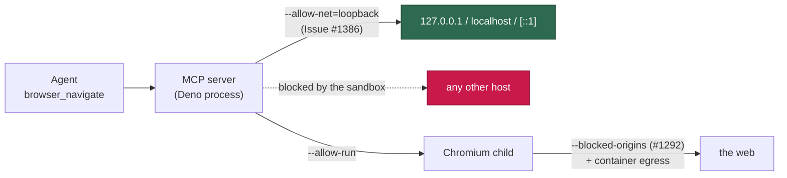

## Summary

The Playwright MCP server was spawned with a bare `--allow-net`, so the Deno
process backing the browser tool could open a socket to any host on the network
— unbounded egress with no destination allowlist. `generateMcpConfig` now emits
Deno's host-scoped form, `--allow-net=<hosts>`, built from the new
`PLAYWRIGHT_MCP_ALLOWED_NET_HOSTS` allowlist (loopback: `127.0.0.1`,
`localhost`, `[::1]`), which is exactly what the server itself needs —
`playwright-core` reaches the browser it launched over loopback, and the prompts
tell the agent to serve local pages there. `npm:` module resolution is gated by
Deno's import permissions rather than `--allow-net`, so no registry host is
required.

Operators who need one more destination (a CI preview URL, a dev server on a
non-loopback address) _add_ to the list with `VIBE_BROWSER_ALLOWED_HOSTS`
(comma-separated `host` or `host:port`); the knob can never replace the list or
widen it to everything. Both failure modes fail loud rather than degrading
silently: an empty list throws (Deno reads `--allow-net=` as a parse error, and
dropping the flag would restore unrestricted egress), and a host containing a
comma or whitespace throws instead of emitting a fragmented list that looks
complete and matches nothing — the same shape already used for `--deny-read`
paths (Issue #1288) and `--blocked-origins` (Issue #1292).

**Residual risk, stated plainly:** like every Deno permission this binds the
server _process_ only. Chromium is spawned under `--allow-run` and does its own
networking, so a prompt-injected `browser_navigate` remains bounded by
`--blocked-origins` and the container's egress boundary, not by this list. What
the scoping removes is the MCP server process itself as a general-purpose
exfiltration channel — the excessive-agency grant the issue names.

Closes #1386.

## Evidence

Backend/CLI change with no web surface to screenshot: the deliverable is the
argv `generateMcpConfig` produces, so the evidence is the test output below.

Generated flag, before and after:

```text
before:  --allow-read --allow-write --allow-net       --allow-env --deny-env=… --allow-run --allow-sys
after:   --allow-read --allow-write --allow-net=127.0.0.1,localhost,[::1] --allow-env --deny-env=… --allow-run --allow-sys
```



The regression test observed failing against the unfixed code and passing after
the fix (same assertion as the shipped test, run against `HEAD~1`'s
`screenshot.ts`):

```text
--- against UNFIXED code ---
red: --allow-net must be host-scoped (Issue #1386) ... FAILED
FAILED | 0 passed | 1 failed

--- against FIXED code ---
red: --allow-net must be host-scoped (Issue #1386) ... ok
ok | 1 passed | 0 failed
```

Shipped suite:

```text
deno test --allow-all tests/setup_screenshot_test.ts
ok | 68 passed | 0 failed (15ms)
```

**Trigger closed, no trivial bypass.** The original trigger — the MCP server
process being able to connect to an arbitrary attacker host — is closed at the
sandbox layer: `--allow-net=<hosts>` is Deno's enumerated allowlist, so any
destination outside it raises `NotCapable` at connect time. The bypasses worth
naming are all shut: the flag can never be emitted bare (`allowedNetValue`
throws on an empty list rather than letting the caller drop it), a host smuggled
through `VIBE_BROWSER_ALLOWED_HOSTS` can only _add_ to the default list and a
comma- or whitespace-bearing value is refused loudly instead of silently
fragmenting the grant, and Deno accepts no wildcard host, so no allowlist entry
can re-open "any host". The unchanged part is stated above under residual risk:
the browser child's own egress was never governed by this flag and is bounded by
`--blocked-origins` and the container.

## Test Plan

Added to `worker/deno/tests/setup_screenshot_test.ts`:

- `worker/deno/tests/setup_screenshot_test.ts::generateMcpConfig - scopes --allow-net to a host allowlist instead of granting unrestricted egress (Issue #1386)`
  — the regression test: it asserts the args carry no bare `--allow-net` and do
  carry `--allow-net=<hosts>` covering loopback. It **fails against the unfixed
  code** (which emits the bare flag) and **passes after the fix**, as shown in
  the run above.
- `resolveAllowedNetHosts - extends the allowlist from VIBE_BROWSER_ALLOWED_HOSTS without replacing it`
  — the operator knob adds hosts, drops blank entries, and keeps the defaults.
- `resolveAllowedNetHosts - unset knob yields exactly the default allowlist` —
  the default path.
- `allowedNetValue - fails loud on an empty allowlist rather than emitting a flag that grants everything`
  — the empty-list failure mode.
- `allowedNetValue - fails loud when a host contains the list separator` — a
  comma or whitespace in a host is refused, not silently fragmented.
- `generateMcpConfig - propagates an unexpressible allowed host instead of emitting a broken flag (Issue #1386)`
  — the guard is reachable through the real config path.

Quality gate: `./quality.sh` run in full. Every check passed except
`deno tests`, which fails on `tests/setup_lockfile_test.ts` and
`tests/setup_credential_provisioning_test.ts` — **pre-existing and unrelated**:
the same 28 failures reproduce on the base commit (`HEAD~1`) in a clean
worktree, and both files exercise the bash setup harness, not the screenshot
config. `tests/setup_screenshot_test.ts` passes 68/68.

Docs updated (`docs/DEPLOYMENT.md`): the manual test command, the supply-chain
hardening notes, and the environment-variable table now describe the host-scoped
`--allow-net` and `VIBE_BROWSER_ALLOWED_HOSTS`.
