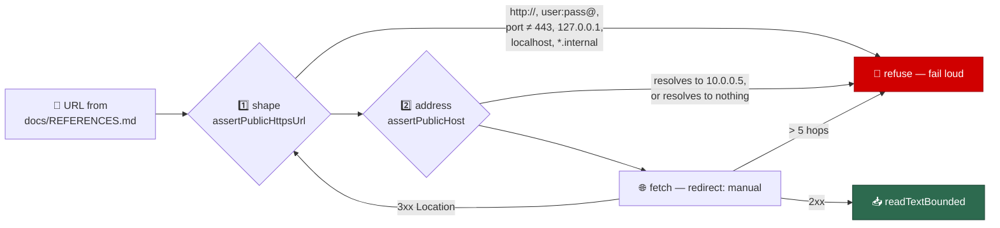

# Close the two unfiled security-scan findings (Issue #1387)

## Summary

The security-scan overflow tracker listed two findings that survived triage but
were never filed. Both are fixed here. Closes #1387.

**SEC-e3b7a2f95c14 — SSRF in the references page probe (medium).**
`fetchSourceText` in `worker/deno/lib/references_source_probe.ts` fetched a URL
taken verbatim from a `docs/REFERENCES.md` credit row. The only validation was
`references_doc.ts`'s `url.startsWith("https://")`, and `bounded_fetch.ts`
bounds only *how much* a fetch costs, never *where* it goes — so a merged edit
to that document could point the worker at `127.0.0.1`, at
`169.254.169.254`, or at an RFC-1918 host, and `redirect: "follow"` re-validated
nothing after a hop.

A new module, `worker/deno/lib/public_url_guard.ts`, is the guard such a fetch
now passes through. It refuses on three axes because each alone is bypassable:



One abort signal covers the whole redirect chain, so hops cannot multiply the
time budget, and the caller still owes the response a bounded read.

**SEC-08c4f1a7e2b9 — bare 32-hex credential unmasked by `redactSecrets` (low).**
`secret_redaction.ts` masked the ImgBB API key only while it kept a wrapper —
an `--imgbb-api-key <key>` flag or a `VIBE_IMGBB_API_KEY=<key>` assignment.
Stripped of both (an upload client echoing the rejected key into an error
string, or the key sitting in an `?key=` query parameter) it is a bare hex blob
with no provider prefix and no rule matched it, even though
`export_scrub_gate.ts` has treated that exact shape as a credential since it was
written. A `hex32-credential` rule closes the gap on the redaction chokepoint,
scoped by length, case and neighbours — exactly 32 lowercase hex characters with
no alphanumeric either side — so a 40-hex git SHA, a 64-hex sha256 digest and a
dashed UUID, all of which the worker logs constantly, are untouched. It runs
last, so a key inside a recognised structure is still masked by the structural
rule that owns it.

The "chunks not reached" listed in the issue are a scoping note for a future
sweep, not findings; nothing is claimed about them here.

## Evidence

Backend/CLI change with no web interface to screenshot. The evidence is the
tests: each regression test was run against the unfixed tree and observed
failing, then passing after the fix.

```text
# before the fix — 7 red
FAILED | 26 passed | 7 failed (83ms)
  SEC-e3b7a2f95c14 - the page probe refuses a loopback source URL
  SEC-e3b7a2f95c14 - the page probe refuses the cloud metadata address
  SEC-e3b7a2f95c14 - the page probe refuses a non-HTTPS source URL
  SEC-e3b7a2f95c14 - the page probe refuses an intranet hostname
  SEC-08c4f1a7e2b9 - redacts a bare 32-hex credential
  SEC-08c4f1a7e2b9 - the bare key is detected by containsSecret
  SEC-08c4f1a7e2b9 - redacts the key inside an ImgBB upload URL

# after the fix
ok | 51 passed | 0 failed (132ms)
```

Full gate: `./quality.sh` — `Result: PASSED (with skipped checks)`; the single
skip is `config integration`, which is skipped on this host regardless of the
change.

## Documentation

- `SECURITY.md` — new "Guarded outbound fetches — where the call is allowed to
  go" section beside the bounded-fetch one, and the known-credential-shape list
  now names the bare 32-hex shape.
- `docs/THREAT-MODEL.md` — attack path **AP-17** (SSRF via a document-supplied
  URL) and control **C30** (the guard), with its enforcing tests.
- `docs/audits/lib-sweep-coverage.json` — the new module claimed by the
  remainder slice, so the lib-sweep coverage ledger stays complete.

## Test Plan

- `worker/deno/tests/public_url_guard_test.ts` (new, 26 tests) — address
  classification across every private IPv4 and IPv6 range including
  `::ffff:127.0.0.1`; URL shape refusals (scheme, userinfo, port, obfuscated
  `2130706433` / `0177.0.0.1` loopback forms, intranet hostnames); resolution
  refusals (a hostname resolving to `10.0.0.5`, to nothing, and a resolver
  failure); and redirect handling (a hop re-validated before it is requested, a
  redirect to a private address refused, a public redirect followed, the hop cap,
  a `Location`-less 3xx, and a failed request named).
- `worker/deno/tests/security_scan_overflow_1387_test.ts` (new, 9 tests) — one
  block per finding, calling `createDefaultProbeDeps().fetchTextFn` and
  `redactSecrets` / `containsSecret` with real data.
- Existing suites re-run green: `references_source_probe_test.ts`,
  `secret_redaction*_test.ts`, `secret_transform_redaction_test.ts`,
  `console_redaction_test.ts`, `gh_body_redaction_test.ts`,
  `export_scrub_gate_test.ts`, `handover_note_test.ts`, `imgbb_upload_test.ts`,
  `regex_dos_3942_test.ts`, `threat_model_docs_test.ts`,
  `lib_sweep_coverage_test.ts`.

## Security Self-Check

- **Input validation** — the whole change is input validation: an
  externally-supplied URL is parsed and range-checked before it is dereferenced,
  and each redirect target is re-validated as a fresh input.
- **Secrets** — no credentials staged; the test fixture key
  (`0123456789abcdef…`) is the same non-secret placeholder the existing
  overflow tests use.
- **Injection surface** — no new shell, SQL or filesystem calls. The one new
  outbound call is narrower than the one it replaces.
- **Error handling** — every refusal is a loud `Error` naming the reason; no
  path returns a quietly-skipped fetch as a clean one.
- **Dependencies** — none added.
