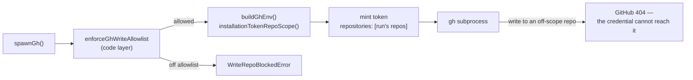

# Scope the GitHub App installation token to the repos a run may write to

## Summary

The per-run write-repo allowlist (#3311) contained egress in **code** only, and
said so: *"No credential/token changes … per-run scoped GitHub App tokens are a
deferred follow-up."* This change lands the deferred half. A GitHub App
installation token minted with no request body carries the App's permissions on
**every repository the installation covers**, so any write that got past the two
code chokepoints — a new direct `Deno.Command("gh", …)`, a mutation-classifier
gap, an agent invoking the real `gh` binary by absolute path — still succeeded
against any repo in the organisation.

`buildGhEnv` now mints the installation token with a `repositories` scope
derived from the run's own allowlist, so GitHub refuses what the allowlist would
have refused. Closes #1391.

- `github_app_auth.ts` — `getInstallationToken` / `ensureValidToken` /
  `getGhTokenForSubprocess` accept `owner/repo` slugs and POST
  `{"repositories": [...]}`. `installationRepoNames` is the one place slugs
  become the bare names GitHub resolves against the installation account.
- The token cache is now keyed by identity **and** scope (a `Map`, bounded at 16
  entries), so a narrower claim can never be served the wider token an earlier
  claim minted — and two concurrent slots no longer thrash a single cache entry.
- `write_repo_allowlist.ts` — `installationTokenRepoScope()` returns `allowed` ∪
  heartbeat pins in their registered casing, or `null` before a run seeds an
  allowlist (the same fail-open-until-seeded rule the write checks follow).
- `withTokenScopedRepo(repo, fn)` grants **read reach without write authority**:
  an App token is scoped per repository, not per verb, so a repo the worker only
  reads must still be named in the scope. The repo is *not* added to `allowed`,
  the grant is refcounted and released even on a throw, and it logs
  `[SECURITY] [TOKEN_SCOPE_GRANT]`. Its one caller is the cross-repo
  dependency-PR bridge, whose probes (`repos/…/branches/…`, `gh pr list`) would
  otherwise 404 under a scoped token and report an authorised dependency as
  unreachable.

Fail-loud throughout: an empty scope is refused rather than silently widened to
the unscoped token, and a slug that is not `owner/repo` throws rather than being
dropped from the scope (either would hand back a credential wider than the one
requested).

## Evidence

Backend/credential change — no web interface to screenshot. The evidence is the
test suite plus the full quality gate.

- New tests: `deno test tests/installation_token_scope_1391_test.ts` →
  **13 passed, 0 failed**.
- Adjacent suites re-run unchanged: `github_app_auth_test.ts`,
  `write_repo_allowlist_test.ts`, `write_repo_allowlist_slots_test.ts`,
  `gh_spawn_test.ts`, `cross_repo_pr_handoff_test.ts`,
  `heartbeat_allowlist_pin_test.ts` → **123 passed, 0 failed**.
- `./quality.sh` → **PASSED** (semgrep, deno test, lint, type check, fmt,
  markdownlint, mermaid, every chokepoint check).

### Regression test linkage

Added
`worker/deno/tests/installation_token_scope_1391_test.ts::installation token - scopes the exchange to the repos the run may write to`,
which asserts the token exchange carries
`{"repositories":["VibeCoder"]}` for a run allowed to write only
`stSoftwareAU/VibeCoder`. It **fails against the unfixed code** — verified by
stashing `worker/deno/lib` and re-running, which reports
`TS2554 Expected 2-3 arguments, but got 4` on `getInstallationToken` plus
`TS2305 … has no exported member 'installationTokenRepoScope'` — and **passes
after the fix**. The sibling
`::installation token - a narrower run never reuses a wider cached token` covers
the second half of the flaw: a scope-blind cache would have handed the narrow
run the wide token even once the body was correct.

### Original trigger closed, no trivial bypass

The trigger is a GitHub write reaching a repo outside the run's allowlist. With
the fix, the credential that subprocess holds is minted for exactly
`installationTokenRepoScope()`, so GitHub itself refuses any call naming another
repo — the write no longer depends on the code layer being correct. The
bypasses that mattered are closed by construction rather than by a check that
can be skipped:

- **Widen by asking for nothing.** An empty scope throws
  (`Refusing to mint an installation token for an empty repository scope`)
  instead of falling through to the unscoped body.
- **Widen by a malformed slug.** `installationRepoNames` throws on anything that
  is not exactly `owner/repo`, so a bad entry can neither be silently dropped
  (narrowing) nor sent as a bare name that resolves to some other repo.
- **Widen by reusing a cached token.** The scope is part of the cache key and an
  unscoped request has its own key, so no scope can be served another's token.
- **Widen through the read grant.** `withTokenScopedRepo` adds to `tokenScoped`,
  never to `allowed`, so `enforceGhWriteAllowlist` still refuses every write to
  a read-granted repo; the grant is refcounted and released in a `finally`.

Residual, and deliberate: before a run seeds an allowlist the scope is `null`
and the token keeps the installation's full reach. That matches the existing
fail-open-until-seeded contract of the allowlist itself — the main loop's
cross-repo scanning runs outside any claim — and narrowing it is a separate
change to that contract, not to this one.

## Test Plan

New file `worker/deno/tests/installation_token_scope_1391_test.ts` (13 tests),
all driving real functions with an injected `fetch` and a generated RSA key:

- `scopes the exchange to the repos the run may write to` — the regression test.
- `sends bare repo names, de-duplicated and sorted`.
- `stays unscoped when no scope is supplied` — back-compat for `undefined`/`null`.
- `refuses an empty repository scope rather than widening`.
- `fails loud on a slug that is not owner/repo` — five malformed shapes.
- `a narrower run never reuses a wider cached token`.
- `reuses the cached token for an identical scope`.
- `an unscoped request never reuses a scoped token`.
- `is null until a run seeds the allowlist`.
- `is the repos the run may write to`.
- `includes heartbeat pins` (and drops them on unpin).
- `a read grant widens the token, not the write allowlist`.
- `releases the read grant when the call throws`.

Documentation updated in the same change: SECURITY.md §6 (the "Code-level only"
bullet replaced by the credential layer, plus the flowchart) and the module
docs in `write_repo_allowlist.ts` that named the scoped token as deferred.
