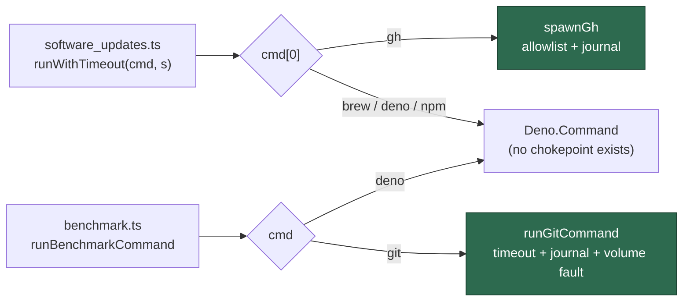

# Route the last two indirect gh/git spawns through their chokepoints (Issue #1396)

## Summary

Two `lib/` modules reached their binary through a variable, so both spawned
outside the chokepoint that owns the controls for it. Both are routed now, and
`gh extension` is given the explicit classification that was blocking the first
of them. Closes #1396.

- **`worker/deno/lib/software_updates.ts`** — `runWithTimeout(cmd, seconds)`
  spawned `cmd[0]`, so `gh extension list` and the pinned
  `gh extension install <repo> --pin <ref> --force` skipped the write-repo
  allowlist and the audit journal every other worker `gh` call passes through. A
  new `runUpdateCommand` dispatches on the binary name: `gh` goes through
  `spawnGh`, everything else (`brew`, `claude`, `deno`, `npm`, `which`) spawns
  directly under the same abort signal. The dispatch is on the _binary_, not on
  the two call sites, so any `gh` command a future caller passes takes the same
  route.
- **`worker/deno/lib/benchmark.ts`** — the `git-clone-local` fixture ran through
  `new Deno.Command(cmd, …)`, outside `runGitCommand`'s timeout, audit journal
  and work-volume fault detection. The runner is now the exported
  `runBenchmarkCommand`, which sends `git` to `runGitCommand`. This is
  production `lib/` code shipped in the worker rather than a test fixture, so it
  is routed rather than excluded by shape — and a fixture repository is exactly
  where an I/O-faulted work volume shows itself first (Issue #229), which the
  direct spawn could not see.

**The decision the issue asked for: `gh extension` is a local-tool mutation.**
`classifyGhMutation` now classifies the `extension` root (with its `ext` /
`extensions` spellings) explicitly, with `scope: "non-repo"`. The root was split
across both classifier tables by accident, giving one command surface two
opposite answers:

| command                                 | before                                                                                              | after                                                                     |
| --------------------------------------- | --------------------------------------------------------------------------------------------------- | ------------------------------------------------------------------------- |
| `gh extension install owner/x --pin v1` | `null` — a read, so the worker's own installs were never journalled                                 | `extension-install`, `non-repo` — journalled, allowed                     |
| `gh extension upgrade x`                | `null` — likewise a read; `upgrade` is in neither table                                             | `extension-upgrade`, `non-repo` — journalled, allowed                     |
| `gh extension remove x` / `create x`    | in `GH_GENERIC_MUTATING_VERBS`, on a root that is not cwd-scoped → `scope: "unknown"` → **refused** | `extension-remove` / `extension-create`, `non-repo` — journalled, allowed |
| `gh extension list` / `browse` / `exec` | read                                                                                                | read (unchanged)                                                          |

Nothing under that root writes to a repository — an install unpacks into
`GH_CONFIG_DIR` — so the extension's source repo is deliberately **not** treated
as a write target: there is no write to compare against the allowlist. The
mutation is still recorded, which is what the journal was missing.

**The agent boundary is untouched.** `gh extension install|upgrade|remove|exec`
from the agent subprocess is still refused unconditionally by
`classifyGhLocalStateChange` (Issue #187), which `evaluateGhCommand` consults
ahead of every allowlist check, so the new classification cannot become an agent
bypass. A test pins that, with the allowlist active and inert.

## Evidence

Backend/CLI change — no web interface to screenshot. The evidence is the tests
below plus the full gate.

- `./quality.sh` — **PASSED** (1m58s), including `gh spawn chokepoint`,
  `git spawn chokepoint`, `semgrep`, `deno tests`, lint, type check and fmt.
- Each regression test was observed failing against the unfixed code and passing
  after the fix:
  - reverting `lib/audit_mutation_classifier.ts` → 3 classifier tests fail, and
    `write-repo-allowlist - a pinned gh extension install is allowed …` fails on
    the `WriteTargetUndeterminableError`;
  - reverting `lib/software_updates.ts` → both `runWithTimeout … chokepoint`
    tests fail (the stubbed chokepoint runner is never called);
  - replacing the `git` branch of `runBenchmarkCommand` with the old direct
    spawn (export kept) →
    `perf workload runner - the git fixture inherits the
    chokepoint's work-volume fault detection`
    fails: the fault is never recorded.

**The original trigger is closed, with no trivial bypass.** The two argv shapes
named in the issue — `["gh", "extension", "list"]` and
`["gh", "extension", "install", …]` — cannot reach a subprocess without passing
`enforceGhWriteAllowlist` and `auditGhMutation`, because `runWithTimeout` no
longer constructs a `gh` process at all: the only `gh` spawn left in
`software_updates.ts` is the `spawnGh` call in `runUpdateCommand`, which
dispatches on `cmd[0] === "gh"` rather than on the two known call sites, so a
new `gh` argv added later is routed by construction. The equivalent `git` shape
in `benchmark.ts` has the same property: the dispatch is on `cmd === "git"`, not
on the fixture's argv. The classification change widens nothing at the agent
boundary — `evaluateGhCommand` reaches `classifyGhLocalStateChange` before any
allowlist branch, so `gh extension …` from the agent is still refused with
`GH_LOCAL_STATE_REFUSED` whether or not the allowlist is active (pinned by
`gh-guard #1396 - the extension refusal survives its non-repo mutation
classification`),
and the `non-repo` scope grants no repo write: it only tells the allowlist there
is no write target to compare, which is true of every `gh extension` verb.

## The known-gaps sets are not on this base branch

The two exemption sets the issue asks to shrink do not exist in this branch's
history. `GH_INDIRECT_KNOWN_GAPS` and `GIT_INDIRECT_KNOWN_GAPS` were added by PR
#1399 (commit `d6c16b0a`, Issue #1378), which is on
`milestone/scan-issues-07092026` — verified with
`git merge-base --is-ancestor d6c16b0a origin/main` (not an ancestor) and
against this PR's base, `milestone/windose-20260907`, where
`worker/deno/lib/gh_spawn_chokepoint_check.ts` still carries only the literal
spawn pattern and no exemption set at all. There is no entry here to delete, so
the diff cannot shrink a set that this base does not have.

What the routing does guarantee is that neither exemption is _needed_ once the
two milestone branches meet: #1378's indirection rule exempts a module that
imports its chokepoint (`chokepointImportPattern`), and both modules now do —
`software_updates.ts` imports `spawnGh` from `gh_spawn.ts`, `benchmark.ts`
imports `runGitCommand` from `git_timeout.ts` — so both files pass the indirect
scan on their own merits, exemption or not. Deleting the two now-inert entries
is tracked as follow-up #1429, because doing it before this change lands on
`main` would make that branch's own gate fail.

## Acceptance Criteria

<!-- vibe-spec-review inputs="diff+issue-body" -->

The issue states its criteria under "What done looks like" rather than an
`## Acceptance Criteria` heading; they are answered here in the same form.

- **met** — route `software_updates.ts`'s `gh extension list` /
  `gh extension install` through `spawnGh` — evidence:
  `worker/deno/lib/software_updates.ts` `runUpdateCommand` dispatches
  `cmd[0] === "gh"` to `spawnGh`;
  `worker/deno/tests/software_updates_test.ts::runWithTimeout - a gh command is spawned by the gh chokepoint, not directly`
  — reviewer: met
- **met** — classify `gh extension` explicitly so the write allowlist does not
  fail closed on it — evidence: `worker/deno/lib/audit_mutation_classifier.ts`
  returns `scope: "non-repo"` for the `extension` root;
  `worker/deno/tests/write_repo_allowlist_test.ts::write-repo-allowlist - a pinned gh extension install is allowed, not refused as undeterminable`
  — reviewer: met
- **met** — route `benchmark.ts`'s fixture `git` through `runGitCommand` (the
  issue's alternative was a structural exclusion; routing was chosen because
  this is production `lib/` code, not a test fixture) — evidence:
  `worker/deno/lib/benchmark.ts::runBenchmarkCommand`;
  `worker/deno/tests/benchmark_test.ts::perf workload runner - the git fixture inherits the chokepoint's work-volume fault detection (Issue #1396)`
  — reviewer: met
- **partial** — remove the corresponding entry from each known-gaps set; the
  sets must shrink, never grow — evidence:
  `worker/deno/lib/gh_spawn_chokepoint_check.ts` on this base has no exemption
  set to remove — reviewer: partial — reason: both sets were added by PR #1399
  on `milestone/scan-issues-07092026` and are absent from this PR's base and
  from `main`, so nothing could be deleted here; neither set grew, both files
  now satisfy the rule's `chokepointImportPattern` on their own merits, and the
  deletion is tracked as #1429
- **unrequested** — a chokepoint refusal is classified `permanent` rather than
  retried three times (`software_updates.ts::isWriteRefusal`) — reviewer:
  unrequested — reason: the routing is what introduced a throwing path into
  `runWithTimeout`; retrying a refused write only delays the warning and
  re-emits the `[SECURITY]` line, so the error path the change created is
  handled where it lands
- **unrequested** — `defaultRun` in `benchmark.ts` becomes the exported
  `runBenchmarkCommand` — reviewer: unrequested — reason: the routing needed a
  seam a test could drive against a real repository; the function is otherwise
  unchanged
- **unrequested** — `gh_local_state_guard.ts` now imports `GH_EXTENSION_ROOTS`
  instead of keeping its own alias map — reviewer: unrequested — reason: the
  classification added the second copy of that list, and the standards reviewer
  found the two had already drifted; sharing one list is the fix for the
  duplication this change caused
- **unrequested** — comment-only edits in `gh_guard_decision.ts` and
  `docs/audits/security-sweep-1214-subprocess-argv.md`, plus the `SECURITY.md`
  and `docs/AGENT-ACCOUNTABILITY.md` paragraphs — reviewer: unrequested —
  reason: both docs stated as fact what this diff makes false ("no timeout",
  "`classifyGhMutation` reports no mutation"), which the docs-owed-by-code rule
  requires updating in the same change

## Standards Review

<!-- vibe-standards-review inputs="diff+CODING-STANDARDS.md" -->

- **violation** — the subprocess-sweep audit doc still described the old spawns
  as untimed and unrouted — evidence:
  `docs/audits/security-sweep-1214-subprocess-argv.md:188` — reason: fixed here;
  both bullets now describe the routed runners
- **violation** — the new write-allowlist test asserted nothing, passing on "did
  not throw" and discarding the captured sinks — evidence:
  `worker/deno/tests/write_repo_allowlist_test.ts:660` — reason: fixed here; it
  now asserts no `blocked-*` audit and no `[SECURITY]` line, and a sibling test
  asserts a real repo write is still blocked with both
- **violation** — the error path of the new routing had no test, and a security
  refusal was classified transient and retried — evidence:
  `worker/deno/lib/software_updates.ts:507` — reason: fixed here;
  `isWriteRefusal` makes it permanent, covered by two new tests
- **violation** — the `gh extension` root spellings existed twice and had
  already drifted from the guard's copy — evidence:
  `worker/deno/lib/gh_local_state_guard.ts:74` — reason: fixed here; the guard
  imports `GH_EXTENSION_ROOTS`, and the deliberately different verb lists now
  say why in the doc comment
- **violation** — a stray blank line made the SECURITY.md bullet list loose —
  evidence: `SECURITY.md:1351` — reason: fixed here
- **violation** — the classifier's rationale mis-stated which verbs matched the
  generic table (`upgrade` is in neither table; `create` is in the generic one)
  — evidence: `worker/deno/lib/audit_mutation_classifier.ts:190` — reason: fixed
  here, and the same correction applied to `SECURITY.md` and this summary
- **violation** — `software_updates.ts` gains a ~40-line subprocess-dispatch
  concern rather than a new module — evidence:
  `worker/deno/lib/software_updates.ts:373` — reason: stands; extracting it
  would move `runWithTimeout`, a seam eleven existing tests import, for a change
  of two call sites — the smaller-files rule does not justify that churn here
- **clean** — Australian English throughout the added lines; Deno-native tooling
  only (`deno fmt`/`lint`/`check`/`test`); no catch-and-ignore added and spawn
  failure still surfaces as `code: -1` with the real message; every new test
  drives real exported functions with no source-grepping, sleeps or wall-clock
  thresholds; no existing test modified or removed; no hidden path staged;
  commit carries the issue reference and the run-id trailer; the new `Deno.test`
  names avoid the `bench` pattern the benchmark audit rejects

## Residual risks, stated

- **The credential these calls use changes on GitHub-App hosts.** `spawnGh`
  injects a scoped installation `GH_TOKEN` (`buildGhEnv`), where the update path
  previously inherited whatever the process environment held. Every `gh` call in
  this module reads public third-party data — `gh api repos/cli/cli/releases`,
  an extension's own releases, the extension tarball — which an authenticated
  installation token can read, so the expected reach is unchanged. If it ever is
  not, the failure is loud, not silent: the release-age gate fails closed
  (`passesQuarantine` refuses to upgrade an undatable release) and
  `runUpdateWithRetry` logs a warning, so a lost lookup skips an upgrade rather
  than installing an unchecked one.
- **Nothing on this base branch stops the direct spawn coming back.** The
  indirection rule that would catch it is on the sibling milestone branch (see
  above), so until the two meet, the routing is held by review rather than by
  the gate. The literal-spawn checks still pass and still forbid
  `new Deno.Command("gh"/"git", …)` in either file.
- **The `git` fixture is not journalled, and should not be.** `auditGitMutation`
  records `git push` only, so `git init/add/commit/clone` against a scratch
  directory adds no journal entries — the fixture picks up the timeout and the
  fault detector without polluting the audit log.

## Test Plan

Regression tests added (all fail against the unfixed code, pass after the fix,
except the agent-boundary test, which pins existing behaviour against this
change):

- `worker/deno/tests/software_updates_test.ts::runWithTimeout - a gh command is spawned by the gh chokepoint, not directly`
- `worker/deno/tests/software_updates_test.ts::runWithTimeout - the pinned extension install is routed through the chokepoint too`
- `worker/deno/tests/software_updates_test.ts::runWithTimeout - a non-gh command still spawns directly`
- `worker/deno/tests/software_updates_test.ts::runWithTimeout - a refused gh write fails loud instead of spawning`
- `worker/deno/tests/software_updates_test.ts::runUpdateWithRetry - a refused gh write is permanent, not retried three times`
- `worker/deno/tests/audit_hook_test.ts::audit_hook - a gh extension install is journalled as a local-tool mutation (Issue #1396)`
- `worker/deno/tests/audit_hook_test.ts::audit_hook - gh extension list stays a read and is not journalled (Issue #1396)`
- `worker/deno/tests/write_repo_allowlist_test.ts::write-repo-allowlist - an off-allowlist repo write is still refused beside the extension exception`
- `worker/deno/tests/benchmark_test.ts::perf workload runner - the git fixture inherits the chokepoint's work-volume fault detection (Issue #1396)`
- `worker/deno/tests/benchmark_test.ts::perf workload runner - a non-git binary still spawns directly (Issue #1396)`
- `worker/deno/tests/audit_mutation_classifier_test.ts::classifyGhMutation - gh extension install is a non-repo mutation`
- `worker/deno/tests/audit_mutation_classifier_test.ts::classifyGhMutation - gh extension upgrade/remove/create are non-repo, not undeterminable`
- `worker/deno/tests/audit_mutation_classifier_test.ts::classifyGhMutation - the ext/extensions root spellings classify alike`
- `worker/deno/tests/audit_mutation_classifier_test.ts::classifyGhMutation - gh extension reads stay reads`
- `worker/deno/tests/write_repo_allowlist_test.ts::write-repo-allowlist - a pinned gh extension install is allowed, not refused as undeterminable`
- `worker/deno/tests/gh_guard_decision_test.ts::gh-guard #1396 - the extension refusal survives its non-repo mutation classification`

All of these are **unit tests**: each drives an exported function in-process
with literal arguments and injected seams (`_setGhSpawnRunner`,
`_setWriteRepoAllowlistSinks`, the audit hook's env map), the two that touch the
filesystem use a temp dir, and the slowest is the `git` fixture at ~8ms. Nothing
here is a benchmark — no timing assertion, no wall-clock threshold — and the
`git-clone-local` step the change touches is measured by the existing benchmark
harness, not by a test.

No existing test was modified or removed.
