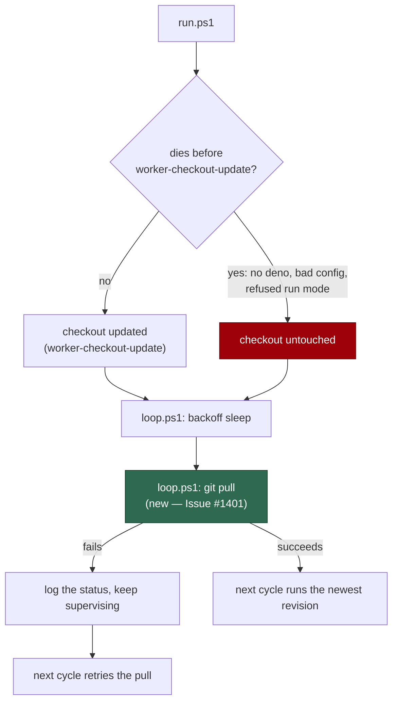

## Summary

`loop.sh` ends every cycle with a `git pull`; `loop.ps1` had **no git invocation
at all**, so a Windows host supervised by it could run the revision it was
started with indefinitely. `run.ps1` does update the checkout
(`worker-checkout-update`, `run.ps1:514`), but only once a cycle _reaches_ that
step — a run that dies earlier (no `deno` on PATH `run.ps1:174`, an unreadable
configuration or a refused run mode `run.ps1:299/306/330`) never gets there, and
without a pull of its own the supervisor cannot pick up the very fix that would
repair the host.

`loop.ps1` now pulls at the same point in the cycle as `loop.sh` does — after
the backoff sleep — with the same non-fatal treatment: a failed pull is logged
and the loop keeps supervising. `try/catch` is required because PowerShell 7.4
turns a failing native command into a terminating error under
`$ErrorActionPreference = "Stop"`, and a missing `git` throws outright; Windows
PowerShell 5.1 is covered by the `$LASTEXITCODE` check.

Closes #1401.

## Evidence

Backend/CLI change — no web interface to screenshot. The evidence is the
regression test below and the full `./quality.sh` gate (PASSED, 18 checks, one
skipped for missing optional config).

## Reproduction

- **symptom** — `loop.ps1` contained no git invocation, so a Windows host whose
  `run.ps1` fails before `worker-checkout-update` runs frozen code for ever and
  never self-heals from an upstream fix
- **status** — `verified` —
  `loop.ps1 refreshes the worker checkout every cycle
  (Issue #1401)` and
  `loop.ps1 refreshes at the same point in the cycle as
  loop.sh` were both
  observed **failing** against the unfixed `loop.ps1` (`5 passed | 2 failed`)
  and **passing** after the fix (`7 passed | 0 failed`)
- **regression test** —
  `worker/deno/tests/loop_checkout_refresh_test.ts::loop.ps1 refreshes the worker checkout every cycle (Issue #1401)`

## Test Plan

- **Added** `worker/deno/tests/loop_checkout_refresh_test.ts`:
  - `checkoutRefreshLines` exercised on known bash and PowerShell sources —
    finds the refresh, ignores one written in a line or block comment, and does
    not mistake `hub-git pull` or `/usr/bin/git pull` for the supervisor's own.
  - `loop.sh refreshes the worker checkout every cycle` — the existing
    behaviour, so the parity claim is anchored at both ends.
  - `loop.ps1 refreshes the worker checkout every cycle (Issue #1401)` — the
    regression test.
  - `loop.ps1 refreshes at the same point in the cycle as loop.sh` — the pull
    follows the inter-cycle sleep, as `loop.sh:496` does.
  - The check reads each supervisor's **executable** lines (`executableLines`,
    `worker/deno/lib/launcher_source.ts`), so a `git pull` written in a comment
    cannot satisfy it. It never spawns either script — the behavioural half
    belongs to the separately-filed loop parity suite, which is why the file is
    registered in `SCRIPT_READING_UNIT_TESTS` (it runs in the gate, in
    milliseconds) rather than in `INTEGRATION_TEST_FILES`.
- `./quality.sh` — PASSED (deno tests, lint, type check, fmt, semgrep,
  markdownlint, mermaid and the chokepoint audits).
