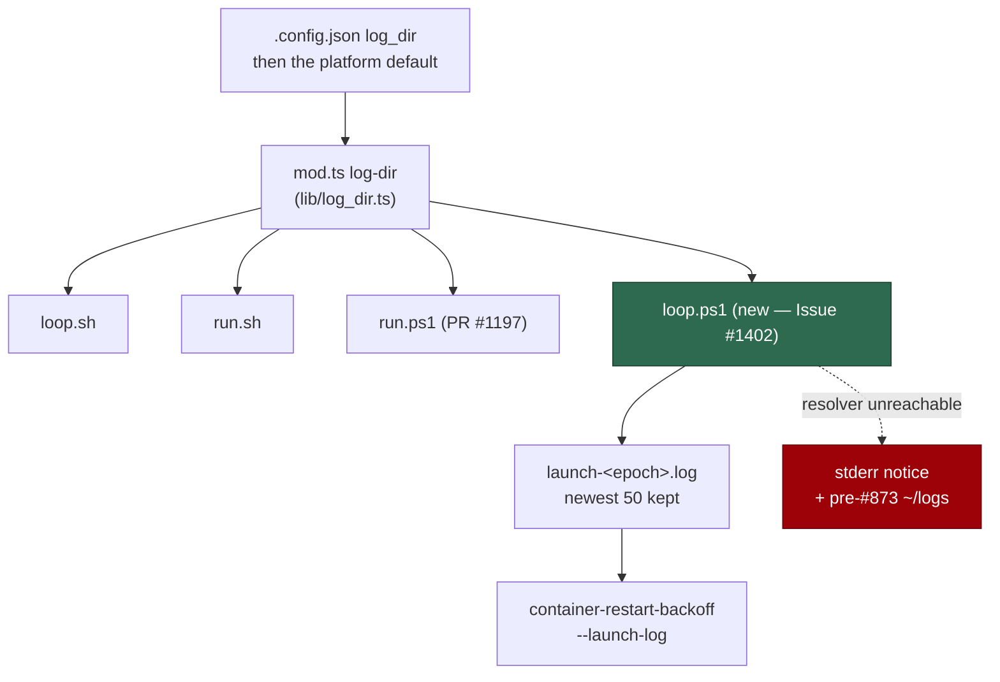

## Summary

`loop.sh:145` asks the worker where the logs go (`mod.ts log-dir`) so every
launcher agrees. `loop.ps1` had **no reference to `log-dir` at all** — it
resolved nothing and wrote nothing, so a supervised Windows host left no
per-cycle record anywhere the worker, `run.ps1` or an operator would look. This
is the Issue #873 defect PR #1197 fixed in two places in `run.ps1`, still
present in the supervisor beside it; both locations being writable is why it
hid.

`loop.ps1` now:

- resolves the directory **once, before its first cycle**, through
  `mod.ts log-dir` — the `.config.json` `log_dir` key, then the platform default
  — with the resolver's stderr (the legacy-location notice, and any ignored
  `LAUNCH_LOG_DIR` / `LOG_DIR`) passed straight through;
- falls back **loudly, never silently** to the pre-#873 `$HOME/logs`
  (`%USERPROFILE%` first on Windows) when the worker cannot answer, the same
  treatment `loop.sh:159` applies — a supervisor that must never exit still says
  what it did;
- writes a per-cycle `launch-<epoch>.log` under the resolved directory, newest
  50 kept (Issue #633), and hands it to `container-restart-backoff` as
  `--launch-log` so an escalation can quote the cycle rather than only its exit
  status.

**Scope note — what the launch log holds.** `loop.ps1` invokes `run.ps1`
in-process, and `run.ps1` writes all 65 of its diagnostics straight to the
process's stderr handle (`[Console]::Error`), which no redirection an in-process
caller applies can see. The file therefore holds the **supervisor's** account of
the cycle — the launcher's exit status, the backoff, the checkout refresh —
rather than `run.ps1`'s output, which `loop.sh` captures only because it spawns
`run.sh` as a child process. Said plainly in the code, in `docs/DEPLOYMENT.md`
and here, rather than shipping a file that looks like a capture and holds
nothing. Making `loop.ps1` spawn `run.ps1` out of process is a different change
(it would also lift the documented Issue #423 wall-clock divergence) and is not
made here.

Closes #1402.

## Evidence

Backend/CLI change — no web interface to screenshot. The evidence is the
regression suite below, run red against the unfixed `loop.ps1` and green after,
plus the full `./quality.sh` gate: **PASSED**, 18 checks, one skipped
(`config integration`, missing optional config), 1m 54s.

## Reproduction

- **symptom** — `loop.ps1` contained no `log-dir` resolution, so a supervised
  Windows host wrote no launch log in the directory the worker resolves, and
  nothing reported the gap
- **status** — `verified` — the three new `loop.ps1` cases were observed
  **failing** against the unfixed supervisor (`6 passed | 3 failed`) and
  **passing** after the fix (`9 passed | 0 failed`)
- **regression test** —
  `worker/deno/tests/loop_log_dir_test.ts::loop.ps1 resolves the log directory through the worker (Issue #1402)`

No PowerShell interpreter is installed in this run's container
(`command -v pwsh` → not found), so the suite reads each supervisor's
**executable** lines rather than spawning one — a `log-dir` written in a comment
cannot satisfy it. That is the same shape the equivalent `loop.ps1` parity fix
(PR for Issue #1401, `tests/loop_checkout_refresh_test.ts`) took, and for the
same reason.

## Test Plan

- **Added** `worker/deno/tests/loop_log_dir_test.ts`:
  - `logDirResolutionLines` exercised against known bash and PowerShell sources
    — finds the resolution, ignores one written in a line or block comment, and
    does not mistake `--build-log-dir` or `log-directory` for it.
  - `loop.sh resolves the log directory through the worker` — the existing
    behaviour, so the parity claim is anchored at both ends.
  - `loop.ps1 resolves the log directory through the worker (Issue #1402)` — the
    regression test.
  - `loop.ps1 resolves the log directory once, before its first cycle` — the
    resolution precedes `while ($true)`, so a cycle does not spawn `deno` for
    it.
  - `loop.ps1 writes each cycle's launch log into the resolved directory
    (Issue #1402)`
    — a directory resolved and never written to is the same silence with more
    code.
  - `loop.ps1 falls back to the pre-#873 default loudly, never silently` — the
    fallback notice exists and reaches stderr.
  - Registered in `SCRIPT_READING_UNIT_TESTS`
    (`worker/deno/lib/integration_test_manifest.ts`) with its reason: it reads
    both supervisors and spawns neither, so it belongs in the gate rather than
    in the integration manifest.
- **Docs** — `docs/CONFIGURATION.md` (the one resolution now names `loop.ps1`),
  `docs/DEPLOYMENT.md` (where a supervised host's launch logs land, and what the
  in-process capture can and cannot see), and
  `docs/workflows/resilience-and-concurrency.md` (both supervisors pass
  `--launch-log`).
- `./quality.sh` — PASSED (deno tests, lint, type check, fmt, semgrep,
  markdownlint, mermaid and the chokepoint audits).
