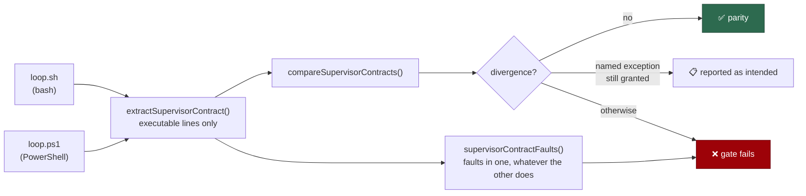

## Summary

`setup` and `run` each had a parity test holding their bash and PowerShell
halves to one contract; `loop` had neither, and the two supervisors drifted to
501 and 148 lines before anyone noticed that `loop.ps1` never pulled its
checkout (Issue #1401) or resolved its log directory (Issue #1402) — both found
by reading the files side by side, months after they appeared. This adds the
missing gate. Closes #1403.

- **`worker/deno/lib/loop_contract.ts`** — reads a supervisor's **executable**
  source (comments stripped) and reports the contract it keeps: the never-exit
  loop, the launcher invocation, the delegated backoff, the resolved log
  directory, the per-cycle launch log and its pruning, the log quoted in the
  escalation, the host named in it, the checkout refresh, the frozen lockfile,
  the base-sleep override, loud fallbacks on stderr, and the launcher exit
  statuses each supervisor tells apart from a crash.
- **`worker/deno/tests/loop_parity_test.ts`** — compares the two and fails on
  any divergence no named exception covers, and reports faults in one supervisor
  whatever the other does (two supervisors that both stop pulling their checkout
  agree with each other and are both wrong).
- **Three intended asymmetries, each named with the condition that ends it.** An
  exception that cannot lapse is a licence, not an exception:

  | Exception                       | Why                                                                                                                   | Lapses when                                                                              |
  | ------------------------------- | --------------------------------------------------------------------------------------------------------------------- | ---------------------------------------------------------------------------------------- |
  | `host-side-run-bound`           | `loop.ps1` invokes `run.ps1` in-process and can bound nothing host-side (Issue #423)                                  | a supervisor caps a run without reaping the container the kill orphans (Issue #322)      |
  | `macos-container-control-plane` | the probe exists for the macOS-only Apple `container` runtime and recovers through the Unix process tree (Issue #323) | a supervisor probes without being able to recover                                        |
  | `process-group-signals`         | SIGTERM/SIGHUP reach a bash supervisor through the Unix process group (Issue #1836)                                   | the **bash** supervisor drops its traps — the exception excuses the PowerShell side only |

Two precision details worth a reviewer's eye:

- **A step named only in a message is not the step.** Both supervisors log
  `git pull exited with status ...` beside the pull itself, so capabilities
  whose every spelling is an unquoted command (`git pull`,
  `pgrep`/`kill
  -TERM`, `container exec`, `container kill`) are matched
  **outside quoted strings**. It is deliberately not applied where a dialect
  spells the marker as a quoted argument (`$WorkerMod "log-dir"`,
  `-Filter "launch-*.log"`), which stripping would hide.
- **A constant nothing compares against distinguishes nothing.** An exit status
  counts only when it is assigned to a name that says it is an exit status _and_
  that name is used at least once more.

Scripts and docs updated: both `loop.sh` and `loop.ps1` headers now point at the
gate, `docs/INTERNALS.md` gains the three-gate table and the exception table,
and `docs/DEPLOYMENT.md` records that the wall-clock-cap divergence is now a
named, conditional exception rather than prose alone.



## Evidence

Backend/CLI only — no web interface to screenshot. The evidence is the gate run
against the code it exists to police.

**Against the real pre-fix `loop.ps1`** (`git show b61978c3:loop.ps1`, the
148-line file the issue describes), compared with today's `loop.sh`:

```text
pre-fix loop.ps1 (b61978c3): 5 faults, 5 divergences
  - resolved log directory diverge: loop.sh has true, loop.ps1 has false
  - per-cycle launch log diverge: loop.sh has true, loop.ps1 has false
  - launch-log pruning diverge: loop.sh has true, loop.ps1 has false
  - launch log quoted in the escalation diverge: loop.sh has true, loop.ps1 has false
  - per-cycle checkout refresh diverge: loop.sh has true, loop.ps1 has false
current loop.ps1: 0 faults, 0 divergences, 5 named exceptions
```

Issues #1401 and #1402 are both in that list, so the gate would have caught them
the day they appeared. The current pair is clean, and its remaining asymmetries
are the three named exceptions above.

**Test suite:** `deno test tests/loop_parity_test.ts` — 23 passed, 0 failed (6
ms). **Full gate:** `./quality.sh < /dev/null` —
`Result: PASSED (with
skipped checks)`; the only skip is `config integration`,
which is skipped on this host for reasons unrelated to this change.

## Reproduction

- **symptom** — nothing compared `loop.sh` with `loop.ps1`, so the two drifted
  to 501 and 148 lines and two real defects (`loop.ps1` never pulling its
  checkout, never resolving its log directory) reached production and survived
  for months until someone read the files side by side
- **status** — `verified` — the new gate was run against the real unfixed
  `loop.ps1` (`b61978c3`) and reported 5 faults and 5 divergences, Issues #1401
  and #1402 among them; against the current pair it reports none. The `git pull`
  mutation case was additionally observed **failing** against the first version
  of the extractor, which credited the supervisor's own log message as the pull
  — the fix is the outside-quoted-strings matching described above, and the case
  is green now
- **regression test** —
  `worker/deno/tests/loop_parity_test.ts::compareSupervisorContracts - a supervisor that stops pulling its checkout diverges (Issue #1401)`
  and
  `worker/deno/tests/loop_parity_test.ts::compareSupervisorContracts - a supervisor that stops resolving the log directory diverges (Issue #1402)`

## Test Plan

`worker/deno/tests/loop_parity_test.ts` — 23 cases, all calling the real
extractor, comparator and fault reporter:

- **The extractor, against sources whose contents are known** — a sound bash
  supervisor and a sound PowerShell one, field by field; a capability named in a
  bash comment or a PowerShell block comment is not one; a step named only in a
  log message is not performed; a status constant nothing compares against
  distinguishes nothing.
- **Faults in one supervisor** — a bare loop reports all 13; a loop that can
  exit is named as such; a run cap without reaping is a fault (Issue #322); a
  probe without recovery is a fault (Issue #323).
- **Parity comparison** — a sound pair diverges only through the named
  exceptions; the real `loop.ps1` mutated to drop its `git pull` (#1401), its
  `log-dir` resolution (#1402) or its quota-pause constant (#342) each produce
  exactly one divergence naming the lost behaviour.
- **The exceptions lapse rather than licence** — a PowerShell supervisor that
  gains a cap without reaping is reported, not excused; one that probes without
  recovering is reported; and if the **bash** supervisor drops its signal traps
  the `process-group-signals` exception no longer applies.
- **The real supervisors** — no divergences, no faults in either, every
  remaining asymmetry named, and both tell every shared exit status apart.

Supporting changes so the repo's own gates stay green and honest:

- `worker/deno/lib/integration_test_manifest.ts` — the new suite is declared in
  `SCRIPT_READING_UNIT_TESTS` (it reads both scripts, never spawns them, and
  runs in milliseconds), which `integration_test_manifest_test.ts` enforces.
- `docs/audits/lib-sweep-coverage.json` — `loop_contract.ts` joins slice 12e,
  enforced by `lib_sweep_coverage_test.ts`.
- `worker/deno/lib/vibe_env_registry.ts` — `VIBE_SUPERVISOR_RECORDS_OUTCOME`
  declared as `launch_plumbing`, enforced by `vibe_env_registry_test.ts`.
