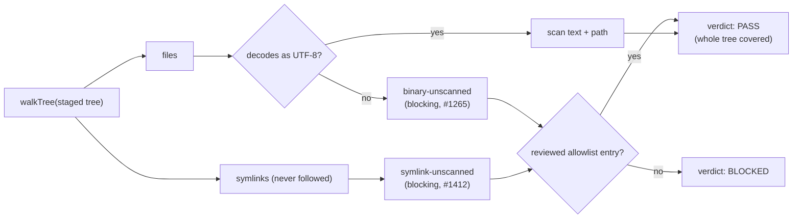

# Report staged symlinks as a blocking coverage finding (Issue #1412)

## Summary

The shared export tree walk dropped symlinks on the floor
(`if (entry.isSymlink) continue;`), so a staged symlink left no trace in any
export stage's verdict. A symlink can be committed to git and its _target path_
is content, so a staged link pointing at an operator home path would have been
published with the scrub gate reporting PASS — weaker than the undecodable-file
case Issue #1265 closed, where the file was at least counted.

- `worker/deno/lib/export_tree.ts` — new `walkTree()` returns
  `{ files, symlinks }`: the walk still never follows a symlink, it now says
  which ones it refused. `listTreeFiles()` delegates to it, so the branding,
  redaction and link-rewriting stages are byte-for-byte unchanged.
- `worker/deno/lib/export_scrub_gate.ts` — new `symlink-unscanned` coverage
  class, raised per staged symlink, counted in `symlinksSkipped`, printed as
  `symlinks-skipped:` and `[symlink-unscanned] <path>`. `gatePasses()` now
  iterates `COVERAGE_CLASSES` and requires each class's skipped count to be
  fully accounted for by findings; the counter lookup is an exhaustive switch
  guarded by `assertNever`, so a third coverage class breaks the compile rather
  than being silently checked against the wrong counter.
- The excerpt names no target: the gate never followed the link, so nothing
  behind it reaches the report — the same discipline the binary case follows.

The two ways past it are exactly the #1265 ones: drop the symlink from the
export, or cover it with a reviewed allowlist entry
(`symlink-unscanned
<path> *`), which still requires a justifying comment on the
line above.

Closes #1412.

## Evidence

Backend/CLI change with no web interface to screenshot. The evidence is the test
suite:
`deno test -A tests/export_tree_test.ts
tests/export_scrub_gate_test.ts tests/export_branding_test.ts
tests/export_redact_test.ts tests/export_links_test.ts`
→ 65 passed, 0 failed (the three unchanged consumer stages included, to prove
`listTreeFiles` behaviour is untouched).

Regression linkage, observed both ways: with the two `lib/` files reverted and
the new tests kept, `deno test -A --no-check --filter symlink` fails 6 tests
(`AssertionError: an unaccounted symlink must not read as a pass`, and
`SyntaxError: … does not provide an export named 'walkTree'`); with the fix
applied the same run is green. Specifically,
`worker/deno/tests/export_scrub_gate_test.ts::scrub-gate - a staged symlink blocks, and the report names its path`
reproduces the flaw — it fails against the unfixed code (the tree passes the
gate with the symlink unreported) and passes after the fix.

**Original trigger closed, no trivial bypass.** The trigger was a staged symlink
whose target path is content the gate never read. `walkTree()` is now the only
walk of the staged tree, and every symlink it meets is pushed to
`walked.symlinks` before the `continue`, so no branch of the walk can drop one;
`scanTree()` raises a `symlink-unscanned` finding for each entry of that list,
and `gatePasses()` returns false unless every skipped input of every coverage
class raised a finding that was blocking or explicitly allowlisted. There is no
bypass flag (`scrub-gate command - there is no bypass flag` covers that), an
allowlist entry without a justifying comment is a gate error rather than an
exemption, and an entry naming a different path does not cover the link. A
symlinked _directory_ is reported and not descended into, so a link cannot
smuggle files past the walk either.

## Acceptance Criteria

<!-- vibe-spec-review inputs="diff+issue-body" -->

- **met** — the walk reports what it skipped rather than discarding it —
  evidence: `worker/deno/lib/export_tree.ts` `walkTree()`,
  `worker/deno/tests/export_tree_test.ts::export-tree - the walk reports files and the symlinks it did not follow`
  — reviewer: met
- **met** — the scrub gate turns a staged symlink into a blocking coverage
  finding the reviewed allowlist can cover, in the #1265 shape — evidence:
  `worker/deno/tests/export_scrub_gate_test.ts::scrub-gate - a reviewed allowlist entry is the only way a symlink passes`
  — reviewer: met
- **met** — regression test, both directions: a staged symlink fails the gate
  and the report names the path; allowlisted or removed, it passes — evidence:
  `worker/deno/tests/export_scrub_gate_test.ts::scrub-gate - a staged symlink blocks, and the report names its path`
  and `::scrub-gate - removing the symlink is the other way past the gate` —
  reviewer: met
- **met** — the change respects the shared-walk constraint (branding, redaction
  and link stages unchanged) — evidence: `listTreeFiles()` delegates to
  `walkTree()`; `export_branding_test.ts`, `export_redact_test.ts`,
  `export_links_test.ts` unchanged and green — reviewer: met
- **unrequested** — symlink paths are themselves scanned for identifiers
  (`scanPath` is called on each symlink before the coverage finding) — reviewer:
  unrequested — reason: every walked file's path is already scanned, so omitting
  it would leave a link _named_ after a private repo unscanned; one line, same
  code path as files
- **unrequested** — two rule-scoped `nosemgrep` comments on the pre-existing
  `compileIdentifier` regex constructions — reviewer: unrequested — reason: the
  local semgrep gate scans whole changed files, so these pre-existing findings
  (present unchanged on the milestone base) blocked the gate; the suppression is
  scoped to the rule and carries the same justification `compileRepoName` two
  functions above already uses

## Standards Review

<!-- vibe-standards-review inputs="diff+CODING-STANDARDS.md" -->

- **violation** — coverage counters selected by a two-way ternary, so a third
  coverage class would silently be checked against the wrong counter — evidence:
  `worker/deno/lib/export_scrub_gate.ts:769` — reason: fixed here — `gatePasses`
  iterates `COVERAGE_CLASSES` and `skippedCount()` is an exhaustive switch
  guarded by `assertNever`
- **violation** — a code change owes a docs change: the command's own header
  documented only the `binary-unscanned` coverage contract — evidence:
  `worker/deno/commands/export_scrub_gate.ts:20` — reason: fixed here — the
  header now states both coverage classes
- **violation** — bare `try/catch` "fails loud" test instead of the repo's
  `assertRejects` convention — evidence:
  `worker/deno/tests/export_tree_test.ts:67` — reason: fixed here — now
  `assertRejects(() => walkTree(root), Deno.errors.NotFound)`
- **violation** — the reworded coverage-hole verdict line was reachable by no
  test — evidence: `worker/deno/lib/export_scrub_gate.ts:946` — reason: fixed
  here — the wording now leaves the #1265 binary-only message untouched and
  `::scrub-gate - a skipped symlink that raised no finding cannot report PASS`
  asserts the symlink wording
- **violation** — two one-line wrappers over a third private helper where one
  function would do (KISS) — evidence:
  `worker/deno/lib/export_scrub_gate.ts:804` — reason: fixed here — a single
  `coverageFinding(rel, klass, excerpt)` is called directly from `scanTree`
- **violation** — helper missing an explicit return type, unlike its neighbour —
  evidence: `worker/deno/tests/export_scrub_gate_test.ts:458` — reason: fixed
  here — `treeWithSymlink(): Promise<string>`
- **clean** — Australian English throughout; fail-loud (the walk propagates on a
  missing root, the finding is blocking not advisory); no raw match or symlink
  target printed in the report; tests call real code against real temp trees and
  real `Deno.symlink`; no test removed or commented out; no hidden paths staged;
  `deno fmt`, `deno lint` and `deno check` clean

## Test Plan

- Added `worker/deno/tests/export_tree_test.ts` — 4 tests over the previously
  untested shared walk: files and unfollowed symlinks reported separately, a
  symlinked directory not descended into, `.git/` still skipped, a tree with no
  symlinks reports none, `listTreeFiles` reports the walk's files only, and a
  missing tree rejects rather than reporting an empty walk.
- Added to `worker/deno/tests/export_scrub_gate_test.ts` — 5 tests: a staged
  symlink blocks and the report names the path without leaking the target; a
  symlinked directory is reported, not descended; a reviewed allowlist entry is
  the only way one passes (a wrong-path entry still blocks, an uncommented one
  is a gate error); removing the symlink passes; and a hand-built report whose
  symlink counter outruns its findings cannot read as PASS.
- Modified in `worker/deno/tests/export_scrub_gate_test.ts` — the existing #1265
  invariant test's hand-built report literal gained the new `symlinksSkipped: 0`
  field. No assertion was weakened or removed; the field is required by
  `GateReport` so the counter cannot be omitted by accident.
- Re-ran the three unchanged consumer suites (branding, redaction, links) to
  prove `listTreeFiles` behaviour is unchanged.
