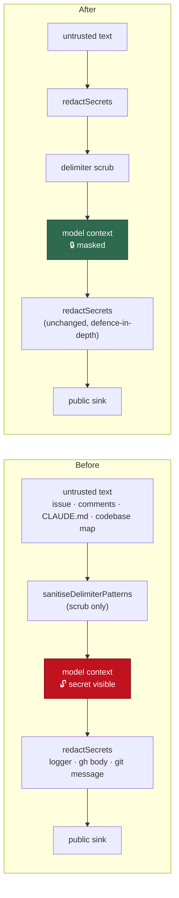

# Redact secrets before untrusted text enters the model's context

## Summary

`redactSecrets` was wired into output-side sinks only — the logger's write path,
`gh` body publication, captured subprocess tails — so the redaction boundary sat
_after_ the model had already read the text. A credential quoted in an issue
body or comment, left in a `CLAUDE.md` on the branch under work, or carried in a
generated codebase map reached the model's own context unmasked.

`sanitiseDelimiterPatterns()` (`worker/deno/lib/prompt_delimiter.ts`) is the
single ingestion chokepoint every prompt builder already routes untrusted text
through — issue titles, bodies and labels, comment bodies, repository guidance
documents, the codebase map, recent-activity summaries, PR review comments (86
call sites across 19 modules). It now **redacts before it scrubs**, so the mask
is applied where untrusted text is ingested rather than only where model output
leaves the process.

Redaction runs first because the delimiter scrub substitutes fullwidth
characters mid-string and could otherwise split a secret across a signature-rule
boundary — the same ordering `fenceQualityOutput()` and
`formatConflictIssueContextSection()` already use. `redactSecrets` is idempotent
(the placeholder matches no rule), so the call sites that already redact their
own text are unaffected.

Closes #1424.

## Evidence

Backend/CLI change — no web interface to screenshot. Evidence is the regression
test and the full quality gate.

Where the boundary moved:

Quality gate: `./quality.sh` — **PASSED**, re-run on the final tree after
`origin/main` was merged in (through `a02f0eb7`): all 21 checks pass
(`config integration` is skipped as it always is without a live config).

Cost of the inbound call, measured on this tree via `sanitiseDelimiterPatterns`
over a synthetic codebase map: 11 ms at 81 KB, 33 ms at 324 KB, 128 ms at 1.3 MB
— linear in input length, and paid once per prompt assembly.

## Security-fix evidence

- **Regression test** —
  `worker/deno/tests/prompt_context_secret_redaction_1424_test.ts::issue prompt - secrets in the issue, repo guidance and codebase map never reach the model`
  builds a real issue prompt whose title, body, repo-guidance document and
  codebase map each carry a credential, and asserts none of them appears in the
  assembled prompt. It was observed **failing against the unfixed code** (4 of
  the 5 new tests failed: the token was present in the prompt bytes) and
  **passing after the fix**.
- **Original trigger closed, no trivial bypass** — the trigger is "secret-shaped
  text in an issue/comment body, a working-tree file, or a cached prior-run
  artefact that gets read into the prompt". Every one of those paths reaches the
  model only through `sanitiseDelimiterPatterns()`, which now redacts as its
  first statement, before any other transformation of the input; the delimiter
  scrub that follows can no longer expose an unmasked secret because it never
  sees one. A bypass would require a prompt builder that interpolates
  externally-sourced text _without_ the delimiter scrub — which is already
  forbidden by the untrusted-fencing standard (C4) and would be a
  prompt-injection hole in its own right, not merely a redaction gap. Feeding
  the secret in transformed (base64, hex, reversed, split across lines) does not
  evade it either: `redactSecrets` runs the decode-then-rescan pass
  (`secret_transform_redaction.ts`) as part of the same call.

## Test Plan

Added `worker/deno/tests/prompt_context_secret_redaction_1424_test.ts`:

- `untrusted ingestion - a token in untrusted text is masked before the prompt sees it`
  — the chokepoint masks a GitHub token in free text.
- `untrusted ingestion - ordinary text is left byte-identical` — no
  over-redaction of ordinary prose.
- `untrusted ingestion - delimiter scrubbing still applies alongside redaction`
  — the pre-existing boundary scrub is unchanged.
- `untrusted ingestion - a comment body is masked while genuine headers survive`
  — redaction does not degrade the nonce-bearing trust headers (Issue #3637).
- `issue prompt - secrets in the issue, repo guidance and codebase map never reach the model`
  — the end-to-end assertion over `buildIssuePrompt` output.

No existing test was modified or removed. The full suite passes under
`./quality.sh`.

## Documentation

- `SECURITY.md` — new **The inbound side — text entering the model's context**
  subsection under the redaction standard, stating the ordering rule and that
  outbound sinks still owe their own call.
- `docs/THREAT-MODEL.md` — control **C33** (inbound secret redaction) added and
  cited from attack path **AP-13**.
- `worker/deno/lib/secret_redaction.ts` — module docstring now names the inbound
  chokepoint alongside the outbound ones.
