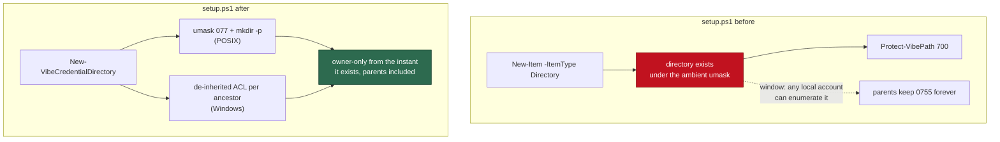

# Port both credential-handling security fixes to `setup.ps1`

## Summary

Two security fixes landed on `setup.sh` and neither reached its PowerShell twin.
Both are ported, and the parity contract is widened so the next one cannot land
on one side alone. Closes #1430.

1. **Newline guard (Issue #1301).** `provider.env` holds one `NAME=value` line
   and every reader splits on the first `=`, so a credential carrying a line
   break cannot be represented: writing it stores a truncated token behind a
   success message. `Set-VibeProviderCredential` now refuses a CR- or LF-bearing
   value with `setup.sh`'s message, **before** any directory is created, so a
   refused credential leaves nothing behind.
2. **Owner-only directories at creation (Issue #1374).** The three
   `New-Item -ItemType Directory` + `Protect-VibePath` pairs are replaced by
   `New-VibeCredentialDirectory`. Off Windows it creates every level through one
   `mkdir -p` under `umask 077` — the same subshell `setup.sh` uses, so the
   parents created on the way are owner-only too. On Windows each missing
   ancestor is created carrying an explicit, de-inherited ACL granting the
   current account alone; both editions are handled, because Windows PowerShell
   5.1 is a supported host and it puts that ACL on a different call from
   PowerShell 7.
3. **The contract now compares credential handling.** `setup_contract.ts` gained
   `refusesNewlineCredential` and `createsCredentialDirsOwnerOnly`, so a
   credential-handling fix applied to one script and not the other is a
   divergence and a per-script fault, not a clean pass.

## Evidence

Backend/CLI change — no web interface to screenshot. The evidence is the tests
below, each run against the unfixed script first.

Observed creation-time modes, from the `mkdir` shim the new test resolves (child
run under `umask 022`, the permissive default of a shared host):

| Directory                                | Before             | After              |
| ---------------------------------------- | ------------------ | ------------------ |
| `~/.vibe-coder` (parent, never narrowed) | `0755` permanently | `0700`             |
| `<dir>/claude`                           | `0755` → `0700`    | `0700` at creation |
| `<dir>/gh`                               | `0755` → `0700`    | `0700` at creation |

`./quality.sh` passes (`Result: PASSED (with skipped checks)`; the skip is
`config integration`, which needs credentials this run does not have). The
`setup_ps1_test.ts` suite is an integration suite excluded from the gate, so it
was run directly against a locally installed PowerShell 7.6.5:
`env -u CONFIG_PATH VIBE_PWSH=… deno test --allow-all tests/setup_ps1_test.ts` —
**26 passed, 0 failed**. The `-u CONFIG_PATH` matters only to this container,
which exports a `CONFIG_PATH` of its own; inherited, it makes
`Resolve-VibeConfigFile` correctly refuse the pair and two unrelated Issue #672
cases fail on the untouched tree for that reason alone. The `setup.sh` side is
unchanged and still green — `tests/setup_credential_provisioning_test.ts` and
`tests/setup_provider_env_parse_test.ts`, 28 passed, 0 failed.

## Reproduction

- **symptom** — on a host onboarded by `setup.ps1`, a credential pasted with a
  trailing line break was written truncated behind a `[ok]` line, and every
  credential directory existed group- and world-readable between its creation
  and the `Protect-VibePath` call that narrowed it — with the parents created on
  the way keeping that loose mode for good
- **status** — `verified` — all three regression tests were observed failing
  against the unfixed `setup.ps1` (`WROTE=yes` where `WROTE=no` was required;
  the credential directories created without ever reaching `mkdir`, leaving
  `~/.vibe-coder` at `0755`) and passing after the fix
- **regression test** —
  `worker/deno/tests/setup_ps1_test.ts::setup.ps1 - a credential holding a newline is refused, not truncated`,
  `…::setup.ps1 - a pasted credential ending in CRLF is refused too`,
  `…::setup.ps1 - every credential directory is owner-only from creation (Issue #1374)`

## Acceptance Criteria

The issue states no `## Acceptance Criteria` section; the requirements below are
its three "Suggested fix" clauses, judged by an independent Spec reviewer given
the diff and the issue body and nothing else.

<!-- vibe-spec-review inputs="diff+issue-body" -->

- **met** — refuse a newline-bearing credential with the same message —
  evidence: `setup.ps1:486-491`, covered by
  `worker/deno/tests/setup_ps1_test.ts::setup.ps1 - a credential holding a newline is refused, not truncated`
  — reviewer: met
- **met** — create every credential directory owner-only at creation rather than
  narrowing it afterwards — evidence: `setup.ps1:239-292`, all three call sites
  converted, covered by
  `…::setup.ps1 - every credential directory is owner-only from creation (Issue #1374)`
  — reviewer: met — reason: the reviewer marked the POSIX half met and the
  Windows half "unverified"; it has no runtime here, so its two spellings are
  now required by the parity contract instead
  (`worker/deno/lib/setup_contract.ts:79-95`)
- **met** — extend the parity contract to credential handling — evidence:
  `worker/deno/lib/setup_contract.ts:79-101`, `:228-238`, `:418-433`, covered by
  `worker/deno/tests/setup_parity_test.ts::compareSetupContracts - a one-sided credential fix is a divergence (Issue #1430)`
  — reviewer: partial — reason: the reviewer called the enforcement "weak"
  because a field is satisfied by a spelling appearing anywhere in executable
  source; that is how every field of this pre-existing module works, and the
  PowerShell directory field now requires **both** platforms' halves so deleting
  the Windows branch fails the contract
- **partial** — `setup.ps1` still writes `provider.env` and `hosts.yml` wide and
  narrows them to 0600 afterwards, where `setup.sh` writes them inside a
  `umask 077` subshell — evidence: `setup.ps1:422-423`, `:499-500` — reviewer:
  partial — reason: the issue asks for directories, and the file window is
  inside a directory that is already 0700, so nothing can traverse to it;
  `docs/SETUP.md` now says exactly that rather than claiming full parity
- **unrequested** — `docs/INTERNALS.md` gained a paragraph on what the setup
  contract now compares — reviewer: unrequested — reason: the contract module
  changed in this diff and the repo's standards require the docs change to ride
  with it; trimmed to what the contract checks, with the retrospective narration
  removed
- **unrequested** — `runPwsh` in `setup_ps1_test.ts` gained an optional `umask`
  parameter — reviewer: unrequested — reason: PowerShell cannot set a
  file-creation mask itself, and without one the creation-time assertion would
  pass or fail on the runner's own mask

## Standards Review

<!-- vibe-standards-review inputs="diff+CODING-STANDARDS.md" -->

- **violation** — ~70 lines of `mkdir` observer scaffolding duplicated between
  the two credential suites — evidence: `worker/deno/tests/setup_ps1_test.ts`
  (as first written) — reason: fixed here — extracted to
  `worker/deno/tests/support/mkdir_observer.ts` and both suites now import it
- **violation** — the test comment claimed the shim observes the parents
  `mkdir -p` creates on the way; it records only the paths it was given —
  evidence: `worker/deno/tests/setup_ps1_test.ts:1140` (as first written) —
  reason: fixed here — the comment and the shim's docstring now say what is
  observed, and the parents are covered by the surviving-mode assertion
- **violation** — the Windows ACL branch had no coverage and nothing could
  detect its removal — evidence: `setup.ps1:265-292` — reason: partly fixed — no
  Windows runtime exists in this container, so the parity contract now requires
  the ACL-carrying creation call (`worker/deno/lib/setup_contract.ts:88-94`) and
  deleting the branch fails `setup_parity_test.ts`; the branch also falls back
  loudly rather than aborting provisioning if neither runtime spelling resolves
- **violation** — `runPwsh` repeated its whole option bag across a ternary —
  evidence: `worker/deno/tests/setup_ps1_test.ts:62-88` (as first written) —
  reason: fixed here — the shared options are built once
- **violation** — `docs/SETUP.md` claimed `setup.ps1` "keeps the same
  guarantee", which the file writes do not — evidence: `docs/SETUP.md:391` (as
  first written) — reason: fixed here — the paragraph now scopes the claim to
  the directories and says why the file window is contained
- **violation** — hyphens where the file's other comments use em dashes —
  evidence: `setup.ps1:475-477` (as first written) — reason: fixed here; the
  operator-facing message stays ASCII, as every other string in `setup.ps1` does
- **violation** — the new contract fields match source spelling rather than
  behaviour — evidence: `worker/deno/lib/setup_contract.ts:96-101` — reason: it
  stands — this is what the module is (`launcher_contract.ts` and every existing
  field work the same way), and the behaviour itself is covered by the
  behavioural cases in `setup_ps1_test.ts`, which do run the real script
- **clean** — Australian English throughout; no secret interpolated into the
  refusal message (the variable _name_ only); the shell-out passes paths as `$1`
  rather than interpolating them; fail-loud on a failed `mkdir`; the guard
  refuses before anything is created; no test greps source for behaviour it
  should execute; no wall-clock sleep or absolute timing threshold; one commit
  with the run-id trailer and no hidden or credential paths staged

## Test Plan

Added to `worker/deno/tests/setup_ps1_test.ts` (each dot-sources the real
`setup.ps1` and asserts on what it wrote):

- `a credential holding a newline is refused, not truncated` — the refusal is
  reported, nothing is written, and no directory is left behind.
- `a pasted credential ending in CRLF is refused too` — the interactive flow's
  `-VarName`/`-Secret` path, which is where a copy-paste picks up a trailing
  break.
- `a credential with no line break is still written` — the guard refuses only
  what cannot be represented.
- `every credential directory is owner-only from creation (Issue #1374)` —
  resolves `mkdir` to a shim recording each directory's mode at the instant it
  is created, runs the interpreter under an explicit `umask 022`, and asserts no
  created directory carries a group or world bit, that the never-narrowed parent
  is `0700`, and that the end state is what the worker's preflight requires.

Added to `worker/deno/tests/setup_parity_test.ts`:

- `extractSetupContract - reads a script's credential handling` — both fields,
  positive and negative, against synthetic sources.
- `extractSetupContract - a commented-out guard does not count`.
- `compareSetupContracts - a one-sided credential fix is a divergence (Issue #1430)`
  — the real `setup.ps1` with each guard removed must diverge from `setup.sh`.

Modified (business-logic change, documented): the two fault-count assertions in
`setup_parity_test.ts` — a script that decides for itself now has 10 faults
rather than 8, and the "compliant in every other respect" fixture gained the two
credential-handling behaviours. No test was removed or disabled.

Extracted (no behaviour change): the `mkdir` observer shim that both
credential suites use now lives in
`worker/deno/tests/support/mkdir_observer.ts`, imported by
`setup_ps1_test.ts` and `setup_credential_provisioning_test.ts` rather than
copied into each. All 28 shell-side cases still pass.

Docs updated for the changed behaviour: `docs/SETUP.md` (both the file
permissions and the `provider.env` sections now describe `setup.ps1` as well)
and `docs/INTERNALS.md` (the setup contract covers credential handling).
