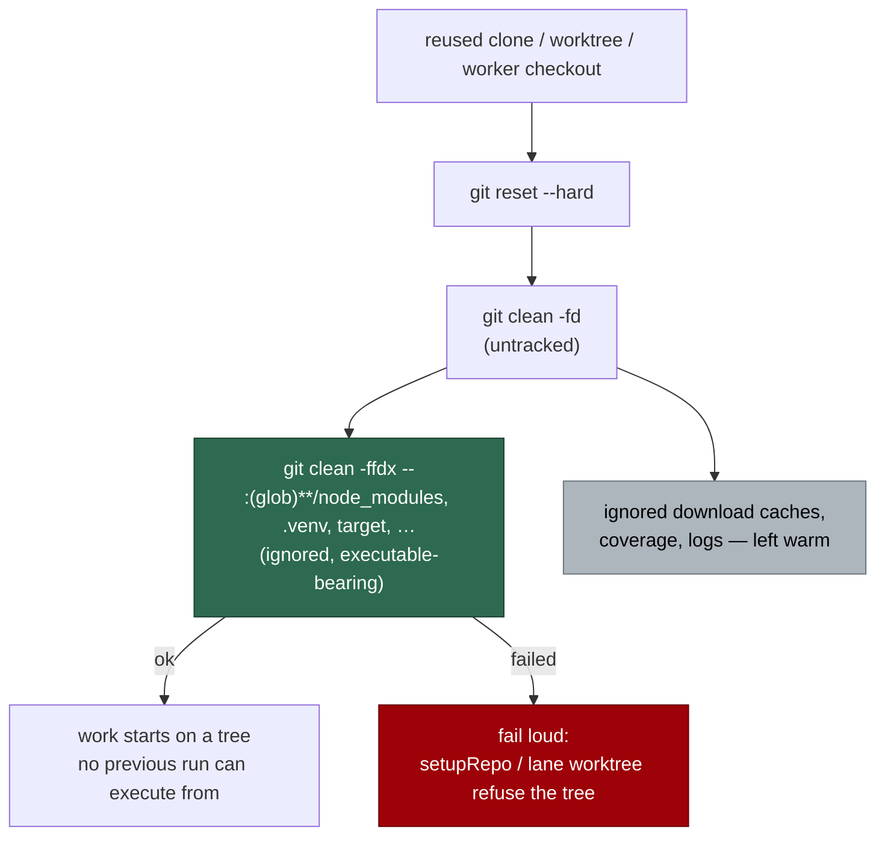

## Summary

`git clean -fd` removes untracked paths but not **ignored** ones, so everything
`.gitignore` matched survived the reset that exists to erase it — and
`node_modules/.bin`, a `.venv` interpreter, a `target/` or `dist/` binary are
exactly what the next, entirely legitimate run of that repository *executes*
during its build and quality gate. Tampering there was persistent where
tampering with tracked source is transient.

Every reused-tree reset now follows `clean -fd` with a **pathspec-scoped**
`git clean -ffdx` over the ignored directory names that carry executable
content, at any depth, whether the path is a real directory or a symlink
standing in for one, and including a nested `.git`. Pure download caches stay
warm, so the repeated cost a blanket `-fdx` would impose on repositories with
large dependency trees is not paid. A clean that could not do its job returns a
fail-loud error: `setupRepo` and the lane-worktree reset refuse the tree rather
than hand the run a tree whose executable content is last run's.

Closes #1443.

## Evidence

Backend-only change — there is no web interface to screenshot. The evidence is
the tests, the fleet's own quality gate, and the measurement behind the
trade-off.

**Regression test, and its linkage.** Added
`worker/deno/tests/ignored_path_clean_test.ts::setupRepo - a reused clone does not carry ignored executable content into the next run`,
which plants `node_modules/.bin/tool` and `packages/a/node_modules/dep/i.js` in
a real reused clone and calls the real `setupRepo`. It **fails against the
unfixed code** — observed: `AssertionError: setupRepo must erase ignored
executable content from a reused clone` with the call site reverted — and
passes after the fix. The same file pins the symlink evasion
(`cleanWorkingTree - erases a symlinked dependency directory, not only a real one`),
the nested-`.git` case, the warm-cache half of the trade, and the fail-loud
error path.

**Original trigger closed, with no trivial bypass.** The attack input is
content left in an ignored path of a reused clone. After the fix the reset runs
`git clean -ffdx -- :(glob)**/<dir> :(glob)**/<dir>/**` for each name in
`EXECUTABLE_IGNORED_DIRS`, so the three bypasses of a naive fix are closed by
construction: a **nested** copy (`packages/*/node_modules`) is matched because
the pathspec is `**`-rooted rather than repository-root-relative; a
**git-installed dependency** holding its own `.git` is removed because `-ff`
does not skip nested repositories; and a **symlinked** directory
(`ln -s store/real node_modules`) is removed because each name carries the
entry form as well as the contents form — git does not descend a symlink, so
the contents form alone matched nothing. A clean that cannot run cannot pass as
one that did: `cleanWorkingTree` returns a fail-loud `Result` and the two
agent-facing reset sites refuse the tree. What remains is scope, not bypass:
ignored content under a name outside the set (and the *target* of an erased
symlink) is recorded as **R12** in `docs/THREAT-MODEL.md` with the measured
cost of widening it.

**Measured cost of the alternative** (why the clean is scoped rather than
blanket, so the decision is reconstructable):

| Measurement | Scoped clean (this fix) | Blanket `git clean -ffdx` |
| ----------- | ----------------------- | ------------------------- |
| Fixture: 5,000-file `node_modules` beside a 287 MB ignored registry cache | dependencies erased in **14 ms**, all **287 MB** of cache kept | both erased — the 287 MB is a network re-download on the **next** run, every run |
| This repository (Deno; nothing ignored present) | **2–4 ms** per reset | same 0 bytes discarded — the cost lands on npm/Rust/Python repos, not here |

**Quality gate:** `./quality.sh` — `Result: PASSED (with skipped checks)`
(`config integration` skips on a host with no `.config.json`). 20,000+ unit
tests, semgrep, markdownlint, mermaid, lint, type check and fmt all green.

## Acceptance Criteria

<!-- vibe-spec-review inputs="diff+issue-body" -->

- **met** — the `clean -fd` class is fixed at every named call site, not one — evidence: `worker/deno/commands/git_operations.ts:591`, `worker/deno/lib/git_pull.ts:534`, `worker/deno/lib/checkout_update.ts:434` and `:474`, `worker/deno/lib/git_repo_validation.ts:74` — reviewer: met
- **met** — ignored executable paths in a reused clone cannot carry content from a previous run into the next one — evidence: `worker/deno/tests/ignored_path_clean_test.ts::setupRepo - a reused clone does not carry ignored executable content into the next run` — reviewer: partial — reason: the reviewer reproduced a symlink evasion (`node_modules -> store/real` survived the contents-only pathspec) and called the criterion partial on that basis; it was fixed after the review by adding the `:(glob)**/<dir>` entry form, and pinned by `cleanWorkingTree - erases a symlinked dependency directory, not only a real one`
- **met** — the narrower option the issue asks to be weighed first — clean only executable-bearing ignored paths, keeping pure download caches warm — is the one built, rather than a blanket `-x` — evidence: `worker/deno/lib/ignored_path_clean.ts:58-96`; warm-cache half asserted by `cleanWorkingTree - erases ignored executable paths at any depth and keeps caches warm` — reviewer: met
- **met** — the residual is explicitly accepted and recorded in `docs/THREAT-MODEL.md` with the reasoning and the measured cost of the alternative — evidence: `docs/THREAT-MODEL.md` R12, plus C32 and AP-18 and the rewritten "known instances" bullet — reviewer: met — reason: the reviewer's reservation was that the measurement is prose rather than a committed benchmark; it re-ran the fixture independently and got the same direction and order of magnitude, and the numbers are in the table above
- **unrequested** — a sixth call site, the lane-worktree parity reset, was converted alongside the five the issue lists — evidence: `worker/deno/lib/issue_worker_wiring.ts:426` — reviewer: unrequested — reason: same class and the longest-lived reused tree in the fleet, so leaving it out would have left the hole open where it matters most
- **unrequested** — `-ff` rather than `-f`, which also removes a nested git repository inside a dependency directory — evidence: `worker/deno/lib/ignored_path_clean.ts:90` — reviewer: unrequested — reason: a single `-f` prints "Skipping repository node_modules/dep" and leaves exactly the content that must not survive; the pathspec bounds the extra force to the named set, and a tracked submodule is untouched
- **unrequested** — the named set is ten directories, where the issue sketched four — evidence: `worker/deno/lib/ignored_path_clean.ts:58-69` — reviewer: unrequested — reason: `venv`, `.tox`, `__pycache__`, `dist`, `out` and `vendor` are the same shape of path (a tool runs something from them) and each is rebuildable from tracked sources plus an out-of-clone cache; the issue's list was explicitly a sketch ("a known set")
- **unrequested** — `docs/CONFIGURATION.md` and `docs/DEPLOYMENT.md` prose, and the `checkout_update.ts` docstrings, were updated where the issue named only `docs/THREAT-MODEL.md` — evidence: `docs/CONFIGURATION.md:1250`, `docs/DEPLOYMENT.md:243`, `worker/deno/lib/checkout_update.ts:16` — reviewer: unrequested — reason: these are the surfaces that spell the reset sequence out; the repo standard is that a code change owes the docs change that names it
- **unrequested** — `docs/audits/security-sweep-1443-ignored-path-clean.md` and the chunk-`12g` slice in `docs/audits/lib-sweep-coverage.json` — evidence: `docs/audits/lib-sweep-coverage.json` — reviewer: unrequested — reason: gate-mandated, not gold-plating — `worker/deno/tests/lib_sweep_coverage_test.ts` fails any `worker/deno/lib/` module no sweep slice claims, and a small slice must name each module in its own record

## Standards Review

<!-- vibe-standards-review inputs="diff+CODING-STANDARDS.md" -->

- **violation** — `cleanWorkingTree` returned `void`, so a failed security-control clean was indistinguishable from success to its callers — evidence: `worker/deno/lib/ignored_path_clean.ts:112` (pre-fix) — reason: fixed here; it now returns a fail-loud `Result`, `setupRepo` and the lane worktree refuse the tree, `validateRepoState` records a warning and the milestone sync names it in its note
- **violation** — the untracked `clean -fd` result was dropped without inspecting `ok` or `code` — evidence: `worker/deno/lib/ignored_path_clean.ts:115` (pre-fix) — reason: fixed here; its failure is warned with the path and git's message, while its long-standing best-effort semantics are kept deliberately
- **violation** — no test covered either fail-loud branch of the one function the change calls a security control — evidence: `worker/deno/tests/ignored_path_clean_test.ts` (pre-fix) — reason: fixed here by `cleanWorkingTree - a clean that cannot run fails loud instead of reporting success`
- **violation** — self-agreeing assertions: the expected argv was re-derived from the module's own constant, and the checkout sequence expectation called the production builder — evidence: `worker/deno/tests/ignored_path_clean_test.ts:102`, `worker/deno/tests/checkout_update_test.ts:581` (pre-fix) — reason: fixed here; the argv is pinned as a literal list of 23 tokens, and the checkout test asserts the step's shape without calling the builder
- **violation** — `workingTreeCleanSteps()` was exported with no production caller and a docstring that contradicted the code — evidence: `worker/deno/lib/ignored_path_clean.ts:97` (pre-fix) — reason: fixed here; the export is gone
- **violation** — the sweep record claimed "a failure cannot read as success" on the strength of a downstream check that does not exist for three of the callers — evidence: `docs/audits/security-sweep-1443-ignored-path-clean.md:50` (pre-fix) — reason: fixed here; the row now describes what each caller actually does with the error, which the `Result` change made true
- **violation** — no PR summary in the diff — evidence: `docs/archive/pr-summaries/pr-summary-1443.md` (absent at review time) — reason: this file; it is written last, after the reviewers ran
- **clean** — Australian English throughout; commit safety (no hidden or credential-shaped path staged, no `git add -f`, no `--no-verify`, run-id trailer on both commits); Deno-native tooling only, module beside its `tests/<name>_test.ts`, `@std/assert` only, strict types; tests drive real code against real git repositories and assert on the resulting tree, with no source-grepping, no sleep/poll and no absolute wall-clock budget; single-responsibility files (145 and 268 lines); the only new sink is `console.warn`/`console.error`, which routes through the patched-console redaction chokepoint (C24); the doc obligation is discharged in the same change (THREAT-MODEL C32/AP-18/R12, CONFIGURATION, DEPLOYMENT, the `checkout_update.ts` docstrings and the sweep record)

## Test Plan

Added — `worker/deno/tests/ignored_path_clean_test.ts` (7 cases):

- `ignoredExecutableCleanArgs - scopes an ignored clean to the executable-bearing directories` — the argv pinned literally, so a dropped or mistyped directory name fails here.
- `cleanWorkingTree - erases ignored executable paths at any depth and keeps caches warm` — root and nested `node_modules`, `target/`, `.venv/` erased; `.cache/registry.tar`, an ignored log and tracked files untouched.
- `cleanWorkingTree - erases a dependency directory that holds a nested git repository` — the `-ff` case a single `-f` would skip.
- `cleanWorkingTree - erases a symlinked dependency directory, not only a real one` — the `ln -s` evasion.
- `cleanWorkingTree - an ignored file outside the executable set is the documented residual` — pins the scope R12 records.
- `cleanWorkingTree - a clean that cannot run fails loud instead of reporting success` — the error path, naming the issue and the path.
- `setupRepo - a reused clone does not carry ignored executable content into the next run` — the end-to-end regression test; red before the fix, green after.

Modified — `worker/deno/tests/checkout_update_test.ts`: the pinned update
sequence gains the scoped ignored clean as its final step. This is a
deliberate change to an existing expectation, because the production sequence
changed; no test was removed or commented out.

Re-run green: the seven new cases, `checkout_update_test`,
`git_repo_validation_test`, `git_pull_conflict_test`,
`git_pull_lane_isolation_test`, `setup_repo_default_branch_cache_test`,
`setup_repo_skip_fetch_test`, `setup_repo_slug_guard_test`,
`lane_worktree_test`, `lane_scoped_worktree_test`,
`git_operations_command_test`, `regression_git_operations_test`,
`stale_workdir_command_test`, `threat_model_docs_test`,
`lib_sweep_coverage_test`, and the full `./quality.sh` gate.
