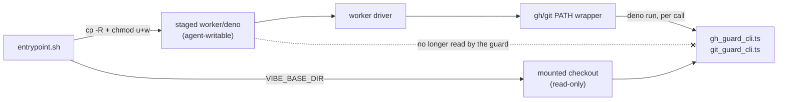

## Summary

The `gh` and `git` PATH wrappers spawn a fresh guard child on every call, so
the guard entry point is **re-read from disk each time**. It was resolved
against `import.meta.url` — the staged worker copy `container/entrypoint.sh`
marks writable so the next launch's `rm -rf` can replace it (Issue #514) — and
that write bit belongs to `vibe`, the uid the coding agent runs as with
unrestricted Bash. The write-repo allowlist, the reserved-label denylist, the
issue-lifecycle refusal, the credential-disclosure guard and body redaction all
re-enter through that module, so the constrained party could rewrite its own
boundary mid-launch.

Both entry points now resolve through
`worker/deno/lib/guard_module_path.ts`, which names the checkout the launcher
mounted read-only (`VIBE_BASE_DIR`) — the same precedent `PROMPTS_DIR` already
sets in that block of the entrypoint. The driver keeps the fast staged copy;
the guard does not. `chmod -R u+w` on the staged tree is untouched, so #514
still holds.

It fails closed rather than degrading: a named checkout that does not carry the
module, or a `VIBE_BASE_DIR` that cannot be read, makes `installGhGuardShim`
return the same `blocked` verdict every other uninstallable-shim fault takes,
warned and journalled. With `VIBE_BASE_DIR` unset nothing was staged and the
running copy *is* the checkout copy, so host runs are unaffected.

Closes #1444.



## Evidence

Backend/CLI only — no web interface to screenshot. The evidence is the test
run: the regression tests below plant a distinct, always-refusing guard module
in a fake read-only checkout and assert the wrapper executes **that** module
(its marker on stderr, non-zero exit, the real `gh`/`git` never invoked). They
fail against the unfixed resolution, which executed the running copy and let
the command through.

```
$ deno test --allow-all tests/guard_module_path_test.ts
gh-guard-shim - executes the checkout guard, not the writable staged copy ... FAILED
git-guard-shim - executes the checkout guard, not the writable staged copy ... FAILED   # before the fix
...
ok | 12 passed | 0 failed   # after the fix
```

`./quality.sh` passed in full after the final edit (18 checks; `config
integration` skipped by the gate itself, as it is on every run without a
deployed config).

**Original trigger closed, no trivial bypass.** The trigger was: write to
`${LOCAL_SRC}/worker/deno/lib/gh_guard_cli.ts` (or `git_guard_cli.ts`) as
`vibe`, and the next `gh`/`git` call executes the rewritten module. The path
baked into the wrapper is now `${VIBE_BASE_DIR}/worker/deno/lib/<module>` on
the read-only mount, so that write no longer changes what runs. The nearby
bypasses are closed too: the path is resolved once in the worker process and
written into the wrapper as a shell-quoted literal, so the agent cannot steer
it at call time; `VIBE_BASE_DIR` is read in the worker, not by the wrapper, so
exporting it in the agent's shell changes nothing; and making the checkout
copy unreachable does not silently fall back to the writable one — the install
is refused. The module name is validated as a bare `*.ts` file name, so no
traversal can reach outside `worker/deno/lib`. What remains is the residual
risk already recorded in SECURITY.md §6a: an agent that invokes the real
binary by absolute path or edits `PATH` bypasses the wrapper entirely — this
change does not widen or narrow that.

## Acceptance Criteria

<!-- vibe-spec-review inputs="diff+issue-body" -->

- **met** — the module the `gh`/`git` guard wrapper executes is not writable by the uid the coding agent runs as — evidence: `worker/deno/lib/guard_module_path.ts:97-140`, wired at `worker/deno/lib/gh_guard_shim.ts:481-495` and `:509-515`; `container/entrypoint.sh:427` exports `VIBE_BASE_DIR`, and `container_launch.ts:1112` names the `ro` mount — reviewer: met
- **met** — verified in the first direction: the wrapper still guards correctly — evidence: `worker/deno/tests/guard_module_path_test.ts::gh-guard-shim - the real guard still refuses an off-allowlist write from another checkout root` plus the 14 pre-existing `git_guard_shim_test.ts` cases and 20 `gh_guard_shim_test.ts` cases, all now naming the checkout explicitly — reviewer: met
- **met** — verified in the second direction: a write to the staged copy does not change what the guard executes — evidence: `worker/deno/tests/guard_module_path_test.ts::gh-guard-shim - executes the checkout guard, not the writable staged copy` and its `git` twin — reviewer: met — reason: the reviewer noted the converse form is tested (the checkout copy is proven to be the one executed) rather than mutating the running copy; the two are equivalent and nothing in the diff writes to the running copy
- **met** — the #514 property is kept: the staged tree stays writable so the next launch's `rm -rf` succeeds — evidence: `container/entrypoint.sh:411` `chmod -R u+w` untouched; the only entrypoint change is the added export — reviewer: met
- **met** — the guard's import graph resolves cleanly from the mount — evidence: `worker/deno/tests/guard_module_path_test.ts::gh-guard-shim - the real guard still refuses an off-allowlist write from another checkout root` runs the real `gh_guard_cli.ts` through a different checkout root — reviewer: missing — reason: the reviewer saw only the first commit, where this was confirmed manually (252 file-only specifiers, no jsr/npm/https) but not automated; the second commit adds the automated case
- **unrequested** — the bare-`*.ts` module-name validation that throws (`guard_module_path.ts:52,99-103`) — reviewer: unrequested — reason: both callers pass literals today, but the function takes a name and builds a filesystem path from it, so validating the input is the repo's secure-coding default; one line and one test
- **unrequested** — `docs/audits/lib-sweep-coverage.json` gains the new module — reviewer: unrequested — reason: forced by repo convention; `lib_sweep_coverage_test.ts` fails on any unclaimed `lib/` module
- **unrequested** — `SECURITY.md` §6a, the `docs/THREAT-MODEL.md` C13 row and the `docs/CONTAINER.md` staging bullet — reviewer: unrequested — reason: "a code change owes a docs change"; these are the operator-facing descriptions of exactly this control and this entrypoint block
- **unrequested** — `script?:` on `EntrypointOpts` and the shared `checkoutEnv`/`CHECKOUT_ROOT` seam in `tests/support/env_lookup.ts` — reviewer: unrequested — reason: test infrastructure the new cases need; the shim suites would otherwise inherit the *host's* `VIBE_BASE_DIR` and silently exercise the mounted checkout's guard instead of the branch's

## Standards Review

<!-- vibe-standards-review inputs="diff+CODING-STANDARDS.md" -->

- **violation** — catch-and-ignore on a refused `VIBE_BASE_DIR` read degraded the boundary silently — evidence: `worker/deno/lib/guard_module_path.ts:95` (first commit) — reason: fixed here; that path now returns the same `degraded` verdict as a missing module, and `installGhGuardShim` refuses the install rather than warning and continuing
- **violation** — untested branches on a new public function (the throwing `EnvLookup`, the `candidate === running` short-circuit) — evidence: `worker/deno/tests/guard_module_path_test.ts` (first commit) — reason: fixed here; both branches now have cases, as does the layout `GUARD_MODULE_DIR` assumes
- **violation** — the `CHECKOUT_ENV` constant duplicated verbatim across two suites — evidence: `worker/deno/tests/git_guard_shim_test.ts:61` (first commit) — reason: fixed here; moved to `worker/deno/tests/support/env_lookup.ts` beside the other env seams
- **violation** — an assertion that could not fail either way (`defaultGitGuardModulePath()` merely *contains* `/lib/git_guard_cli.ts`) — evidence: `worker/deno/tests/git_guard_shim_test.ts:321` (first commit) — reason: fixed here; it now asserts the exact checkout path, that it is not degraded, and that the file exists
- **violation** — `docs/CONTAINER.md` describes the staging block the diff edits and did not mention the new export — evidence: `docs/CONTAINER.md:772-778` (first commit) — reason: fixed here
- **violation** — DRY: the "checkout root from `VIBE_BASE_DIR`, else module-relative" shape already exists as `workerCheckoutDir` (`callback_failure_streak.ts:145`) — evidence: `worker/deno/lib/guard_module_path.ts:117-133` — reason: it stands. That helper swallows a refused env read into the module-relative path, which is precisely the silent degradation this control must not take, and a security boundary should not import its resolution from a failure-reporting module
- **violation** — the PR summary was absent — evidence: `docs/archive/pr-summaries/pr-summary-1444.md` — reason: this file
- **clean** — Australian English throughout (no American forms in the added lines); no test greps source or asserts call relationships; no existing test deleted or disabled; no wall-clock sleep, poll loop or timing assertion; no hidden path staged and no `git add -f`; both commits carry the issue reference and the `Vibe-Coder-Run-Id` trailer; the new logic is Deno TypeScript and the shell change is a single `export`; the loud-failure paths name both the marker and the two paths

## Test Plan

Added `worker/deno/tests/guard_module_path_test.ts`:

- `guard-module-path - prefers the checkout copy over the running one`
- `guard-module-path - trailing separators on the base dir are ignored`
- `guard-module-path - without VIBE_BASE_DIR the running copy is the checkout copy`
- `guard-module-path - the named checkout that carries no guard is degraded`
- `guard-module-path - an unreadable VIBE_BASE_DIR is degraded, not swallowed`
- `guard-module-path - the running copy inside the named checkout needs no probe`
- `guard-module-path - the checkout layout it assumes is the one on disk`
- `guard-module-path - refuses a traversing module name`
- `gh-guard-shim - executes the checkout guard, not the writable staged copy` — the regression test: it fails against the unfixed code (the running copy's guard allows the command and the stub `gh` runs) and passes after the fix (the planted checkout guard refuses it)
- `git-guard-shim - executes the checkout guard, not the writable staged copy` — the same for the `git` wrapper
- `gh-guard-shim - the real guard still refuses an off-allowlist write from another checkout root` — the whole guard, not a stub, reached through a foreign checkout root
- `gh-guard-shim - blocks the run when the named checkout carries no guard module` — the fail-closed verdict

Added to `worker/deno/tests/container_entrypoint_test.ts`:

- `entrypoint - names the checkout for the gh/git guards when it staged the source (Issue #1444)` — runs a fixture copy of the real entrypoint with `VIBE_BASE_DIR` unset and asserts the driver was handed `VIBE_BASE_DIR` (and `PROMPTS_DIR`) naming the derived checkout. Confirmed red with the export removed, green with it.

Modified: `worker/deno/tests/gh_guard_shim_test.ts` and
`worker/deno/tests/git_guard_shim_test.ts` — every install now names the
checkout under test through the shared `checkoutEnv` seam, so the suites
exercise this branch's guard rather than the host's mounted one. No assertion
was weakened; the `defaultGitGuardModulePath` case was tightened.
